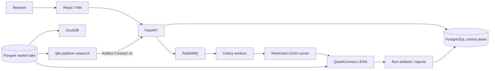

# LEAN Local Platform

[](https://github.com/magic-alt/platform/actions/workflows/ci.yml)
[](LICENSE)

A local-first quantitative execution and control platform built around [QuantConnect LEAN](https://github.com/QuantConnect/Lean), with FastAPI, React, Celery, RabbitMQ, PostgreSQL, Parquet, and DuckDB.

LEAN Local Platform focuses on the engineering boundary between **trusted market data, reproducible research delivery, authoritative LEAN validation, backtesting, optimization, paper trading, and operational control**. Model research remains intentionally separated in the external `qlib-platform` repository and is handed off through versioned, content-addressed artifacts.

> [!IMPORTANT]
> The current release is **NOT CERTIFIED** after the PostgreSQL/RabbitMQ architecture migration. Live trading / P9 activation is disabled. See [Current Release Status](docs/release-status.md) before treating any deployment as production-ready.

## Why this project exists

Most quantitative stacks can run a backtest. Fewer make it possible to answer, later and unambiguously:

> Which code, data release, parameters, runtime, research artifact, and validation evidence produced this result?

This repository is designed around that question. It keeps market facts, control-plane facts, research outputs, execution evidence, and runtime state in explicit domains instead of treating the local workstation as one mutable black box.

## Core capabilities

- **Authoritative LEAN execution** for backtests and validation.
- **A-share daily-data workflows** with fail-closed data, benchmark, QA, PIT, and reference-data gates.
- **Experiment batches and optimization** using standard child backtests, rolling windows, parameter grids, and walk-forward workflows.
- **Paper accounts** with immutable intents, fills, ledgers, checkpoints, and rebuildable projections.
- **Governed market-data ingestion** with normalization, source selection, quarantine, watermarks, lineage, manifests, hashes, and atomic Parquet publication.
- **Research handoff** from external `qlib-platform` through Artifact Contract v2 and content-addressed `TARGET_PORTFOLIO` artifacts.
- **Reproducible evidence** including project snapshots, dataset versions, runtime fingerprints, raw results, logs, reports, manifests, and checksums.
- **Docker and native deployment adapters** over the same application architecture.
- **Operational controls** for backup/restore, health checks, alerts, scheduling, and optional observability services.

## Architecture



### Sources of truth

| Concern | Authority |
| --- | --- |
| Market time-series facts | Parquet under `$LEAN_DATA_DIR` |
| Tasks, registries, accounts, PIT/control metadata, audit | PostgreSQL `lean_platform` |
| Celery result metadata | PostgreSQL `lean_celery` — disposable, not a business authority |
| MLflow metadata | PostgreSQL `lean_mlflow` |
| Task transport | RabbitMQ |
| Backtest / execution validation | Platform + QuantConnect LEAN |
| Research execution | External `qlib-platform` |
| Parquet query | DuckDB |
| Analytical mirror | ClickHouse — optional, never authoritative |

PostgreSQL must not become a market quote store. RabbitMQ is transport, not business truth. SQLite is allowed only in isolated tests.

For the complete system model, read [Current State](docs/current-state.md) and [Architecture](docs/architecture.md).

## Research / execution boundary

```text
platform
  └─ publishes immutable DataRelease
       ↓
qlib-platform
  ├─ features and factors
  ├─ model training and selection
  └─ walk-forward research
       ↓
Artifact Contract v2
+ content-addressed TARGET_PORTFOLIO
       ↓
platform
  ├─ fail-closed import
  ├─ lineage / hash validation
  ├─ authoritative LEAN validation
  └─ backtest / optimization / paper control
```

The platform preserves `artifactId`, `DataReleaseId`, target-weight SHA-256, lineage, and lifecycle state. It does not silently repair an invalid imported artifact and does not grow a second feature/model research system.

## Current support boundary

| Capability | Current status |
| --- | --- |
| China A-share daily data | Supported production surface |
| Backtest | Supported |
| Optimization / experiment batches | Supported |
| Research Artifact v2 import | Supported |
| Paper accounts | Supported with operational gates |
| Docker deployment | Supported |
| Windows/Linux native deployment | Supported adapter |
| Cross-asset workflows | Research-only or preview-only where documented |
| Minute / tick production execution | Disabled |
| Live broker writes / P9 activation | **Disabled** |
| Current release certification | **NOT CERTIFIED** |

The exact boundary is versioned in [Current State](docs/current-state.md) and [Release Status](docs/release-status.md). Those documents take precedence over historical audits or screenshots.

## Quick start

### Prerequisites

Recommended local path:

- Git
- Docker Engine or Docker Desktop
- Docker Compose v2
- Python 3.12 for repository control scripts
- At least 16 GiB assigned to Docker Desktop for a full initial data synchronization

### 1. Clone and configure

```bash
git clone https://github.com/magic-alt/platform.git
cd platform
cp .env.example .env
```

Set unique infrastructure secrets in `.env`:

```text
LEAN_POSTGRES_ADMIN_PASSWORD
LEAN_POSTGRES_APP_PASSWORD
LEAN_POSTGRES_CELERY_PASSWORD
LEAN_POSTGRES_MLFLOW_PASSWORD
LEAN_RABBITMQ_PASSWORD
```

Then configure credentials only for the providers you actually enable, for example `TUSHARE_TOKEN`.

Never commit `.env`, provider credentials, broker credentials, API tokens, runner tokens, or downloaded market data.

### 2. Validate the host

```bash
python scripts/platformctl.py --mode docker --profile full doctor
```

### 3. Start the stack

```bash
python scripts/platformctl.py --mode docker --profile full start
```

The startup path enforces dependency ordering around PostgreSQL initialization/migrations and RabbitMQ health before application consumers start.

### 4. Inspect status

```bash
python scripts/platformctl.py --mode docker --profile full status
```

The API health endpoint is available at `GET /api/health` on the configured API port.

For deployment, secret provisioning, backup/restore, and production-like requirements, use [Deployment](docs/deployment.md).

## Native deployment

Docker and native hosts are deployment adapters for the same application architecture.

```bash
python scripts/platformctl.py --mode native doctor
python scripts/platformctl.py --mode native --profile core start
```

On a Dockerless Windows development machine:

```powershell
.\scripts\start_windows_native.ps1
```

Windows user-process management is the local-development default. Windows SCM is reserved for explicitly configured certified deployments. See [Native Deployment](docs/native-deployment.md).

## Repository layout

```text
platform/
├── .github/              GitHub governance, templates, CODEOWNERS, workflows
├── config/               deployment and portable data-source configuration
├── data/                 authoritative local market lake / derived caches
├── deploy/               native-host deployment assets
├── docker/               observability and container support files
├── docs/                 architecture, operations, API, help, history
├── examples/             standalone examples outside the production path
├── scripts/              control, validation, migration, audit utilities
├── strategies/           strategy templates
└── web/
    ├── backend/           FastAPI, services, repositories, Celery, LEAN integration
    ├── frontend/          React / TypeScript application
    └── runtime/           local runtime artifacts; not source control
```

Runtime artifacts belong under `web/runtime/` or the configured `$LEAN_DATA_DIR`. Root-level `results/`, `runs/`, `Data/`, and `parquet/` directories are not supported. See [Repository Layout](docs/repository_layout.md).

## Development

Run the backend:

```bash
cd web/backend
.venv/bin/python -m uvicorn app.main:app --reload --host 127.0.0.1 --port 8000
```

Run the frontend:

```bash
cd web/frontend
npm run dev
```

### Validation

Repository and governance checks:

```bash
python scripts/check_repository_hygiene.py
python scripts/check_oss_governance.py
```

Backend:

```bash
cd web/backend
.venv/bin/python -m pytest -q
```

Frontend:

```bash
cd web/frontend
npm ci
npm run build
```

LEAN Docker integration is opt-in:

```bash
cd web/backend
RUN_LEAN_DOCKER_INTEGRATION=1 .venv/bin/python -m pytest -q tests/test_ashare_lean_integration.py
```

See [Testing](docs/testing.md) for the complete validation matrix.

## CI policy

`.github/workflows/ci.yml` contains two layers:

1. **Always-on governance checks** — repository structure, open-source metadata, policy links, and hygiene.
2. **Compute-heavy validation lanes** — backend, frontend, native contracts, Windows contracts, and optional LEAN integration. These remain controlled by repository variables while hosted Actions quota is constrained.

Local validation remains authoritative for lanes that are intentionally disabled in hosted CI. A skipped heavy lane must not be represented as evidence that the corresponding runtime passed.

## Documentation

| Document | Purpose |
| --- | --- |
| [Current State](docs/current-state.md) | Single source of truth for runtime architecture and support boundaries |
| [Architecture](docs/architecture.md) | Component boundaries, main chains, storage and recovery |
| [Release Status](docs/release-status.md) | Certification state and evidence bindings |
| [Deployment](docs/deployment.md) | Docker/native deployment, backup and recovery |
| [Data Sources](docs/data_sources.md) | Provider governance and source correctness |
| [Data Pipeline](docs/data_pipeline.md) | Full/incremental/on-demand synchronization and publication |
| [API](docs/api.md) | API contracts and error semantics |
| [Testing](docs/testing.md) | Unit, integration, browser, and acceptance validation |
| [Operations Runbook](docs/operations/level5-runbook.md) | SLO, RPO/RTO, alerts, recovery, and release gates |
| [Roadmap](docs/roadmap.md) | Current priorities and planned work |
| [Help Center](docs/help/index.md) | In-application operating documentation |

Historical material under `docs/history/` is evidence for its original baseline and is not current operating guidance.

## Contributing

Contributions are welcome. Start with [CONTRIBUTING.md](CONTRIBUTING.md), follow the [Code of Conduct](CODE_OF_CONDUCT.md), and use the repository issue / pull-request templates.

Important project invariants include:

- keep market time series in Parquet, not PostgreSQL;
- keep RabbitMQ as transport, not business truth;
- preserve the `qlib-platform` → Artifact Contract v2 → platform boundary;
- never silently repair invalid research artifacts;
- do not introduce broker writes or live activation as incidental feature work;
- update the `Unreleased` section of `CHANGELOG.md` for each commit.

Security-sensitive findings must follow [SECURITY.md](SECURITY.md), not a public bug report.

## License

This project is licensed under the [Apache License 2.0](LICENSE).

QuantConnect LEAN is an independent upstream project and is also distributed under Apache-2.0. QuantConnect and LEAN names and trademarks remain the property of their respective owners. This repository is not presented as an official QuantConnect product.

## Project status

The engineering priority order is deliberately conservative:

```text
Data correctness
    ↓
Research contract integrity
    ↓
Reproducible LEAN validation
    ↓
Paper execution
    ↓
Operational reliability
    ↓
Release certification
    ↓
Live execution
```

Live execution is not enabled. Always check [docs/release-status.md](docs/release-status.md) before relying on historical certification evidence.
