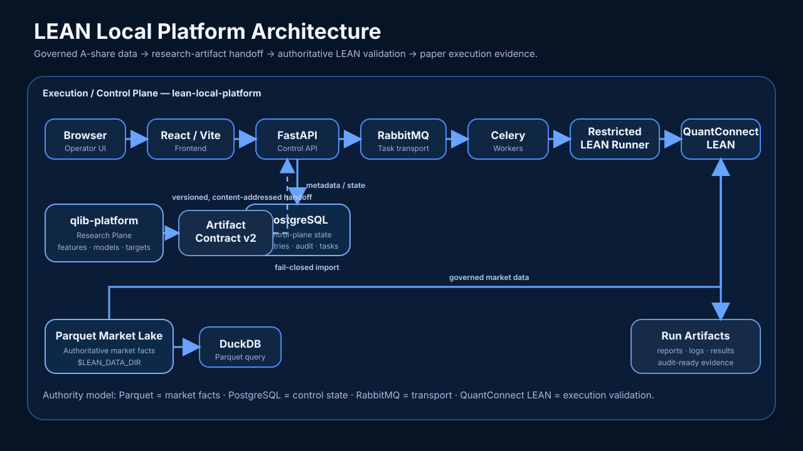

<div align="center">


# LEAN Local Platform

### Local-First A-share Execution & Control Plane on QuantConnect LEAN

**Governed Data · Research Handoff · Reproducible LEAN Validation · Optimization · Paper Execution · Audit-Ready Evidence**

<p>
  <a href="https://github.com/magic-alt/lean-local-platform/actions/workflows/ci.yml"></a>
  <a href="LICENSE"></a>
  
  
  
  
  <a href="docs/release-status.md"></a>
</p>

[Quick Start](#quick-start) · [Architecture](#architecture) · [Workflow](#workflow) · [Documentation](#documentation) · [Support Boundary](#support-boundary) · [Contributing](CONTRIBUTING.md) · [Release Status](docs/release-status.md)

English · [简体中文](README.zh-CN.md)

</div>

> [!IMPORTANT]
> **Current release status: NOT CERTIFIED.** The PostgreSQL/RabbitMQ architecture migration invalidated earlier certification evidence. **Live trading / P9 activation is disabled.** Live broker writes remain disabled. Read [Current Release Status](docs/release-status.md) before using the platform in any production-like environment.

## What is LEAN Local Platform?

LEAN Local Platform is a local-first **execution plane / control plane** built around [QuantConnect LEAN](https://github.com/QuantConnect/Lean). It turns governed A-share data and versioned research artifacts into reproducible LEAN validation, backtests, optimization runs, paper-account state, and audit-ready evidence.

The repository is intentionally separated from [`qlib-platform`](https://github.com/magic-alt/qlib-platform):

- **`qlib-platform`** owns research workflows such as factor engineering, model training, and target-portfolio artifact generation.
- **`lean-local-platform`** owns governed data publication, fail-closed artifact import, LEAN validation, paper execution workflows, and operational control.

## Workflow

```text
Governed market data
    -> immutable DataRelease
    -> qlib-platform research
    -> Artifact Contract v2
    -> fail-closed import
    -> authoritative LEAN validation
    -> backtest / optimization
    -> paper execution workflow
    -> audit-ready evidence
```

The central invariant is simple: **execution must never silently change the identity or meaning of its research and data inputs.**

## Architecture

<p align="center">
  
</p>

**Authority model**

- **Parquet** is the authoritative market-fact layer under `$LEAN_DATA_DIR`.
- **PostgreSQL** stores control-plane state, registries, metadata, and audit records.
- **RabbitMQ** is transport for task dispatch.
- **QuantConnect LEAN** remains the authoritative execution validator.
- **Research artifacts** cross into this repository only through **Artifact Contract v2**.

## Quick start

### Prerequisites

- Git
- Docker Engine or Docker Desktop
- Docker Compose v2
- Python 3.12

### Start the recommended local stack

```bash
git clone https://github.com/magic-alt/lean-local-platform.git
cd lean-local-platform
cp .env.example .env
```

Set infrastructure secrets in `.env`:

```text
LEAN_POSTGRES_ADMIN_PASSWORD
LEAN_POSTGRES_APP_PASSWORD
LEAN_POSTGRES_CELERY_PASSWORD
LEAN_POSTGRES_MLFLOW_PASSWORD
LEAN_RABBITMQ_PASSWORD
```

Then validate and start:

```bash
python scripts/platformctl.py --mode docker --profile full doctor
python scripts/platformctl.py --mode docker --profile full start
python scripts/platformctl.py --mode docker --profile full status
```

For native-host and Windows-specific paths, see [Deployment](docs/deployment.md) and [Native Deployment](docs/native-deployment.md).

## Documentation

Start with the **[Documentation Hub](docs/README.md)**.

- [Current State](docs/current-state.md) — current architecture and support boundary
- [Architecture](docs/architecture.md) — system components, authority boundaries, and data flow
- [Deployment](docs/deployment.md) — Docker deployment, secrets, PostgreSQL/RabbitMQ, and recovery
- [Data Pipeline](docs/data_pipeline.md) — ingestion, QA, publication, and lineage
- [API](docs/api.md) — API semantics and examples
- [Testing](docs/testing.md) — validation matrix and test boundaries
- [Branding & Discoverability](docs/branding-and-discovery.md) — screenshots, social preview, and repository identity
- [Roadmap](docs/roadmap.md) — planned engineering direction

## Support boundary

| Capability | Current status |
| --- | --- |
| China A-share daily data | Supported production surface |
| Backtest | Supported |
| Optimization / experiment batches | Supported |
| Research Artifact v2 import | Supported |
| Paper accounts | Supported with operational gates |
| Docker deployment | Supported |
| Windows/Linux native deployment | Supported adapter |
| Minute / tick production execution | Disabled |
| Live trading / P9 activation | **Disabled** |
| Current release certification | **NOT CERTIFIED** |

## Contributing

Contributions are welcome. Please read [CONTRIBUTING.md](CONTRIBUTING.md), follow the [Code of Conduct](CODE_OF_CONDUCT.md), and report security issues through [SECURITY.md](SECURITY.md).

## License

This project is licensed under the [Apache License 2.0](LICENSE).

<div align="center">

**Built for quant workflows where reproducibility, governed data, and execution evidence matter as much as strategy code.**

[Documentation](docs/README.md) · [Roadmap](docs/roadmap.md) · [Contributing](CONTRIBUTING.md) · [Security](SECURITY.md)

</div>
