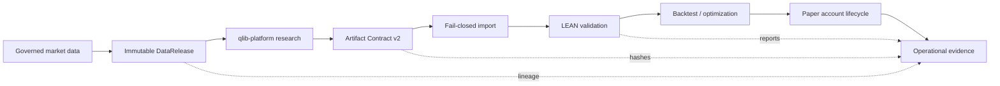
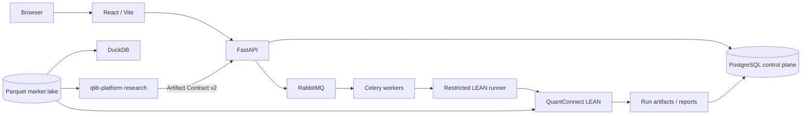

<div align="center">

# LEAN Local Platform

**Reproducible quantitative research delivery, LEAN validation, and paper execution — on your own infrastructure.**

A local-first control plane around [QuantConnect LEAN](https://github.com/QuantConnect/Lean) for governed A-share data, artifact-based research handoff, backtesting, optimization, paper trading, and audit-ready evidence.

[](https://github.com/magic-alt/platform/actions/workflows/ci.yml)
[](LICENSE)
[](https://www.python.org/)
[](https://github.com/QuantConnect/Lean)
[](docs/release-status.md)

[Quick Start](#quick-start) · [Architecture](#architecture) · [Documentation](#documentation) · [Roadmap](docs/roadmap.md) · [Contributing](CONTRIBUTING.md)

English · [简体中文](README.zh-CN.md)

</div>

> [!IMPORTANT]
> **Current release status: NOT CERTIFIED.** The PostgreSQL/RabbitMQ architecture migration invalidated earlier certification evidence. Live trading / P9 activation is disabled. Read [Current Release Status](docs/release-status.md) before using the platform in any production-like environment.

## What is LEAN Local Platform?

LEAN Local Platform is an open-source quantitative execution and control platform built around **QuantConnect LEAN**, with **FastAPI, React, Celery, RabbitMQ, PostgreSQL, Parquet, and DuckDB**.

It is designed for teams and independent researchers who want more than “a backtest that ran once.” The platform makes the research-to-execution path explicit and inspectable: which market-data release, code snapshot, parameters, runtime, research artifact, validation evidence, and execution state produced a result.

Model research is intentionally separated into the external [`qlib-platform`](https://github.com/magic-alt/qlib-platform) repository. Research outputs cross the boundary only through versioned, content-addressed artifacts and are revalidated by this platform before execution workflows continue.

## Why this project exists

Most quantitative stacks can produce a backtest. Fewer can answer this question later and unambiguously:

> **Which code, data release, parameters, runtime, research artifact, and validation evidence produced this result?**

LEAN Local Platform is organized around that requirement.

| Design goal | What it means in practice |
| --- | --- |
| **Reproducible by design** | Project snapshots, dataset versions, runtime fingerprints, manifests, hashes, logs, reports, and raw results are preserved as evidence. |
| **Fail-closed data governance** | Market-data ingestion uses normalization, source selection, QA/PIT/reference gates, quarantine, watermarks, lineage, manifests, hashes, and atomic publication. |
| **LEAN remains authoritative** | Backtests and execution validation are performed through QuantConnect LEAN rather than a second bespoke execution engine. |
| **Research and execution stay separate** | `qlib-platform` owns features/models/research; this repository owns governed data publication, LEAN validation, paper state, OMS boundaries, and operations. |
| **Operational truth is explicit** | Parquet, PostgreSQL, RabbitMQ, DuckDB, and optional analytical services each have a defined role instead of becoming interchangeable state stores. |
| **Safety boundaries are visible** | Live broker writes and P9 activation are disabled until deliberately enabled through a separate architecture and certification effort. |

## End-to-end workflow



The platform preserves `artifactId`, `DataReleaseId`, target-weight SHA-256, lineage, and lifecycle state. Invalid imported research artifacts are rejected rather than silently repaired or reinterpreted.

## Core capabilities

| Area | Capability |
| --- | --- |
| **Execution validation** | Authoritative QuantConnect LEAN backtests and validation workflows. |
| **A-share data** | Daily-data ingestion with source governance, normalization, QA, PIT/reference-data gates, lineage, immutable releases, and atomic Parquet publication. |
| **Experiments** | Standard child backtests, rolling windows, parameter grids, experiment batches, optimization, and walk-forward workflows. |
| **Research handoff** | Artifact Contract v2 and content-addressed `TARGET_PORTFOLIO` import from external `qlib-platform`. |
| **Paper trading** | Immutable intents, fills, ledgers, checkpoints, rebuildable projections, and operational gates. |
| **Evidence & auditability** | Project snapshots, dataset versions, runtime fingerprints, raw results, logs, reports, manifests, and checksums. |
| **Deployment** | Docker and native-host adapters over the same application architecture. |
| **Operations** | Health checks, scheduling, alerts, backup/restore, recovery workflows, and optional observability services. |

## Quick start

### Prerequisites

Recommended local setup:

- Git
- Docker Engine or Docker Desktop
- Docker Compose v2
- Python 3.12 for repository control scripts
- At least 16 GiB assigned to Docker Desktop for a full initial data synchronization

### 1. Clone and configure

```bash
git clone https://github.com/magic-alt/platform.git
cd platform
cp .env.example .env
```

Set unique infrastructure secrets in `.env`:

```text
LEAN_POSTGRES_ADMIN_PASSWORD
LEAN_POSTGRES_APP_PASSWORD
LEAN_POSTGRES_CELERY_PASSWORD
LEAN_POSTGRES_MLFLOW_PASSWORD
LEAN_RABBITMQ_PASSWORD
```

Then configure credentials only for the providers you enable, for example `TUSHARE_TOKEN`.

> [!WARNING]
> Never commit `.env`, provider credentials, broker credentials, API tokens, runner tokens, or downloaded market data.

### 2. Validate the host

```bash
python scripts/platformctl.py --mode docker --profile full doctor
```

### 3. Start the stack

```bash
python scripts/platformctl.py --mode docker --profile full start
```

### 4. Inspect status

```bash
python scripts/platformctl.py --mode docker --profile full status
```

The API health endpoint is available at `GET /api/health` on the configured API port.

For secret provisioning, backup/restore, production-like requirements, and failure recovery, continue with [Deployment](docs/deployment.md).

## Architecture



### Sources of truth

| Concern | Authority |
| --- | --- |
| Market time-series facts | Parquet under `$LEAN_DATA_DIR` |
| Tasks, registries, accounts, PIT/control metadata, audit | PostgreSQL `lean_platform` |
| Celery result metadata | PostgreSQL `lean_celery` — disposable, not a business authority |
| MLflow metadata | PostgreSQL `lean_mlflow` |
| Task transport | RabbitMQ |
| Backtest / execution validation | Platform + QuantConnect LEAN |
| Research execution | External `qlib-platform` |
| Parquet query | DuckDB |
| Analytical mirror | ClickHouse — optional, never authoritative |

**PostgreSQL is not a market quote store. RabbitMQ is transport, not business truth. SQLite is test-only.**

For the full system model, see [Current State](docs/current-state.md) and [Architecture](docs/architecture.md).

## Research / execution boundary

```text
platform
  └─ publishes immutable DataRelease
       ↓
qlib-platform
  ├─ features and factors
  ├─ model training and selection
  └─ walk-forward research
       ↓
Artifact Contract v2
+ content-addressed TARGET_PORTFOLIO
       ↓
platform
  ├─ fail-closed import
  ├─ lineage / hash validation
  ├─ authoritative LEAN validation
  └─ backtest / optimization / paper control
```

This boundary is intentional: the platform does not grow a second feature/model research system, and research artifacts do not become executable merely because they were produced successfully upstream.

## Current support boundary

| Capability | Current status |
| --- | --- |
| China A-share daily data | Supported production surface |
| Backtest | Supported |
| Optimization / experiment batches | Supported |
| Research Artifact v2 import | Supported |
| Paper accounts | Supported with operational gates |
| Docker deployment | Supported |
| Windows/Linux native deployment | Supported adapter |
| Cross-asset workflows | Research-only or preview-only where documented |
| Minute / tick production execution | Disabled |
| Live broker writes / P9 activation | **Disabled** |
| Current release certification | **NOT CERTIFIED** |

The exact boundary is versioned in [Current State](docs/current-state.md) and [Release Status](docs/release-status.md). Those documents take precedence over historical audits, screenshots, or older release evidence.

## Native deployment

Docker and native hosts are deployment adapters for the same application architecture.

```bash
python scripts/platformctl.py --mode native doctor
python scripts/platformctl.py --mode native --profile core start
```

On a Dockerless Windows development machine:

```powershell
.\scripts\start_windows_native.ps1
```

Windows user-process management is the local-development default. Windows SCM is reserved for explicitly configured certified deployments. See [Native Deployment](docs/native-deployment.md).

## Documentation

Start with the [Documentation Hub](docs/README.md).

| Path | Best starting point |
| --- | --- |
| **Understand the system** | [Current State](docs/current-state.md) · [Architecture](docs/architecture.md) |
| **Install and operate** | [Deployment](docs/deployment.md) · [Native Deployment](docs/native-deployment.md) · [Operations Runbook](docs/operations/level5-runbook.md) |
| **Work with data** | [Data Sources](docs/data_sources.md) · [Data Pipeline](docs/data_pipeline.md) · [Market Data Lake](docs/market_data_lake.md) |
| **Integrate through APIs** | [API](docs/api.md) · [Help Center](docs/help/index.md) |
| **Validate changes** | [Testing](docs/testing.md) · [Release Status](docs/release-status.md) |
| **Plan future work** | [Roadmap](docs/roadmap.md) · [Changelog](CHANGELOG.md) |

Historical material under `docs/history/` is evidence for its original baseline and is **not** current operating guidance.

## Repository layout

<details>
<summary><strong>Show repository structure</strong></summary>

```text
platform/
├── .github/              GitHub governance, templates, CODEOWNERS, workflows
├── config/               deployment and portable data-source configuration
├── data/                 authoritative local market lake / derived caches
├── deploy/               native-host deployment assets
├── docker/               observability and container support files
├── docs/                 architecture, operations, API, help, history
├── examples/             standalone examples outside the production path
├── scripts/              control, validation, migration, audit utilities
├── strategies/           strategy templates
└── web/
    ├── backend/           FastAPI, services, repositories, Celery, LEAN integration
    ├── frontend/          React / TypeScript application
    └── runtime/           local runtime artifacts; not source control
```

Runtime artifacts belong under `web/runtime/` or the configured `$LEAN_DATA_DIR`. Root-level `results/`, `runs/`, `Data/`, and `parquet/` directories are not supported. See [Repository Layout](docs/repository_layout.md).

</details>

## Development

### Backend

```bash
cd web/backend
.venv/bin/python -m uvicorn app.main:app --reload --host 127.0.0.1 --port 8000
```

### Frontend

```bash
cd web/frontend
npm run dev
```

### Validation

Repository and governance checks:

```bash
python scripts/check_repository_hygiene.py
python scripts/check_developer_governance.py
python scripts/check_oss_governance.py
```

Backend:

```bash
cd web/backend
.venv/bin/python -m pytest -q
```

Frontend:

```bash
cd web/frontend
npm ci
npm run build
```

LEAN Docker integration is opt-in:

```bash
cd web/backend
RUN_LEAN_DOCKER_INTEGRATION=1 .venv/bin/python -m pytest -q tests/test_ashare_lean_integration.py
```

See [Testing](docs/testing.md) for the complete validation matrix.

## CI policy

`.github/workflows/ci.yml` contains two layers:

1. **Always-on governance checks** — repository structure, open-source metadata, policy links, and hygiene.
2. **Compute-heavy validation lanes** — backend, frontend, native contracts, Windows contracts, and optional LEAN integration. These remain controlled by repository variables while hosted Actions quota is constrained.

Local validation remains authoritative for lanes that are intentionally disabled in hosted CI. A skipped heavy lane must not be represented as evidence that the corresponding runtime passed.

## Contributing

Contributions are welcome. Read [CONTRIBUTING.md](CONTRIBUTING.md), follow the [Code of Conduct](CODE_OF_CONDUCT.md), and use the repository issue / pull-request templates.

Key project invariants:

- keep market time series in Parquet, not PostgreSQL;
- keep RabbitMQ as transport, not business truth;
- preserve the `qlib-platform` → Artifact Contract v2 → platform boundary;
- never silently repair invalid research artifacts;
- do not introduce broker writes or live activation as incidental feature work;
- update the `Unreleased` section of `CHANGELOG.md` for every commit.

Security-sensitive findings must follow [SECURITY.md](SECURITY.md), not a public bug report.

## Project status

The engineering priority is deliberately conservative:

```text
Data correctness
    ↓
Research contract integrity
    ↓
Reproducible LEAN validation
    ↓
Paper execution
    ↓
Operational reliability
    ↓
Release certification
    ↓
Live execution
```

Live execution is not enabled. Always check [docs/release-status.md](docs/release-status.md) before relying on historical certification evidence.

## License

This project is licensed under the [Apache License 2.0](LICENSE).

QuantConnect LEAN is an independent upstream project and is also distributed under Apache-2.0. QuantConnect and LEAN names and trademarks remain the property of their respective owners. This repository is not presented as an official QuantConnect product.

---

<div align="center">

**Built for quant workflows where reproducibility, data lineage, and execution evidence matter as much as strategy code.**

[Documentation](docs/README.md) · [Roadmap](docs/roadmap.md) · [Contributing](CONTRIBUTING.md) · [Security](SECURITY.md)

</div>
