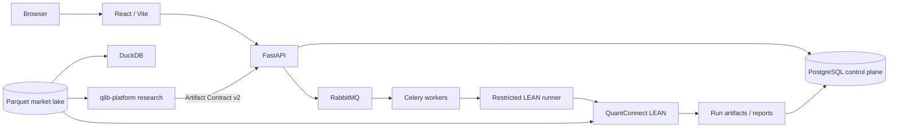
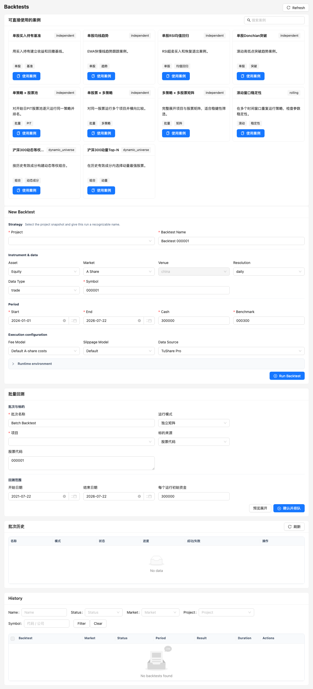

<div align="center">


# LEAN Local Platform

### Local-First A-share Execution & Control Plane on QuantConnect LEAN

**Governed Data · Research Artifact Handoff · Reproducible LEAN Validation · Optimization · Paper Execution · Audit-Ready Evidence**

<p>
  <a href="https://github.com/magic-alt/lean-local-platform/actions/workflows/ci.yml"></a>
  <a href="LICENSE"></a>
  
  
  
  
  <a href="docs/release-status.md"></a>
</p>

[Quick Start](#quick-start) · [Architecture](#architecture) · [Core Workflow](#core-workflow) · [Product Tour](#product-tour) · [Documentation](#documentation) · [Contributing](CONTRIBUTING.md) · [Changelog](CHANGELOG.md) · [Release Status](docs/release-status.md)

English · [简体中文](README.zh-CN.md)

</div>

> [!IMPORTANT]
> **Current release status: NOT CERTIFIED.** The PostgreSQL/RabbitMQ architecture migration invalidated earlier certification evidence. **Live broker writes and P9 activation are disabled.** Read [Current Release Status](docs/release-status.md) before using the platform in any production-like environment.

LEAN Local Platform is an open-source **Execution Plane / Control Plane** built around [QuantConnect LEAN](https://github.com/QuantConnect/Lean). It turns governed market data and externally produced research artifacts into reproducible LEAN validation, backtests, optimization runs, paper-account state, and audit-ready operational evidence.

LEAN Local Platform 是一个围绕 **QuantConnect LEAN** 构建的本地优先量化执行与控制平台。项目重点不是“把一次回测跑出来”，而是让数据版本、代码快照、研究 Artifact、执行参数、运行环境、结果证据与 Paper 生命周期都能够被追踪、复现和审计。

Model research intentionally lives in the separate [`qlib-platform`](https://github.com/magic-alt/qlib-platform) **Research Plane**. Research outputs cross the repository boundary only through versioned, content-addressed artifacts and are revalidated here before execution workflows continue.

---

## Why LEAN Local Platform

A backtest result is useful only when the system can explain exactly how it was produced and whether the same evidence can be reproduced later.

LEAN Local Platform is designed to answer:

- **Which exact market-data release was used?** Market facts, PIT inputs, manifests and hashes must have stable identity.
- **Which code and runtime produced the result?** Project snapshots, parameters and runtime fingerprints are preserved as evidence.
- **Did research cross the execution boundary safely?** Imported artifacts are validated fail-closed rather than silently repaired or reinterpreted.
- **Is LEAN still authoritative?** Backtest and execution validation remain anchored to QuantConnect LEAN instead of a second bespoke execution engine.
- **Can operational state be reconstructed?** Paper intents, fills, ledgers, checkpoints and stored evidence are designed for replay and audit.
- **Where does research end and execution begin?** `qlib-platform` owns model research; this repository owns governed execution validation and operational state.

### What makes it different

| Principle | What it means in this repository |
| --- | --- |
| **Reproducible by design** | Project snapshots, data versions, runtime fingerprints, manifests, hashes, logs, reports and raw results are preserved as evidence. |
| **Fail-closed data governance** | Ingestion uses normalization, source selection, QA/PIT/reference gates, quarantine, watermarks, lineage, manifests and atomic publication. |
| **LEAN remains authoritative** | Backtests and execution validation are performed through QuantConnect LEAN rather than a parallel custom execution engine. |
| **Research / execution separation** | `qlib-platform` owns features, models and research; LEAN Local Platform owns governed data publication, LEAN validation, Paper state, OMS boundaries and operations. |
| **Explicit sources of truth** | Parquet, PostgreSQL, RabbitMQ and DuckDB have distinct responsibilities instead of becoming interchangeable state stores. |
| **Evidence over claims** | Run artifacts, validation results, checksums, lineage and lifecycle state are first-class outputs. |
| **Safety boundaries stay visible** | Live broker writes and P9 activation remain disabled until a separate architecture, security and certification effort explicitly enables them. |

---

## Architecture



The diagram is an orientation view. Normative ownership, deployment and recovery rules live in [Architecture](docs/architecture.md), [Current State](docs/current-state.md), [Market Data Lake](docs/market_data_lake.md) and [Release Status](docs/release-status.md).

### Execution Plane — this repository

- governed market-data ingestion and immutable DataRelease publication;
- authoritative QuantConnect LEAN backtests and execution validation;
- backtest batches, rolling windows, optimization and walk-forward execution workflows;
- fail-closed Artifact Contract v2 import and lineage/hash validation;
- Paper account lifecycle, intents, fills, ledger, checkpoints and projections;
- project snapshots, runtime fingerprints, reports and operational evidence;
- deployment, health, scheduling, alerts, backup/restore and recovery controls;
- OMS and broker-integration boundaries without ordinary live-order activation.

### Research Plane — `qlib-platform`

- Qlib materialization and DatasetVersion lifecycle;
- feature/factor engineering and PIT-aware research;
- model training, selection and walk-forward research;
- prediction/model research artifacts;
- research-only portfolio screening and target construction;
- governed `TARGET_PORTFOLIO` handoff through Artifact Contract v2.

### Sources of truth

| Concern | Authority |
| --- | --- |
| Market time-series facts | Parquet under `$LEAN_DATA_DIR` |
| Tasks, registries, accounts, PIT/control metadata, audit | PostgreSQL `lean_platform` |
| Celery result metadata | PostgreSQL `lean_celery` — disposable, not business authority |
| MLflow metadata | PostgreSQL `lean_mlflow` |
| Task transport | RabbitMQ |
| Backtest / execution validation | LEAN Local Platform + QuantConnect LEAN |
| Research execution | External `qlib-platform` |
| Parquet query | DuckDB |
| Analytical mirror | ClickHouse — optional, never authoritative |

**PostgreSQL is not a market quote store. RabbitMQ is transport, not business truth. SQLite is test-only.**

---

## Quick start

### Requirements

- Git
- Docker Engine or Docker Desktop
- Docker Compose v2
- Python 3.12 for repository control scripts
- at least 16 GiB assigned to Docker Desktop for a full initial data synchronization

### Docker — recommended local path

```bash
git clone https://github.com/magic-alt/lean-local-platform.git
cd lean-local-platform
cp .env.example .env
```

Set unique infrastructure secrets in `.env`:

```text
LEAN_POSTGRES_ADMIN_PASSWORD
LEAN_POSTGRES_APP_PASSWORD
LEAN_POSTGRES_CELERY_PASSWORD
LEAN_POSTGRES_MLFLOW_PASSWORD
LEAN_RABBITMQ_PASSWORD
```

Configure credentials only for providers you actually enable, for example `TUSHARE_TOKEN`.

Validate the host and start the full stack:

```bash
python scripts/platformctl.py --mode docker --profile full doctor
python scripts/platformctl.py --mode docker --profile full start
python scripts/platformctl.py --mode docker --profile full status
```

The API health endpoint is available at `GET /api/health` on the configured API port.

> [!TIP]
> New to the project? Start the stack, complete the minimal **Data → Project → Backtest → Report** path, then continue with [Help Center](docs/help/index.md) and the [Documentation Hub](docs/README.md).

> [!WARNING]
> Never commit `.env`, provider credentials, broker credentials, API tokens, runner tokens or downloaded market data.

### Native host

Docker and native hosts are deployment adapters over the same application architecture.

```bash
python scripts/platformctl.py --mode native doctor
python scripts/platformctl.py --mode native --profile core start
```

On a Dockerless Windows development machine:

```powershell
.\scripts\start_windows_native.ps1
```

Windows user-process management is the local-development default. Windows SCM is reserved for explicitly configured certified deployments. See [Native Deployment](docs/native-deployment.md).

---

## Core workflow

```text
Governed market data
    -> immutable DataRelease
    -> qlib-platform research
    -> Artifact Contract v2
    -> content-addressed TARGET_PORTFOLIO
    -> fail-closed import
    -> authoritative LEAN validation
    -> backtest / optimization
    -> Paper account lifecycle
    -> operational evidence
```

The central invariant is simple: **execution must never silently change the identity or meaning of its research and data inputs.**

The platform preserves `artifactId`, `DataReleaseId`, target-weight SHA-256, lineage and lifecycle state. Invalid research artifacts are rejected rather than silently repaired or reinterpreted.

### Research / execution boundary

```text
lean-local-platform
  └─ publishes immutable DataRelease
       ↓
qlib-platform
  ├─ features and factors
  ├─ model training and selection
  └─ walk-forward research
       ↓
Artifact Contract v2
+ content-addressed TARGET_PORTFOLIO
       ↓
lean-local-platform
  ├─ fail-closed import
  ├─ lineage / hash validation
  ├─ authoritative LEAN validation
  └─ backtest / optimization / paper control
```

Research artifacts do not become executable merely because they were produced successfully upstream.

---

## Capabilities

| Area | Highlights |
| --- | --- |
| **Execution validation** | authoritative QuantConnect LEAN backtests and validation workflows |
| **A-share data** | daily-data ingestion, source governance, normalization, QA, PIT/reference gates, lineage and immutable Parquet publication |
| **Experiments** | child backtests, rolling windows, parameter grids, experiment batches, optimization and walk-forward workflows |
| **Research handoff** | Artifact Contract v2 and content-addressed `TARGET_PORTFOLIO` import from `qlib-platform` |
| **Paper execution** | immutable intents, fills, ledgers, checkpoints, rebuildable projections and operational gates |
| **Evidence & auditability** | project snapshots, dataset versions, runtime fingerprints, raw results, logs, reports, manifests and checksums |
| **Deployment** | Docker and native-host adapters over the same application architecture |
| **Operations** | health checks, scheduling, alerts, backup/restore, recovery workflows and optional observability services |

---

## Product tour

<p align="center">
  <a href="docs/help/backtests.md">
    
  </a>
</p>

<p align="center"><sub><strong>Real product UI.</strong> The screenshot is generated by the repository's Playwright documentation workflow using isolated E2E data. It demonstrates product behavior; it is not release-certification evidence.</sub></p>

<p align="center">
  <a href="docs/help/assets/data-library.png">Data Library</a> ·
  <a href="docs/help/assets/project-editor.png">Projects</a> ·
  <a href="docs/help/assets/optimization-workbench.png">Optimization</a> ·
  <a href="docs/help/assets/research-workspace.png">Research Handoff</a> ·
  <a href="docs/help/assets/reports-library.png">Reports</a>
</p>

Tracked documentation screenshots can be regenerated from the isolated frontend E2E workflow. Branding and screenshot policy is documented in [Branding & Discoverability](docs/branding-and-discovery.md).

---

## Deployment modes

| Mode | Best for | Entry point |
| --- | --- | --- |
| **Docker / full** | recommended complete local stack | `python scripts/platformctl.py --mode docker --profile full start` |
| **Docker / validation** | containerized development and parity checks | `platformctl` Docker profiles documented in [Deployment](docs/deployment.md) |
| **Native / core** | Dockerless or native-host development | `python scripts/platformctl.py --mode native --profile core start` |
| **Windows local process** | Dockerless Windows workstation | `.\scripts\start_windows_native.ps1` |
| **Windows SCM** | explicitly configured certified deployment path | opt-in; see [Native Deployment](docs/native-deployment.md) |

Deployment mode does not change the core authority model: Parquet remains the market-fact layer, PostgreSQL remains the control plane, RabbitMQ remains transport, and LEAN remains the authoritative execution validator.

---

## Current support boundary

| Capability | Current status |
| --- | --- |
| China A-share daily data | Supported production surface |
| Backtest | Supported |
| Optimization / experiment batches | Supported |
| Research Artifact v2 import | Supported |
| Paper accounts | Supported with operational gates |
| Docker deployment | Supported |
| Windows/Linux native deployment | Supported adapter |
| Cross-asset workflows | Research-only or preview-only where documented |
| Minute / tick production execution | Disabled |
| Live broker writes / P9 activation | **Disabled** |
| Current release certification | **NOT CERTIFIED** |

The exact boundary is versioned in [Current State](docs/current-state.md) and [Release Status](docs/release-status.md). Those documents take precedence over historical audits, screenshots or older release evidence.

---

## Project layout

<details>
<summary><strong>Show repository structure</strong></summary>

```text
lean-local-platform/
├── .github/              GitHub governance, templates, CODEOWNERS, workflows
├── config/               deployment and portable data-source configuration
├── data/                 authoritative local market lake / derived caches
├── deploy/               native-host deployment assets
├── docker/               observability and container support files
├── docs/                 architecture, operations, API, help and history
├── examples/             standalone examples outside the production path
├── scripts/              control, validation, migration and audit utilities
├── strategies/           strategy templates
└── web/
    ├── backend/           FastAPI, services, repositories, Celery, LEAN integration
    ├── frontend/          React / TypeScript application
    └── runtime/           local runtime artifacts; not source control
```

Runtime artifacts belong under `web/runtime/` or the configured `$LEAN_DATA_DIR`. Root-level `results/`, `runs/`, `Data/` and `parquet/` directories are not supported. See [Repository Layout](docs/repository_layout.md).

</details>

---

## Documentation

The canonical entry point is the **[Documentation Hub](docs/README.md)**.

| Start here | Use it for |
| --- | --- |
| [Current State](docs/current-state.md) | current architecture, operating facts and support boundary |
| [Architecture](docs/architecture.md) | system components, authority boundaries and data flow |
| [Deployment](docs/deployment.md) | Docker deployment, secrets, PostgreSQL/RabbitMQ and recovery |
| [Native Deployment](docs/native-deployment.md) | Windows/Linux native-host adapters and runtime requirements |
| [Data Sources](docs/data_sources.md) | provider boundaries and governed source behavior |
| [Data Pipeline](docs/data_pipeline.md) | ingestion, quality, publication and lineage |
| [Market Data Lake](docs/market_data_lake.md) | Parquet authority and storage model |
| [API](docs/api.md) | API semantics and integration examples |
| [Help Center](docs/help/index.md) | task-oriented Data, Project, Backtest, Optimization, Research and Paper guides |
| [Testing](docs/testing.md) | validation matrix and test boundaries |
| [Release Status](docs/release-status.md) | current certification state and production-like restrictions |
| [Branding & Discoverability](docs/branding-and-discovery.md) | screenshots, social preview and repository identity |
| [Roadmap](docs/roadmap.md) | planned engineering direction |

Historical material under `docs/history/` is evidence for its original baseline and is **not** current operating guidance.

---

## Development

### Backend

```bash
cd web/backend
.venv/bin/python -m uvicorn app.main:app --reload --host 127.0.0.1 --port 8000
```

### Frontend

```bash
cd web/frontend
npm run dev
```

### Repository validation

```bash
python scripts/check_repository_hygiene.py
python scripts/check_developer_governance.py
python scripts/check_oss_governance.py
```

Backend:

```bash
cd web/backend
.venv/bin/python -m pytest -q
```

Frontend:

```bash
cd web/frontend
npm ci
npm run build
```

LEAN Docker integration is opt-in:

```bash
cd web/backend
RUN_LEAN_DOCKER_INTEGRATION=1 .venv/bin/python -m pytest -q tests/test_ashare_lean_integration.py
```

See [Testing](docs/testing.md) for the complete validation matrix.

### CI policy

`.github/workflows/ci.yml` separates:

1. **Always-on governance checks** — repository structure, open-source metadata, policy links and hygiene.
2. **Compute-heavy validation lanes** — backend, frontend, native contracts, Windows contracts and optional LEAN integration, controlled by repository variables where hosted execution is intentionally constrained.

A skipped heavy lane is not evidence that the corresponding runtime passed.

---

## Contributing

Contributions are welcome. Read [CONTRIBUTING.md](CONTRIBUTING.md), follow the [Code of Conduct](CODE_OF_CONDUCT.md), and use the repository issue / pull-request templates.

Key project invariants:

- keep market time series in Parquet, not PostgreSQL;
- keep RabbitMQ as transport, not business truth;
- preserve the `qlib-platform` → Artifact Contract v2 → `lean-local-platform` boundary;
- never silently repair invalid research artifacts;
- do not introduce broker writes or live activation as incidental feature work;
- update the `Unreleased` section of `CHANGELOG.md` for every commit.

Security-sensitive findings must follow [SECURITY.md](SECURITY.md), not a public bug report.

---

## Project status

The engineering priority is deliberately conservative:

```text
Data correctness
    ↓
Research contract integrity
    ↓
Reproducible LEAN validation
    ↓
Paper execution
    ↓
Operational reliability
    ↓
Release certification
    ↓
Live execution
```

**Live execution is not enabled.** Always check [Release Status](docs/release-status.md) before relying on historical certification evidence.

---

## License

This project is licensed under the [Apache License 2.0](LICENSE).

QuantConnect LEAN is an independent upstream project and is also distributed under Apache-2.0. QuantConnect and LEAN names and trademarks remain the property of their respective owners. This repository is not presented as an official QuantConnect product.

---

<div align="center">

**Built for quant workflows where reproducibility, data lineage and execution evidence matter as much as strategy code.**

[Documentation](docs/README.md) · [Roadmap](docs/roadmap.md) · [Contributing](CONTRIBUTING.md) · [Security](SECURITY.md) · [Changelog](CHANGELOG.md)

</div>
