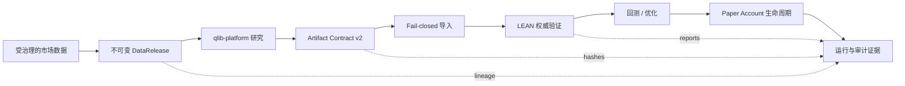
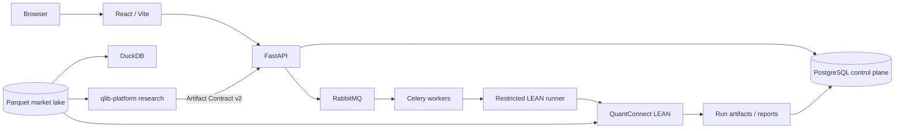

<div align="center">

# LEAN Local Platform

**在本地基础设施上，构建可复现的量化研究交付、LEAN 验证与模拟交易控制平面。**

一个围绕 [QuantConnect LEAN](https://github.com/QuantConnect/Lean) 构建的 local-first 开源量化平台，面向受治理的 A 股数据、研究成果交付、回测、优化、Paper Trading 与可审计运行证据。

[](https://github.com/magic-alt/lean-local-platform/actions/workflows/ci.yml)
[](LICENSE)
[](https://www.python.org/)
[](https://github.com/QuantConnect/Lean)
[](docs/release-status.md)

[快速开始](#快速开始) · [系统架构](#系统架构) · [文档](#文档) · [路线图](docs/roadmap.md) · [参与贡献](CONTRIBUTING.md)

[English](README.md) · 简体中文

</div>

> [!IMPORTANT]
> **当前版本状态：NOT CERTIFIED。** PostgreSQL / RabbitMQ 架构迁移后，旧版本认证证据不再适用于当前架构；Live Trading / P9 激活仍处于禁用状态。任何生产化或类生产部署前，请先阅读 [Current Release Status](docs/release-status.md)。

## 产品界面

<p align="center">
  <a href="docs/help/backtests.md">
    
  </a>
</p>

<p align="center"><sub><strong>真实产品 UI。</strong> 截图由仓库现有 Playwright 文档流程使用隔离 E2E 数据生成；它用于展示产品能力，不代表当前版本已完成 Release Certification。</sub></p>

<p align="center">
  <a href="docs/help/assets/data-library.png">数据</a> ·
  <a href="docs/help/assets/project-editor.png">项目</a> ·
  <a href="docs/help/assets/optimization-workbench.png">优化</a> ·
  <a href="docs/help/assets/research-workspace.png">研究交付</a> ·
  <a href="docs/help/assets/reports-library.png">报告</a>
</p>

## 这是什么项目？

LEAN Local Platform 是一个以 **QuantConnect LEAN** 为权威执行验证引擎的开源量化执行与控制平台，核心技术栈包括 **FastAPI、React、Celery、RabbitMQ、PostgreSQL、Parquet 与 DuckDB**。

它解决的不是“能不能跑一次回测”，而是更难的工程问题：当你在数周或数月后重新审计一次策略结果时，能否明确回答——究竟是哪一个数据版本、代码快照、参数、运行时、研究产物与验证证据生成了这个结果。

模型研究被有意隔离在独立的 [`qlib-platform`](https://github.com/magic-alt/qlib-platform) 仓库中。研究结果只能通过版本化、内容寻址的 Artifact Contract 进入本平台，并在进入执行工作流前再次进行 fail-closed 校验。

## 为什么需要它？

很多量化系统都可以生成一份回测报告，但更少的系统能够在之后准确回答：

> **哪份代码、哪一版数据、哪些参数、哪个运行环境、哪一个研究 Artifact，以及哪组验证证据共同产生了当前结果？**

LEAN Local Platform 围绕这个问题设计。

| 设计目标 | 工程含义 |
| --- | --- |
| **可复现优先** | 保存项目快照、数据集版本、运行时指纹、manifest、hash、日志、报告和原始结果。 |
| **数据治理 fail-closed** | 数据接入包含标准化、数据源选择、QA/PIT/参考数据门禁、隔离、watermark、lineage、hash 与原子发布。 |
| **LEAN 保持权威** | 回测和执行验证通过 QuantConnect LEAN 完成，不再维护第二套自研执行引擎。 |
| **研究与执行分离** | `qlib-platform` 负责 feature/model/research；本仓库负责数据发布、LEAN 验证、Paper、OMS 边界与运行控制。 |
| **事实来源明确** | Parquet、PostgreSQL、RabbitMQ、DuckDB 与可选分析服务各自承担清晰职责。 |
| **安全边界显式** | Live broker write 和 P9 activation 在独立架构与认证工作完成前保持禁用。 |

## 端到端工作流



平台会保留 `artifactId`、`DataReleaseId`、target-weight SHA-256、lineage 与 lifecycle state。无效研究产物会被拒绝，而不是被系统静默修复或重新解释。

## 核心能力

| 领域 | 当前能力 |
| --- | --- |
| **执行验证** | 基于 QuantConnect LEAN 的权威回测与执行验证。 |
| **A 股数据** | 日频数据接入、source governance、标准化、QA、PIT/参考数据门禁、lineage、不可变 release 与 Parquet 原子发布。 |
| **实验与优化** | 标准 child backtest、rolling window、参数网格、experiment batch、optimization 与 walk-forward。 |
| **研究交付** | 从外部 `qlib-platform` 导入 Artifact Contract v2 与内容寻址 `TARGET_PORTFOLIO`。 |
| **Paper Trading** | 不可变 intent、fill、ledger、checkpoint、可重建 projection 与运行门禁。 |
| **证据与审计** | 项目快照、数据版本、runtime fingerprint、raw result、log、report、manifest、checksum。 |
| **部署** | Docker 与 Native Host 共用同一应用架构。 |
| **运行治理** | Health check、调度、告警、备份恢复与可选 observability。 |

## 快速开始

### 前置条件

推荐本地环境：

- Git
- Docker Engine 或 Docker Desktop
- Docker Compose v2
- Python 3.12（用于仓库控制脚本）
- 完整首次数据同步时，建议为 Docker Desktop 分配至少 16 GiB 内存

### 1. 克隆并配置

```bash
git clone https://github.com/magic-alt/lean-local-platform.git
cd lean-local-platform
cp .env.example .env
```

在 `.env` 中设置唯一基础设施密码：

```text
LEAN_POSTGRES_ADMIN_PASSWORD
LEAN_POSTGRES_APP_PASSWORD
LEAN_POSTGRES_CELERY_PASSWORD
LEAN_POSTGRES_MLFLOW_PASSWORD
LEAN_RABBITMQ_PASSWORD
```

然后只配置实际启用的数据源，例如 `TUSHARE_TOKEN`。

> [!WARNING]
> 不要提交 `.env`、数据源凭据、券商凭据、API Token、Runner Token 或下载的市场数据。

### 2. 检查宿主机

```bash
python scripts/platformctl.py --mode docker --profile full doctor
```

### 3. 启动完整栈

```bash
python scripts/platformctl.py --mode docker --profile full start
```

### 4. 查看状态

```bash
python scripts/platformctl.py --mode docker --profile full status
```

API 健康检查端点为配置 API 端口上的 `GET /api/health`。

关于密钥管理、备份恢复、类生产要求与故障恢复，请继续阅读 [Deployment](docs/deployment.md)。

## 系统架构



### Source of Truth

| 关注对象 | 权威来源 |
| --- | --- |
| 市场时序事实 | `$LEAN_DATA_DIR` 下的 Parquet |
| Task、Registry、Account、PIT/control metadata、Audit | PostgreSQL `lean_platform` |
| Celery result metadata | PostgreSQL `lean_celery`，可丢弃，不是业务事实来源 |
| MLflow metadata | PostgreSQL `lean_mlflow` |
| 任务传输 | RabbitMQ |
| 回测 / 执行验证 | Platform + QuantConnect LEAN |
| 研究执行 | 外部 `qlib-platform` |
| Parquet 查询 | DuckDB |
| 分析镜像 | ClickHouse，可选且永远不作为权威来源 |

**PostgreSQL 不存市场行情时序；RabbitMQ 只是 transport，不是业务事实；SQLite 只允许用于隔离测试。**

完整模型见 [Current State](docs/current-state.md) 与 [Architecture](docs/architecture.md)。

## 研究 / 执行边界

```text
lean-local-platform
  └─ 发布不可变 DataRelease
       ↓
qlib-platform
  ├─ features / factors
  ├─ model training / selection
  └─ walk-forward research
       ↓
Artifact Contract v2
+ content-addressed TARGET_PORTFOLIO
       ↓
lean-local-platform
  ├─ fail-closed import
  ├─ lineage / hash validation
  ├─ authoritative LEAN validation
  └─ backtest / optimization / paper control
```

这个边界是有意设计的：LEAN Local Platform 不扩张成第二个特征工程或模型训练平台，研究结果也不会因为“上游成功生成”就自动获得可执行资格。

## 当前支持边界

| 能力 | 当前状态 |
| --- | --- |
| 中国 A 股日频数据 | Supported production surface |
| Backtest | Supported |
| Optimization / experiment batches | Supported |
| Research Artifact v2 import | Supported |
| Paper accounts | Supported with operational gates |
| Docker deployment | Supported |
| Windows/Linux native deployment | Supported adapter |
| Cross-asset workflows | 仅研究或 Preview，按具体文档定义 |
| Minute / tick production execution | Disabled |
| Live broker writes / P9 activation | **Disabled** |
| 当前版本认证 | **NOT CERTIFIED** |

精确边界以 [Current State](docs/current-state.md) 和 [Release Status](docs/release-status.md) 为准；它们的优先级高于历史 audit、截图或旧版认证记录。

## Native 部署

Docker 与 Native Host 是同一应用架构的不同部署适配器。

```bash
python scripts/platformctl.py --mode native doctor
python scripts/platformctl.py --mode native --profile core start
```

Windows 无 Docker 开发机：

```powershell
.\scripts\start_windows_native.ps1
```

Windows 默认使用用户进程进行本地开发；Windows SCM 仅用于明确配置的认证部署。详见 [Native Deployment](docs/native-deployment.md)。

## 文档

从 [Documentation Hub](docs/README.md) 开始。

| 目标 | 推荐入口 |
| --- | --- |
| **理解系统** | [Current State](docs/current-state.md) · [Architecture](docs/architecture.md) |
| **安装与运维** | [Deployment](docs/deployment.md) · [Native Deployment](docs/native-deployment.md) · [Operations Runbook](docs/operations/level5-runbook.md) |
| **使用数据** | [Data Sources](docs/data_sources.md) · [Data Pipeline](docs/data_pipeline.md) · [Market Data Lake](docs/market_data_lake.md) |
| **API 集成** | [API](docs/api.md) · [Help Center](docs/help/index.md) |
| **验证变更** | [Testing](docs/testing.md) · [Release Status](docs/release-status.md) |
| **维护项目品牌** | [Branding & Discoverability](docs/branding-and-discovery.md) · 截图、Social Preview 与仓库迁移说明 |
| **规划后续开发** | [Roadmap](docs/roadmap.md) · [Changelog](CHANGELOG.md) |

`docs/history/` 中的历史文档只代表原始 baseline 的历史证据，**不是当前运行指南**。

## 开发

Backend：

```bash
cd web/backend
.venv/bin/python -m uvicorn app.main:app --reload --host 127.0.0.1 --port 8000
```

Frontend：

```bash
cd web/frontend
npm run dev
```

仓库与治理检查：

```bash
python scripts/check_repository_hygiene.py
python scripts/check_developer_governance.py
python scripts/check_oss_governance.py
```

Backend tests：

```bash
cd web/backend
.venv/bin/python -m pytest -q
```

Frontend build：

```bash
cd web/frontend
npm ci
npm run build
```

完整验证矩阵见 [Testing](docs/testing.md)。

## 参与贡献

欢迎贡献。请先阅读 [CONTRIBUTING.md](CONTRIBUTING.md)，遵循 [Code of Conduct](CODE_OF_CONDUCT.md)，并使用仓库现有 Issue / Pull Request 模板。

重要工程约束：

- 市场时序数据保存在 Parquet，而不是 PostgreSQL；
- RabbitMQ 只负责 transport，不承担业务事实；
- 保持 `qlib-platform` → Artifact Contract v2 → `lean-local-platform` 边界；
- 不静默修复无效研究 Artifact；
- 不把 broker write 或 live activation 作为普通 feature 顺带引入；
- 每次 commit 都要更新 `CHANGELOG.md` 的 `Unreleased`。

涉及安全问题时，请遵循 [SECURITY.md](SECURITY.md)，不要直接公开提交漏洞 Issue。

## 项目状态

工程优先级刻意保持保守：

```text
数据正确性
    ↓
研究契约完整性
    ↓
可复现 LEAN 验证
    ↓
Paper execution
    ↓
运行可靠性
    ↓
Release certification
    ↓
Live execution
```

当前未启用 Live Execution。使用任何历史认证证据前，都应先查看 [docs/release-status.md](docs/release-status.md)。

## License

本项目采用 [Apache License 2.0](LICENSE)。

QuantConnect LEAN 是独立上游项目，同样以 Apache-2.0 分发。QuantConnect 与 LEAN 名称及商标归其各自权利人所有；本仓库不代表 QuantConnect 官方产品。

---

<div align="center">

**适用于那些把可复现性、数据 lineage 与执行证据看得和策略代码同样重要的量化工作流。**

[Documentation](docs/README.md) · [Roadmap](docs/roadmap.md) · [Contributing](CONTRIBUTING.md) · [Security](SECURITY.md)

</div>