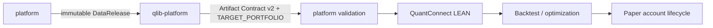

# LEAN Local Platform Documentation

This directory contains the current technical, operational, and user-facing documentation for LEAN Local Platform.

> [!IMPORTANT]
> Start with [Current State](current-state.md) and [Release Status](release-status.md). They define the current architecture, support boundary, and certification status. Files under [`history/`](history/) are historical evidence and must not be treated as current operating instructions.

## Choose your path

| You want to... | Start here |
| --- | --- |
| Understand what the platform is and what it currently supports | [Current State](current-state.md) |
| Understand components, boundaries, storage, and recovery | [Architecture](architecture.md) |
| Install or run the platform | [Deployment](deployment.md) |
| Run without Docker on a supported native host | [Native Deployment](native-deployment.md) |
| Understand market-data providers and source governance | [Data Sources](data_sources.md) |
| Understand synchronization and publication | [Data Pipeline](data_pipeline.md) |
| Operate local data sync, repair, status, and validation from the CLI | [Data Operations CLI](data-operations.md) |
| Understand the Parquet market-data authority | [Market Data Lake](market_data_lake.md) |
| Integrate with the backend | [API](api.md) |
| Validate a change | [Testing](testing.md) |
| Operate, recover, or diagnose the platform | [Operations Runbook](operations/level5-runbook.md) |
| Check whether a release is certified | [Release Status](release-status.md) |
| See planned work | [Roadmap](roadmap.md) |
| Use product-facing help | [Help Center](help/index.md) |

## Documentation map

### 1. System model

These documents define how the platform is supposed to work now.

- [Current State](current-state.md) — canonical current architecture and support snapshot.
- [Architecture](architecture.md) — component model, data/control paths, service boundaries, storage, and recovery.
- [Architecture Boundary](architecture_boundary.md) — explicit responsibility boundaries between platform subsystems and external research.
- [Repository Layout](repository_layout.md) — supported source, runtime, and data locations.
- [LEAN Runner](lean_runner.md) — restricted LEAN execution path and runner responsibilities.

### 2. Data platform

- [Data Sources](data_sources.md) — provider selection, source governance, and correctness constraints.
- [Data Pipeline](data_pipeline.md) — full, incremental, and on-demand synchronization plus publication semantics.
- [Data Operations CLI](data-operations.md) — portable data-root resolution plus status, update, bounded repair, and fail-closed validation commands.
- [Market Data Lake](market_data_lake.md) — Parquet authority, organization, and query model.

The core invariant is simple: **market time-series facts live in Parquet, not PostgreSQL**.

### 3. API and application behavior

- [API](api.md) — backend API contracts and error semantics.
- [Backtest Result Format](backtest_result_format.md) — result payload and artifact expectations.
- [Help Center](help/index.md) — product-facing operating guidance.

For endpoint inventory, prefer generated OpenAPI/help references where the current-state documentation says they are authoritative; avoid copying route counts into narrative documents.

### 4. Deployment and operations

- [Deployment](deployment.md) — Docker deployment, configuration, secrets, backup, and recovery.
- [Native Deployment](native-deployment.md) — native-host adapter and supported process-management modes.
- [Native Runtime Release](native-runtime-release.md) — native runtime release mechanics and constraints.
- [Operations Runbook](operations/level5-runbook.md) — SLO, RPO/RTO, alerts, incident response, restore, and release gates.

RabbitMQ is task transport, not business truth. PostgreSQL is the control-plane authority, not a quote store.

### 5. Validation and release governance

- [Testing](testing.md) — validation matrix and test lanes.
- [Release Status](release-status.md) — current certification state and evidence bindings.
- [Roadmap](roadmap.md) — current priorities and planned work.
- [Changelog](../CHANGELOG.md) — user-visible architecture, behavior, data, and operational changes.

> [!WARNING]
> The current post-migration release remains **NOT CERTIFIED**, and P9/live activation remains disabled. Historical certification evidence does not automatically survive architecture, database, broker, runtime-manager, or API-contract changes.

## Research-to-execution boundary



`qlib-platform` owns feature engineering, factor research, model training/selection, and walk-forward research. This repository owns canonical data publication, artifact validation, authoritative LEAN validation, paper-state control, execution boundaries, and operations.

See [Current State](current-state.md) for the canonical version of this boundary.

## Documentation authority rules

When documents disagree, use the following order:

1. [Current State](current-state.md) for the current architecture and support boundary.
2. [Release Status](release-status.md) for current certification state.
3. Generated API/help sources where current-state documentation marks them authoritative.
4. Topic-specific active documents in this directory.
5. Historical audit material only for the baseline it explicitly records.

Do not use screenshots, historical audits, old migration plans, or archived architecture documents to override current-state documentation.

## Writing and maintenance conventions

When changing documentation:

- describe **current behavior** in active docs and move obsolete baselines to `history/` instead of mixing eras;
- link to a canonical source instead of copying volatile counts, versions, or route inventories unnecessarily;
- use explicit labels such as `Supported`, `Preview`, `Disabled`, or `NOT CERTIFIED` for support-sensitive behavior;
- preserve the `qlib-platform` → Artifact Contract v2 → `platform` responsibility boundary;
- keep live broker writes and P9 activation out of ordinary feature documentation unless the architecture boundary itself is deliberately changed;
- update the `Unreleased` section of [`CHANGELOG.md`](../CHANGELOG.md) for repository changes according to project policy.

## Contributing to the docs

Repository-wide contribution guidance lives in [`CONTRIBUTING.md`](../CONTRIBUTING.md). Security-sensitive information belongs in [`SECURITY.md`](../SECURITY.md), not in a public issue or documentation example.

For documentation/governance changes, the repository validation baseline includes:

```bash
python scripts/check_repository_hygiene.py
python scripts/check_developer_governance.py
python scripts/check_oss_governance.py
```

Return to the [project README](../README.md).
