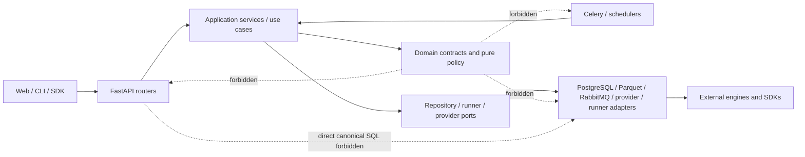

# Modular-Monolith Architecture Baseline

This document is the first bounded remediation slice for Issue #66. It freezes a reproducible **static** architecture baseline before implementation is moved between modules. It does not claim that a smaller file is a better architecture, and it does not claim production performance evidence that has not been measured on the production-like PostgreSQL/RabbitMQ profile.

## Current hotspot anchors

The tracked baseline was captured from `main` at `dbe7f4313e98504bc4b9adc7b5e4c0cc5a5def64` after the integrated workflow PR was merged.

| Module | Bytes | Current responsibility signal |
| --- | ---: | --- |
| `app/services/data_sync.py` | 275,499 | provider IO, normalization, lineage, canonical publication and orchestration remain heavily co-located |
| `app/services/experiment_batches.py` | 87,784 | experiment orchestration, submission, retry/restart and recovery remain concentrated |
| `app/db.py` | 67,741 | compatibility entry, bootstrap/schema and database helpers remain concentrated |
| `app/runner_service.py` | 34,152 | HTTP service, workspace validation, runtime execution and cleanup remain in one compatibility surface |

Any edit to one of these four files must update `config/architecture-baseline.json` deliberately. The byte anchor is an audit trigger, **not** a score: shrinking a file without improving ownership, dependency direction, recovery semantics and measured behavior does not satisfy #66.

## Dependency direction

The target remains a modular monolith unless an independently scalable/failing workload proves a service boundary is necessary.



The executable policy currently enforces two fail-fast rules:

1. `app/domain` cannot import FastAPI/Starlette, Celery/Kombu, database/runtime adapters, or provider/broker vendor SDKs; it also cannot import upward into `api`, `tasks`, `services`, `repositories`, `runners`, or `lean_engine`.
2. `app/api` and `app/tasks` cannot issue direct SQL writes to canonical-writer or orchestration-state tables. Audit-critical canonical tables must still have exactly the single writer declared by `app/architecture/state_ownership.py`.

These are intentionally narrow, enforceable rules. Additional dependency directions should only become blocking once current legacy violations have either been removed or explicitly characterized; a rule that merely grandfathered arbitrary violations would not be a useful gate.

## Reproducible static evidence

Generate the complete current source report:

```bash
python scripts/architecture_baseline.py --json
```

The report is deterministic and contains:

- Python module count, bytes and line count under `web/backend/app`;
- per-hotspot function/class count, structural branch points, largest function spans and largest-function branch points;
- the complete internal Python import-edge graph;
- strongly connected dependency components with more than one module;
- the twenty largest Python modules by bytes;
- all boundary-policy violations.

Generate reusable JSON and Mermaid evidence:

```bash
python scripts/architecture_baseline.py \
  --baseline config/architecture-baseline.json \
  --check \
  --output web/runtime/audit/architecture-baseline.json \
  --mermaid-output web/runtime/audit/architecture-dependencies.mmd
```

`branchPoints` is a transparent structural proxy: the AST count of `If`, loops, `Try`, `Match`, boolean expressions, conditional expressions, comprehensions and exception handlers. It is not presented as an exact McCabe score. `maxFunctionLines` is the largest function source span. The purpose is comparable before/after evidence, not an arbitrary complexity grade.

## CI boundary gate

Governance CI runs both:

```bash
python scripts/check_architecture_boundaries.py
python scripts/architecture_baseline.py --baseline config/architecture-baseline.json --check
```

Backend tests additionally contain negative fixtures proving that a domain vendor/framework import, an API direct ledger write, or a second canonical writer is rejected. This keeps the policy executable rather than documentary.

## Runtime performance baseline remains open

Static analysis cannot prove hot-path performance or recovery behavior. Before a performance-sensitive extraction is accepted, the fixed production-like fixture must record at least:

- latency p50 and p95;
- peak RSS;
- queue throughput;
- PostgreSQL transaction count and retry count;
- output row count and content SHA-256;
- DataRelease identity.

Those measurements must use the #61 PostgreSQL/RabbitMQ production-like profile. A regression requires a documented exception rather than silently refreshing a baseline. This first PR therefore does not invent workstation or hosted-CI numbers and does not close #66.

## Extraction order after this baseline

1. `data_sync`: move provider IO and normalized-batch semantics behind the #63 provider contract; isolate pure validation/planning while the current orchestration facade remains the only state owner.
2. `experiment_batches`: separate pure experiment partition/model policy, backtest submitter port, repository/state transitions, and verifier/recovery coordination while preserving task/retry/cancel/restart and walk-forward certificate behavior.
3. `db.py`: separate bootstrap/migration/schema manifest/session responsibilities while retaining one compatibility entry and no dual writer.
4. runner: converge Docker/native/Windows SCM behind one runner port and preserve ordering/failure mapping before shrinking `runner_service.py`.

Every slice starts with characterization/golden evidence, preserves the compatibility facade for one release, exercises fault/recovery behavior, and only then removes the obsolete path. Service extraction is not a goal by itself.
