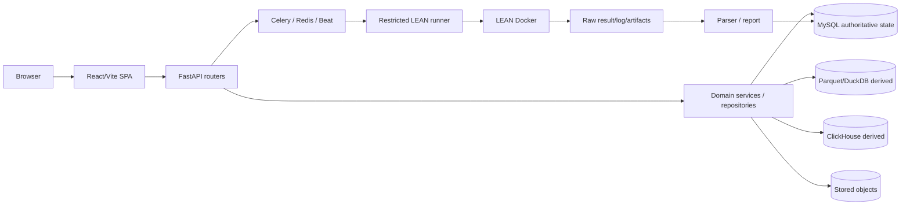
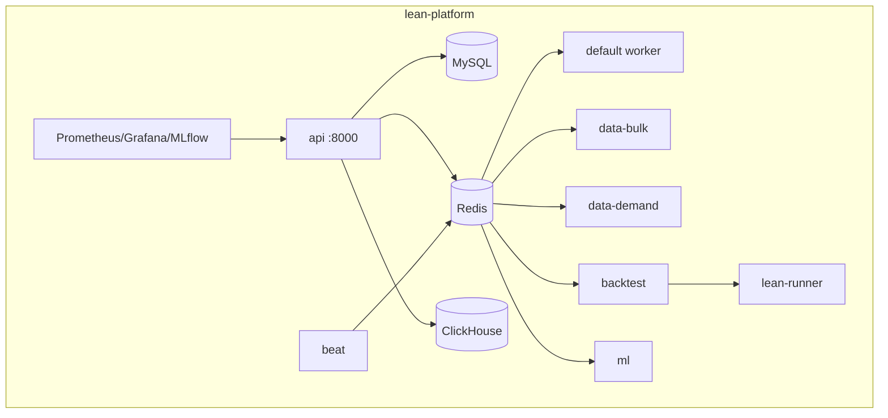
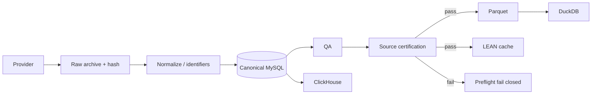
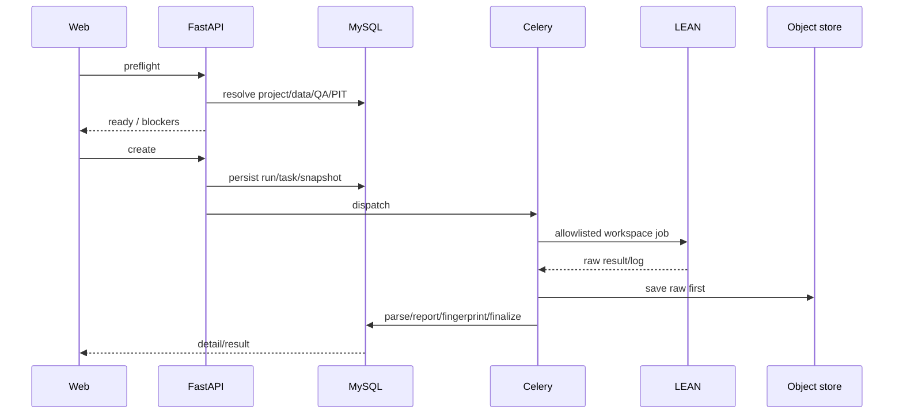
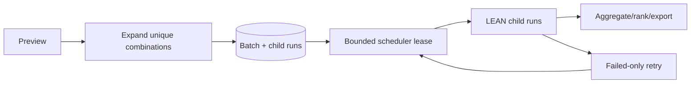
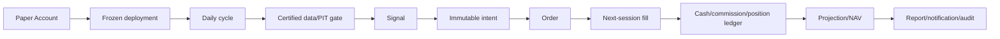
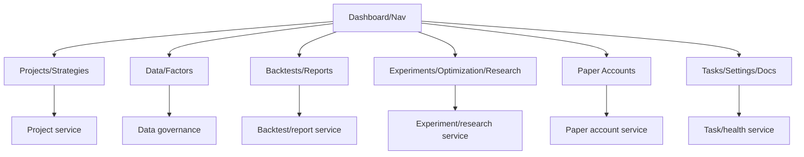
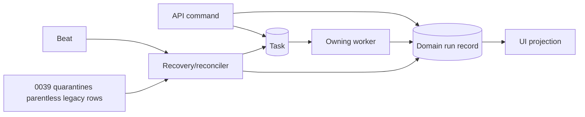
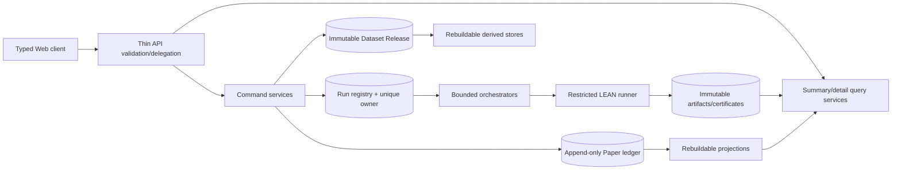

# Actual-environment system review — 2026-08-02（第二次审计）

- 审计对象：`lean-platform`
- 审计日期：2026-08-02（Asia/Shanghai）
- 环境：当前 `lean-platform` Compose project、`lean_market` MySQL 和实际挂载数据目录
- 审计标签：`audit-actual-env-20260802`
- 最终判定：**`LEVEL5_FAIL`**
- 分数：**51 / 100**
- 未关闭问题：**1 Critical、3 P0、8 P1、4 P2、2 P3**
- `NOT_VERIFIED`：**22**

## 1. Executive Summary

第二次审计确认第一次审计后的三个修复提交确实存在：`b07b0cc`（P0）、`47f1179`（P1）、`a81e4e2`（P2）。P0 migration `0039_p0_lineage_and_run_convergence` 已进入实际 MySQL；两个 Paper Account、opening ledger、projection 和 certification cohort 已创建；stale Research run 与 legacy Paper orphan 已收敛或 quarantine。这些属于实际环境中的有效整改成果。

但实际运行进程没有加载后两个提交：当前 API/OpenAPI 只有 225 paths，源码生成 230 paths；实际缺少 Dataset Release、Capability、QA detail、Reproducibility Certificate 和 Golden Pair 五个 endpoint；MySQL 仍停在 `0039`，`0040_p1_trust_and_reproducibility` 未应用；实际 list API 仍返回巨型旧 DTO 和旧 envelope。前端静态资源已是当前 build，而 API/worker 仍是较早进程，形成真实的前后端/代码/schema 部署偏差。故“源码已修复”不能替代实际验收。

最严重的事实仍未消失：回测 `000001-20210730-20260730-20260730152334` 在 canonical DB 中为 `success`，最终 validation 却为 `passed=false`、`severity=critical`。当前代码已修正 finalization 顺序，但没有迁移/重新判定该历史事实，也没有在当前实际进程上产生新的可信 run。因此 ACT-CRIT-001 仍为 Critical，单独足以判定 `LEVEL5_FAIL`。

Paper 的开户层已从 0 提升为 2 个账户，资金 1,000,000 与 3,000,000，opening ledger 与 projection 精确相符；但两个账户均为 `draft`，certification cohort 仍为 `collecting`，各 `0/21` sessions，没有 signal、cycle、order、fill、position、daily report 或 notification。部署显示 automation active，下一运行时间却已过期且没有 cycle。多账户执行、幂等、成交、收费和 21 日稳定性仍未被实际证明。

数据 equity/index 主链当前可用：19,220,229 行统一日线、17,703,084 行 production equity Parquet、44,741 行 production index Parquet、4 个 ready derived watermark、当前 source certification 成功。与此同时，Dataset Release 权威仍未部署，158 个 `dataset_versions` 全为 research/uncertified；期货、期权、可转债、分钟/tick 没有 canonical executable data；公司行动仅 59 行/3 symbols。数据主链为 PARTIAL，而不是全资产 Level 5。

本轮未创建任何业务资源、数据库、隔离环境、备份或恢复；唯一 POST 是无写入的 backtest preflight。没有执行全量同步、导入、Parquet rebuild、删除、ledger/certification 修改或故障注入。

## 2. 范围、方法与排除项

证据优先级严格采用：实际运行结果 → 当前数据库 → LEAN 原始 artifact/log → stored object/immutable ledger → API → Web → 集成测试 → 代码 → 单测 → 文档。已读取 README、CHANGELOG、architecture/API/roadmap、Compose、`.env.example`、docs/history、docs/operations、前后端、scripts、migration 0001–0040、后端测试、20 个 Playwright spec、LEAN 集成及 Level 3/4/5 脚本。

明确未执行：数据库备份/恢复/DR、隔离数据库或 Compose、库/数据/runtime 克隆、全量数据同步/导入/重建、删除/清空/重置、修改 ledger/certification、停止核心服务或用户任务。备份恢复完全排除且不计分。

后端 pytest 未运行：其 autouse fixture 会创建临时 SQLite，与“不创建隔离数据库”冲突。Playwright 未运行：global setup 会启动 `lean-e2e` MySQL/Redis/ClickHouse 并 seed synthetic data；审计开始前已经存在的独立 `lean-e2e`/旧 integration 容器未由本轮创建、未连接、未作为证据。内置 Browser skill 按说明初始化后返回 `No browser is available`，所以四视口、console 和视觉状态均保留 `NOT_VERIFIED`，没有用 mock 页面冒充实际 Web PASS。

## 3. 当前实际环境

| 项目 | 当前事实 | 状态 |
| --- | --- | --- |
| Compose | 声明 `app`/`test` profiles；当前 `lean-platform` 服务集合对应 `app`（test 未在该 project 激活）；api、5类worker、beat、mysql、redis、clickhouse、lean-runner、Prometheus、Grafana、MLflow在线 | PASS |
| API/Web | `http://127.0.0.1:8000`；FastAPI 托管 SPA | PASS |
| OpenAPI | 实际 225 paths / 198,915 bytes；源码 230 paths | FAIL |
| MySQL | 8.4.10，`lean_market`，147 tables，latest applied `0039` | PASS/PARTIAL |
| 未部署 migration | `0040_p1_trust_and_reproducibility`；4 张新表不存在 | FAIL |
| Redis/Celery | Redis healthy；5 workers pong；检查时无 reserved/scheduled queue | PASS |
| Beat | 在线并按分钟执行 recovery/scheduling/alert/resource monitor | PASS/PARTIAL |
| LEAN | restricted runner healthy；现有 3 个成功记录均有 LEAN artifact | PASS |
| 数据/runtime | `/Users/kaermax/Data`、`Data/parquet`、`web/runtime` | PASS |
| 资源 | project 4；backtest 3；batch 2；research 3；WF 1；Paper account/session 2/2 | PASS/PARTIAL |
| 告警 | 53 total、49 open、20 critical；33/33 notification deliveries failed | FAIL |
| 资源压力 | memory 92.24%，超过 90% critical threshold | FAIL |

实际 API/worker 容器启动早于 P1/P2 两个提交；Python 进程无 reload。前端 build 后静态 assets 与当前源码一致，故实际环境存在部署代次错位，而不是单纯文档漂移。

## 4. 最终成熟度与评分

| 维度 | 满分 | 得分 | 当前证据 |
| --- | ---: | ---: | --- |
| 架构 | 12 | 8 | 事实边界清楚、P0 ownership 改善；实际部署版本不一致、超大 service 仍在 |
| 功能完整性 | 12 | 8 | 主要入口和实际资源存在；跨资产、Optimization、Paper 下游为空 |
| Web 与用户流程 | 15 | 6 | build/HTTP 路由通过；真实浏览器不可用、API payload 仍过大 |
| API | 8 | 4 | 认证和主体 API 可用；实际契约落后源码并缺 5 endpoints |
| 数据 | 15 | 10 | equity/index 当前认证；authority split 和跨资产/公司行动缺口 |
| 回测 | 15 | 7 | 真实 LEAN 四方对账；canonical success/critical 矛盾且无 Golden pair |
| Experiment/WF | 8 | 3 | dynamic PIT batch 可查；WF 仍 lineage_broken，无 grid/rolling 证据 |
| Paper | 12 | 4 | 两账户 opening ledger/projection 通过；0 cycle/0 fill/0 report |
| 调度与稳定性 | 3 | 1 | workers/Beat 在线且 P0 orphan 收敛；通知风暴和内存 critical |
| **总计** | **100** | **51** | Critical/P0 触发 `LEVEL5_FAIL` |

## 5. 文档—代码—实际环境—测试四方对照

| 声明/能力 | 文档 | 当前源码 | 实际环境 | 结论 |
| --- | --- | --- | --- | --- |
| LEAN 是唯一正式回测引擎 | 声明 | runner/worker | raw result、log、report 可对账 | PASS |
| MySQL 是唯一运行事实库 | 声明 | runtime MySQL | `lean_market` 147 tables | PASS |
| P0 状态收敛 | Changelog | 0039/reconciler | stale research=0；所有 legacy orphan quarantined | PASS |
| Paper 多账户 | 声明 | account/cycle/ledger 完整 | 2 accounts，但下游事实全 0 | PARTIAL |
| P1 Dataset Release/Golden pair | 声明/生成文档 | 0040 + endpoints | migration/table/endpoint 均不存在 | CODE_ONLY |
| P2 统一分页 | 声明 | `PageEnvelope` | 旧 `{items}`/array 仍运行 | CODE_ONLY |
| Source gate 最终约束 success | 隐含 | 当前源码已修 | 历史 canonical success + critical validation | FAIL |
| Walk-Forward 三段完整血缘 | 声明 | 新 snapshot 字段 | 当前 row `lineage_broken`，新字段 NULL | PARTIAL |
| Paper trust 绑定当前账户 | 当前源码已修 | 0040 trust certification | actual API 仍引用两个已删除账户 | FAIL |
| 架构文档 migration | 写 `0035` | 目录至 0040 | actual 0039 | FAIL |
| Web 四视口 | Playwright 声明 | mock-heavy specs | Browser unavailable | NOT_VERIFIED |

## 6. 架构审查

### 6.1 当前组件架构

### 6.2 当前部署与容器

### 6.3 数据同步数据流

### 6.4 回测控制流与数据流

### 6.5 Experiment Batch

### 6.6 Paper 信号—成交—账本

### 6.7 Web 页面—领域映射

### 6.8 任务状态 ownership

### 6.9 推荐目标架构

架构结论：LEAN/MySQL/derived-store 权威边界基本合理；0039 修复了最明显的状态孤儿；但 actual 进程与代码/schema 代次不一致、Dataset Release 未落地、Paper legacy 与 Account v2 仍同时暴露、巨型 service/DTO 和 runtime trust artifact 仍形成不可持续边界。

## 7. 功能完整性

完整逐项矩阵见 [feature matrix](actual-environment-feature-matrix-2026-08-02.md)。当前摘要：

- Projects/Strategies：4 个项目可查，文件/模板/参数/历史关联存在；创建、编辑、克隆和删除仅代码审查，未做写入 journey。
- Data：equity/index、calendar、status、PIT、benchmark、Parquet/ClickHouse 主链有实际记录；ETF 独立建模、future、option、cbond、minute/tick 不可执行。
- Backtest：3 个真实 LEAN 成功记录；run1 的 raw/DB/report/API 可对账；最终 gate Critical 和 Golden pair 缺失阻断可信度。
- Experiment：2 个 dynamic PIT batch，各一条 child success；CSV export 实际可用；optimization=0，grid/rolling 无当前证据；WF 当前血缘断裂。
- Paper：2 accounts/2 sessions/2 opening ledgers/2 projections/2 deployments；cycle 及全部交易下游为 0。
- System：Dashboard/Tasks/Reports/Docs/Settings 路由存在；health、metrics、worker/Beat 可用；notification delivery 和资源告警不可用。

## 8. Web 页面审查

`npm run build` PASS（5,727 modules，约 2.82s），但仍有 ECharts circular chunk warning。根页面 HTTP 成功且引用当前 build assets。实际 API 页面数据请求均可认证访问；以下 payload 会直接影响页面：backtests 3 条 23,342,903 bytes、tasks 9 条 5,197,127 bytes、QA 20 条 1,432,100 bytes、单个 batch detail 2,451,773 bytes、Paper overview/deployment 各约 300 KB。

Dashboard、Projects、Strategies、Backtests、Backtest Detail、Experiment Batches、Optimization、Research、Factors、Data、Paper、Paper Accounts/Detail、Insights、Reports、Tasks、Docs、Settings 均有前端路由/组件和 API 映射；这只证明入口存在。由于 Browser skill 无可用浏览器，首屏、console、重复请求、图表、modal/drawer、导航返回、无障碍及 1440×900、1280×800、768×1024、390×844 均为 NOT_VERIFIED。现有响应式 Playwright 多处 mock API，不能升级为实际环境 PASS。

UI 分类结论：Information Architecture 存在 legacy Paper/Account 双概念；State Feedback 把 draft 账户显示 automation active 且 next run 已过期；Error Handling 后端细节较丰富但 actual 前端尚未浏览器复核；Table Usability/Performance 被巨型 payload 阻断；Responsive/Accessibility 未验证；Commercial Gap 主要是 Paper 工作台没有运行事实、历史比较/研究导航不完整。

## 9. 用户流程审查

### 9.1 已有项目与最小真实回测入口

复用现有 project 和可信参数执行 `/api/backtests/preflight`，HTTP 200，`ready=true`，耗时 17.129s；未创建新 run。现有 run `000001-20260401-20260722-20260728142527` 从 LEAN raw 到 report/UI API 可导航。未再创建 backtest：实际 P1 schema/worker 未部署且已有 Critical 事实，新增运行既不能证明修复，又违反最小写入原则。

### 9.2 回测历史

实际 list/filter API 可用；run detail/result/chart/orders/holdings/validation/version/log 均返回 200。日志 cursor 实际返回 total 296,777、tail 4,096、offset 292,681。历史异常 run 仍作为 success 返回，reproducibility certificate endpoint 404；browser 的 URL 保持/刷新/空图表兼容未验证。

### 9.3 Experiment

复用两个 dynamic PIT batch；各 total=1/success=1。一个 child 的 detail 可查，CSV export HTTP 200/305 bytes。没有当前 grid/rolling/optimization，未执行 retry/cancel/restart。WF 有两折 Train/Validation/OOS 日期边界，但 parent batch/project 已不存在，selection snapshot 字段为 NULL。

### 9.4 Paper 多账户

复用 remediation 已创建的两个账户。opening balance、ledger、projection、overview 和 comparison 精确一致，未发现跨账户 opening ledger。两个 deployment active，但账户 draft、next run 过期、latestCycle NULL，cohort 两成员均 `0/21`。positions/orders/trades/signals/cycles/reports/audit/notifications 全为 0；因此不能验证 next-session、run-now 幂等、重复成交/收费、NAV 日序列或账户工作台。

## 10. API 和接口契约

详细报告见 [API contract review](actual-environment-api-contract-review-2026-08-02.md)。核心差异：

- actual 225 paths，host source/docs 230；五个 P1 endpoint actual 404/缺失。
- actual sync/parquet/QA/workflow/verification list 仍是 `{items,limit}`、`{items}` 或 array；源码已声明 `PageEnvelope`。
- backtest/task list 仍嵌入大 schedule/fingerprint/validation；源码 summary fix 未生效。
- 401、404 和 preflight domain error 的结构化响应已实测；403/422/429/503 未安全构造。
- 后端 Idempotency-Key 机制存在；当前前端源码已复用 command key，但浏览器 timeout replay 未验证。
- 删除路径只审查保护；不执行真实删除。当前历史 WF orphan 证明旧数据库约束不足。
- `/result` 与 report 都承载大结果，职责仍重叠；Paper Session 与 Paper Account 双 API 仍需明确 deprecated boundary。

## 11. 数据资产盘点与质量

详细报告见 [data review](actual-environment-data-review-2026-08-02.md)。关键实际计数：

| 资产 | 数量/范围 | 当前状态 |
| --- | --- | --- |
| instruments | 8,103 | equity 8,095 + index 8 |
| market/ashare daily bars | 19,220,229 / 19,163,456 | PASS |
| trade calendar | 8,693；1990-12-19..2026-07-30 | PASS |
| trade status | 18,302,220；8,053 symbols；141,551 suspended days | PASS/PARTIAL |
| ST/delisted | 557 / 366 | PASS |
| corporate actions | 59 rows / 3 symbols | PARTIAL，覆盖过窄 |
| PIT | 299,610；CSI300 1,225 | PASS/PARTIAL |
| production Parquet | equity 17,703,084；index 44,741 | certified/QA ok |
| stored objects | 25,011 | provider raw orphan=0 |
| dataset_versions | 158；certified=0；production=0 | FAIL：authority split |
| futures/options/cbond/minute | canonical 0 | NOT_SUPPORTED |

本轮复用首次审计的 A 股普通股、ST、停牌、公司行动、退市、CSI300、指数抽样，并重新验证当前 reference coverage/health。未做全表 rehash 或 consistency POST，因为该入口会持久化报告且可能触发重比较；使用现有 watermarks、manifest/hash、certification 与只读 SQL。

## 12. 数据流与 Point-in-Time

Provider raw archive→normalization→canonical MySQL→QA→certification→Parquet/LEAN cache→backtest artifact 的各层均有 ID/hash/watermark，但尚不能以一个实际 `dataset_release_id` 贯穿，因为 0040 未部署。CSI300 PIT 为 launch-aware 数据，未发现以当前成分替换历史；其他 partial universe 不得宣称完整。cross-asset quality 明确 `passed=false`，缺 cb/fund 等数据，这是合理 fail-closed 证据。

## 13. 回测审查

复核 run `000001-20260401-20260722-20260728142527`：初始资金 300,000，结束资金 271,125.70，总收益 -9.625%，benchmark 6.2461%，drawdown 13.500%，Sharpe -2.042，Sortino -1.832，fees 1,038.43，orders/trades 134，holdings 10。LEAN raw JSON SHA-256 `9d06b8eafe346594673c593f149030077df131958d487074afa61a61fd37e18c`，summary `65a06f…`，order events `b593ed…`，artifact manifest `2885e805…`；raw、DB、API、HTML report 指标一致。

交易规则的 validation/config 存在 T+1、100 股、停牌、ST、涨跌停、next-open、佣金、印花税、滑点、复权、公司行动、benchmark 和交易日历 gate；本轮只能对现有真实订单/费用和 validation 取证，不能把仅存在于 validation 的规则全部判为 matching PASS。未发现当前相同 `inputFingerprint` 的两次 run；LEAN zip/factor SHA 为空，actual certificate API 不存在，复现性为 FAIL/NOT_VERIFIED。

## 14. Experiment、Walk-Forward 与未来数据泄漏

两个现有 batch 是 dynamic_universe 单 child success，参数组合数量和 CSV 可核对。Optimization 表无记录；3×3 grid、rolling、multi-strategy、failed-only retry、cancel/restart、heatmap 均无当前实际证据。

WF `abf80d39-abb0-569d-97bf-21b31e97503f` 有两折：2023 Train→2024H1 Validation→2024H2 OOS，以及 2024 Train→2025H1 Validation→2025H2 OOS；但 parent batch `29075e1a-b921-4a02-9e7e-a6f226ea3ad3` 和 project 均不存在，`lineage_status=lineage_broken`，snapshot/selection input/output/OOS link 均为空。0039 对未来写入增加 guard 是有效修复，但当前没有可验证的新 WF，不能证明 Validation-only 选参、embargo、feature/universe leakage 或 OOS isolation。

## 15. Paper 多账户与账本

账户 A `a97c9a78-c1c1-4154-aa6f-eb4a99ddb6d8` 为 1,000,000；账户 B `b172a4e9-d0bb-4753-9406-8eb9718fbbfe` 为 3,000,000。两条 opening CASH_DEPOSIT ledger 各自 sequence=1、idempotency unique；两条 projection 的 cash/equity/available 与 ledger 精确一致，comparison API `comparable=true`。这是开户层和初始多账户隔离 PASS。

但 account status 均为 draft；certification cohort `2da80404-a54d-411c-8fba-d1866b1ad43f` 为 collecting，两成员均 0/21；cycles/signals/intents/orders/fills/positions/snapshots/reports/notifications 全为 0。actual `dataTrust` 仍为 true 并引用两个已删除旧账户。故 deployment freeze、next-session matching、daily cycle 幂等、duplicate Beat/Run-now、immutable fill/fee/ledger、projection 重建和完整 broker-like UI 均未通过。

## 16. 调度、状态与恢复

5 个 Celery worker 在线，检查时 queue/reserved/scheduled 均为 0。0039 已把 2 个无 task 的 stale Research 收敛为非 running；143 Paper daily jobs 和 139 reconciliations 全部 quarantine，orphan READY=0，ACT-P0-003 可关闭。

新发现：外部通知 33/33 deliveries failed，最大 attempt 3,623、累计 attempts 70,260；Beat 每分钟继续 redeliver，而 health 仍把 channel 报告为 `ok=true`。同时内存 92.24% 持续超过 critical threshold，相关 alert 重复累计。当前无长 queued/running 业务任务、未观察 task completed/domain failed 新错配，但通知健康语义、dead-letter/backoff 和资源压力不符合商业运行要求。

## 17. 商业产品外部能力对标

只比较公开外部能力，不推测内部架构。参照 [QuantConnect Walk-Forward](https://www.quantconnect.com/docs/v2/writing-algorithms/optimization/walk-forward-optimization)、[QuantConnect Paper Trading](https://www.quantconnect.com/docs/v2/cloud-platform/live-trading/brokerages/quantconnect-paper-trading)、[Ricequant Research](https://www.ricequant.com/doc/quant/research)、[Ricequant Backtest](https://www.ricequant.com/doc/quant/backtest)、[IBKR Risk Navigator](https://www.ibkrguides.com/traderworkstation/risk-navigator.htm)、[IBKR What-if Portfolio](https://www.ibkrguides.com/traderworkstation/what-if-portfolios.htm)、[Tiger OpenAPI](https://quant.itigerup.com/openapi/en/python/operation/trade/tradeList.html)、[QMT API](https://dict.thinktrader.net/innerApi/interface_operation.md) 和 [JoinQuant API](https://cdn.joinquant.com/help/img/JoinQuantAPI.pdf)。PTrade/同花顺仅按用户可见产品类别对比，本轮未获得足够官方页面，不做内部或精确功能断言。

| 能力 | 商业级外部表现 | lean-platform 当前能力与实际证据 | 差距/严重度 | 阻断 L5 | 推荐方案 |
| --- | --- | --- | --- | --- | --- |
| 1. 项目管理 | 项目、版本、运行关联一体化 | 4 projects和历史关联可查 | 写操作journey未验/P2 | 否 | 实际创建/保存/归档验收 |
| 2. 策略编辑 | 编辑、参数、版本和调试反馈连贯 | editor/参数路由存在，Browser未验 | Web证据不足/P2 | 否 | autosave/version/error定位 |
| 3. 数据目录 | 覆盖、频率、许可、可用性明确 | equity/index可用，跨资产canonical 0 | P1 | 是 | capability API实际部署 |
| 4. 数据质量 | QA、版本、PIT、异常可追踪 | QA/PIT/certification有事实，release缺 | P1 | 是 | immutable release贯穿 |
| 5. 回测配置 | 市场、数据、费用、benchmark可解释 | actual preflight ready，耗时17.129s | 字段语义/性能P1 | 是 | 配置摘要和gate解释 |
| 6. 回测速度和排队 | 排队SLA、资源状态、取消清楚 | 当前队列空；单次preflight慢 | SLA/容量不足P1 | 是 | 队列估时、payload/查询优化 |
| 7. 结果分析 | 收益、风险、benchmark、图表一致 | run1 raw/DB/API/report一致 | final trust错误/Critical | 是 | 原子finalization |
| 8. 订单和成交 | 逐笔、费用、持仓可核对 | run1 134 orders/trades、10 holdings | UI未浏览器验/P2 | 否 | 逐笔到raw event链接 |
| 9. 参数优化 | 网格、并行、排名、敏感性 | 当前optimization=0 | P1 | 是 | 最小2×2 actual cohort |
| 10. Walk-Forward | 自动滚动、validation选参、OOS隔离 | 当前WF lineage_broken | P0 | 是 | fold certificate/embargo/PIT |
| 11. 多策略实验 | 多策略/多标的有界调度 | 2个单child dynamic PIT batch | 规模证据不足/P2 | 否 | bounded matrix和resource budget |
| 12. 回测比较 | 多run参数/曲线/风险并列 | batch export有1行，无丰富compare证据 | P2 | 否 | canonical comparison DTO |
| 13. 报告 | 可分享、可下载、可追溯 | HTML report和stored object存在 | release/certificate缺/P1 | 是 | immutable report certificate |
| 14. 多模拟账户 | 资金、订单、成交和绩效独立 | 2 opening accounts；0 cycles/fills | P0 | 是 | 现有cohort 2×21 sessions |
| 15. 策略部署 | 输入冻结、代次、启停清楚 | 2 active deployment fingerprints | release/trust旧/P1 | 是 | deployment certificate |
| 16. 自动调度 | due/next/last/recovery真实一致 | next run已过期、latestCycle null | P0 | 是 | scheduler truth/reconciler |
| 17. 持仓和资金 | cash/position/NAV可重算 | opening ledger/projection精确对账 | 无交易后事实/P0 | 是 | ledger replay/daily snapshots |
| 18. 风控 | 订单前约束和拒绝原因可解释 | 代码/schema存在，无actual reject | P1 | 是 | certified non-destructive scenarios |
| 19. 通知 | 多渠道可送达、退避、DLQ | 33/33 failed且无限重试 | P1 | 是 | degraded health/capped retry/DLQ |
| 20. 审计 | 操作、版本、订单和证据可追踪 | artifact/audit表存在，Paper audit为空 | P1 | 是 | resource-bound evidence |
| 21. 移动端 | 核心账户和任务可操作 | 390×844未验证 | P2 | 否 | actual四视口验收 |
| 22. 用户文档 | 工作流、限制、错误行动明确 | 33 help articles check PASS | actual API超前/滞后P2 | 否 | release-coupled docs |
| 23. 异常恢复 | 状态收敛、有操作建议 | orphan已收敛；notification未收敛 | P1 | 是 | unified run/alert ownership |
| 24. 使用门槛 | 概念统一、默认安全、反馈清楚 | legacy Paper与Account并存 | P2 | 否 | deprecation和IA整合 |

所有24项均以外部可观察能力对比；没有因竞品宣传反推其内部实现。

## 18. Critical/P0 与修复纳入状态

| Issue | 当前状态 | 第一次审计修复纳入结论 |
| --- | --- | --- |
| ACT-CRIT-001 | OPEN，Critical | 当前源码已修 finalization；canonical 错误 success 仍存在，actual worker 未重新验证 |
| ACT-P0-001 | PARTIAL，P0 | 2 accounts/opening ledger/projection/cohort 已落地；0/21 sessions，执行链未验证 |
| ACT-P0-002 | PARTIAL，P0 | 0039 已标 lineage_broken 并保护未来写入；当前 WF 无完整 lineage |
| ACT-P0-003 | **RESOLVED_ACTUAL_ENV**，不计数 | stale Research=0，legacy Paper orphan 全 quarantine，READY=0 |
| ACT-P0-004 | OPEN，P0 | 新发现：actual API/worker/schema 落后 P1/P2 提交，前后端部署代次不一致 |

## 19. 全部问题

以下字段顺序统一满足整改执行要求：Issue ID；标题；分类；严重度；Level 5 Gate；当前状态；模块/文件；API；数据表；当前行为；预期行为；实际证据/复现；影响与事实域；根因；推荐修复/涉及模块；migration/API 兼容；测试/验收命令；完成定义；工作量；依赖；状态。

### ACT-CRIT-001 — Critical validation 的回测仍被保存为 success

回测可信度；Critical；最终 gate/frozen data；OPEN。模块/文件：backtest worker/finalizer/source gate；API backtest detail/result/validation；表 `backtest_runs`,`backtest_results`,`tasks`,`stored_objects`。当前 canonical run `000001-20210730-20260730-20260730152334` status=success、final passed=false/severity=critical；预期任一 critical 强制 failed/quarantined。复现：按 run ID 查询 validation gate。影响数据和回测，不直接改 Paper 资金。根因是历史 TOCTOU/finalization 顺序，且修复未部署/历史未重判。修复：部署代码与 0040，冻结 release，在单一 Unit of Work 写 artifact/certificate/status；历史 success 增 additive `trustStatus=invalid`。Migration additive，API additive。测试：certification race + SQL `success AND final_passed=false=0`；验收用最小真实 run 下载证书。DoD：所有成功 run 最终 gate pass且启动/结束 release 相同。L；依赖 Dataset Release。状态 OPEN。

### ACT-P0-001 — Paper 仅完成开户，未形成实际多账户执行链

Paper；P0；账户隔离/幂等/不可变 ledger；PARTIAL。模块：Paper account/deployment/cycle/order pipeline/UI；API `/api/paper/accounts*`；全部 `paper_account_*` 表。当前 2 accounts、2 opening ledger、2 projections、2 deployments，但 0 cycle/signal/order/fill/report，cohort 0/21；预期两个账户至少 21 certified sessions 并可只读重算。证据：上述计数、account comparison 和 overview。影响未来资金/持仓可信度；未确认现存错账。根因是验收 cohort 未运行且 scheduler truth 不一致。修复：先部署 trust/release，再启用现有 cohort 的安全增量 daily cycles，不复制账户。Migration 0040；API additive。测试：account isolation、duplicate Beat/Run-now、fill/fee uniqueness、ledger replay；验收 current cohort 2×21。DoD：无跨账户行、无重复收费、projection digest 一致。L；依赖 ACT-CRIT-001/P0-004/P1-005。状态 PARTIAL。

### ACT-P0-002 — 当前 Walk-Forward 血缘仍然断裂

Experiment；P0；Validation-only/OOS isolation；PARTIAL。模块：walk-forward/experiment services；API batch/WF；表 `walk_forward_runs/windows`,`experiment_batches`,`projects`,`backtest_runs`。当前两折边界存在，parent batch/project 缺失，selection/OOS snapshot NULL；预期每折可从 Train→Validation decision→OOS artifact 重放。复现：LEFT JOIN 指定 WF ID。影响研究选择和潜在未来泄漏，不直接改资金。根因是历史删除保护缺失；0039 只能标 broken。修复：部署 immutable snapshot/FK，使用现有 project 做最小新 WF。Migration additive，API `lineageStatus` additive。测试 validation-only、embargo、PIT snapshot、delete RESTRICT；验收 orphan=0且 certificate 完整。M–L；依赖 release/golden run。状态 PARTIAL。

### ACT-P0-003 — stale/orphan 状态收敛

调度；原 P0；状态 convergence；**RESOLVED_ACTUAL_ENV（不计入当前 P0）**。模块 0039/recovery；相关 task/research/legacy Paper APIs/tables。当前 stale Research=0，143/139 orphan 全 quarantine 且 READY=0；符合预期“不删除历史、不可再派发”。证据为当前 SQL 和 API。影响任务事实；无资金写入。根因已由 owner/recovery quarantine 修复。Migration 0039 已应用；兼容 additive。回归仍需 worker restart 测试，但本轮禁止故障注入。DoD 已满足当前实际事实。状态 RESOLVED。

### ACT-P0-004 — 实际 API/Worker/Schema 未加载 P1/P2 修复

部署/SRE/API；P0；代码—schema—运行一致性；OPEN。模块 Compose release/migrations/API/workers/static UI；API OpenAPI/全部新 endpoints；表 0040 四表。当前 actual=225 paths/0039，source=230/0040；前端 assets 当前、后端进程旧。预期同一 release manifest 原子部署并 health 暴露 git SHA/schema/API hash。复现：比 actual/openapi 与 host OpenAPI，查 migration/table，比较容器启动时间和 commits。影响所有 P1/P2 验收，可能造成前端请求 404；不直接改资金但阻断 Paper 启动。根因是代码提交后未滚动 API/workers/migration。修复：在变更窗口应用 0040、按依赖顺序滚动 api/workers/beat，并做 post-deploy contract/health；不得在本审计中擅自重启。Migration 0040；API additive但 envelope收缩需兼容。测试/验收：actual paths=source paths、all processes same SHA、migration=0040、5 endpoints 200、payload budget。DoD：单一 release identity。M；依赖运维授权。状态 OPEN。

### ACT-P1-001 — Paper trust 仍引用已删除账户

Paper/API；P1；current evidence truth；SOURCE_FIXED_RUNTIME_NOT_DEPLOYED。模块 `paper_accounts.py`/0040；API account list/overview；表 trust certification。actual 对两个当前账户返回 trust metadata，却引用两个不存在旧账户；预期 trust 绑定 account+generation+active release+TTL。复现 GET accounts 并查 evidence IDs。影响 Paper 信任展示，不改 ledger。根因旧 runtime 文件级 trust。修复已在源码，需 0040/deploy/recompute；API additive/default false。测试归档/代次/TTL；验收 current IDs only。DoD dangling evidence=0。S–M；依赖 P0-004。OPEN。

### ACT-P1-002 — 数据 recertification 历史失败且恢复控制未部署

Data/SRE；P1；稳定可重建；SOURCE_FIXED_RUNTIME_NOT_DEPLOYED。模块 derived maintenance/data sync；API health/data；表 maintenance/watermark。actual 最新成功，但之前 8 次 MySQL 2013/orphan；预期 checkpoint resume、单 active、bounded backoff。证据维护时间线。影响数据可用和回测入口。源码已实现，0040/进程未部署；需 7 日观察。Migration additive；API additive。测试连接中断/worker restart 应在获批非破坏窗口；验收单 run resume、无新 orphan。DoD 7 日稳定。M；依赖 P0-004。OPEN。

### ACT-P1-003 — Actual list API 仍返回巨型 DTO

API/Web；P1；主流程性能；SOURCE_FIXED_RUNTIME_NOT_DEPLOYED。模块 backtest/task/QA serializers/前端；相关 list API。actual 3 backtests=23.34MB、9 tasks=5.20MB；预期 summary list <200KB。复现 authenticated GET content length。影响首屏、移动端、polling内存，不改事实。源码已有 summary，进程旧。无 migration；响应收缩需兼容窗口。测试 payload budget/slow network；验收 actual GET。DoD bounded list。S；依赖 P0-004。OPEN。

### ACT-P1-004 — 资产目录与 executable readiness 不一致

Data/Product；P1；真实数据完整性；SOURCE_FIXED_RUNTIME_NOT_DEPLOYED。模块 catalog/capability/preflight/UI；API asset classes/capabilities；表 canonical assets/0040 capability。actual generic asset list 包含 future 等，capability endpoint 404，canonical 0；预期 unavailable/metadata_only/data_ready/executable 明示。复现 API+SQL/cross-asset QA。影响错误研究预期/回测配置。源码已修。Migration 0040；API additive。测试各 scope 三态；验收 UI/API/SQL一致。DoD metadata 不冒充可执行。M；依赖 P0-004。OPEN。

### ACT-P1-005 — Dataset version 权威仍分裂

Data lineage；P1；source/version/certification；SOURCE_FIXED_RUNTIME_NOT_DEPLOYED。模块 release/recertification/source gate；API releases；表 `parquet_datasets`,`dataset_versions`,0040 release。actual 2 production certified Parquet，但158 dataset_versions全 research/uncertified，release endpoint 404。预期单一 immutable release被run/cache/artifact引用。影响数据和回测复现。源码/0040已实现但未部署。Migration需增量 recertify，不需全量重建；API additive。测试唯一active release/FK/fail-closed；验收 equity/index release。DoD每 success run 有有效 release。M–L；依赖 P0-004。OPEN。

### ACT-P1-006 — 无当前 Golden Pair 和可下载复现证书

Backtest；P1；reproducibility；SOURCE_FIXED_RUNTIME_NOT_DEPLOYED。模块 fingerprint/certificate/object store；API certificate/golden-pairs；表 0040 certificate/stored_objects。actual no duplicate inputFingerprint、endpoint 404、LEAN zip/factor hash NULL；预期同输入两次 canonical/orders/fills/equity digest一致。影响回测可信度。源码已实现。Migration/API additive。测试最小真实双跑；验收证书下载/hash。DoD current fetchable pair。M；依赖 CRIT-001/P1-005/P0-004。OPEN。

### ACT-P1-007 — 通知投递全部失败但 health 仍报告可用并无限重试

SRE/Notification；P1；异常处理/恢复；OPEN。模块 alert outbox/Beat/health；API alerts/health；表 alert/delivery/outbox。actual 33/33 failed，max attempts 3,623、sum 70,260，Beat 每分钟重投，health `ok=true`；预期失败阈值后 degraded、指数退避、DLQ、operator action。复现 alerts/delivery 聚合及 Beat log。影响告警不可达和资源消耗，不直接改资金，但会隐藏交易/数据故障。根因示例 webhook/SSL失败与无 terminal cap。修复 channel probe、max attempts、jitter backoff、DLQ、dedupe/ack。Migration可加 terminal/dead-letter字段；API additive。测试永久/瞬时失败；验收失败 channel health degraded且attempt有界。DoD 24h无重试风暴。M。OPEN。

### ACT-P1-008 — 实际内存持续处于 Critical

SRE/Capacity；P1；运行稳定性；OPEN。模块 resource monitor/worker concurrency/large API；API resources/alerts；表 resource samples/alerts。actual memory 92.24%>90%，相关 alert 数千次；预期有容量余量、归因和节流。复现 resource API/alert series。影响 OOM、worker/API不稳定；可能间接中断回测/Paper，不直接改账。根因需 profiling，巨型响应和并发是已证实压力源而非唯一归因。修复先部署 summary DTO，采集 per-container RSS，设置 concurrency/memory limits与告警抑制。无必需migration；API保持。测试 soak/payload/load；验收 24h低于阈值且无OOM。DoD容量SLO。M；依赖 P0-004/P1-003。OPEN。

### ACT-P2-001 — 实际 list envelope 与当前文档/源码漂移

API/docs；P2；contract consistency；SOURCE_FIXED_RUNTIME_NOT_DEPLOYED。模块/文件：data/workflow/verification routers、`PageEnvelope` schema、generated docs、frontend API types；API：sync-runs、Parquet、QA、workflows、verifications；表：各domain list表，无新表。当前actual仍有4种shape，预期统一 `{items,count,limit,offset}`。复现：读取actual OpenAPI和响应。影响客户端维护，不影响数据/回测/资金/持仓。根因是actual进程未加载统一契约。修复：部署源码并给旧shape兼容期；无migration，默认响应变化需版本说明。测试/验收：actual OpenAPI contract snapshot和TS client；所有目标response引用`PageEnvelope`。DoD：docs/TS/OpenAPI/response一致。S；依赖P0-004。状态OPEN。

### ACT-P2-002 — Cursor log UI 尚未在真实浏览器验证

Web/API；P2；diagnosability；SOURCE_FIXED_SERVED_UI_NOT_BROWSER_VERIFIED。模块/文件：`CursorLogViewer.tsx`、Backtest/Task detail pages、task log service；API：backtest/task logs；表/事实源：tasks和runtime logs。当前backend cursor对296,777-byte日志工作，current UI源码已支持cursor，但Browser不可用；预期加载更早/follow/terminal停poll。复现：API tail/offset通过，UI未能启动。影响诊断，不影响数据/回测结果/资金/持仓。根因是验收能力缺失，不是已复现代码失败。修复：在actual Browser完成四视口长日志journey；无migration/API破坏。测试/验收：首尾可达、route返回保持、terminal不poll。DoD：完整日志可操作。S；依赖Browser availability。状态PARTIAL。

### ACT-P2-003 — 稳定幂等键修复未做真实 timeout replay

Web/API；P2；duplicate prevention；SOURCE_FIXED_NOT_BROWSER_VERIFIED。模块/文件：frontend API client/write callers、FastAPI idempotency middleware；API：所有write POST，重点backtest create和Paper run-now；表：`api_idempotency_keys`及domain unique keys。当前served frontend含新key逻辑、backend middleware存在，但无Browser/受控代理完成timeout replay；预期同一UI command重试同key并返回同resource。复现缺失明确标NV。影响潜在重复task/cycle；未确认重复成交、手续费、资金或持仓。根因是实际网络故障场景尚未验收。修复：在terminal no-signal或安全command注入一次timeout；无migration，API兼容。测试：同key同payload replay、同key异payload409。DoD：关键POST稳定operation key。S；依赖可用Browser/测试代理。状态PARTIAL。

### ACT-P2-004 — 唯一 writer/拆分仅在源码，实际旧进程仍运行

Architecture；P2；unique ownership；SOURCE_FIXED_RUNTIME_NOT_DEPLOYED。模块/文件：state ownership manifest、data sync command surface、Paper command/query、worker/router entrypoints；API：data sync、backtest/task、Paper commands；表：run/task/sync/release/ledger/projection状态表。当前源码声明唯一writer，actual API/worker仍是旧进程；预期route只validation/delegation、每张状态表单writer。复现：process start/commit/OpenAPI代次对比。影响竞态和维护，可能间接影响数据/回测/Paper；未复现新错账。根因是部署代次而非设计缺失。修复：滚动部署并执行characterization；无migration/API变化。测试dependency/unique-writer scan；验收所有进程同SHA。DoD：无第二writer。L；依赖P0-004。状态PARTIAL。

### ACT-P3-001 — architecture.md migration 版本仍错误

Docs；P3；doc/runtime一致；OPEN。模块/文件：`docs/architecture.md`和docs check；API：可选health schema version；表：`schema_migrations`。当前文档写0035，actual0039，source0040；预期动态显示或不硬编码。复现：对照文档、migration目录和readonly DB。影响运维判断，不影响数据/回测/资金/持仓。根因是手工版本文本。修复：生成或引用runtime；无migration/API破坏。测试docs check增加assert；验收不再漂移。DoD单一版本事实源。XS；无依赖。状态OPEN。

### ACT-P3-002 — ECharts 循环 chunk warning 仍存在

Web build；P3；bundle stability；OPEN。模块/文件：Vite `manualChunks`和chart imports；API/表：不适用。当前`npm run build` PASS但报告circular chunks；预期无循环依赖且bundle budget稳定。复现：frontend production build。影响缓存/加载顺序和Web性能，不影响数据库/回测/资金/持仓，未复现白屏。根因是ECharts components/vendor分块交叉。修复：调整chunk边界或合并vendor；无migration/API影响。测试build+bundle smoke；验收warning=0。DoD chunk图稳定。XS；无依赖。状态OPEN。

### 19.1 文件位置索引

| Issue | 主要文件位置 |
| --- | --- |
| ACT-CRIT-001 | `web/backend/app/tasks/worker.py`; `services/backtest_execution_validation.py`; `services/reproducibility.py` |
| ACT-P0-001 / P1-001 | `services/paper_accounts.py`; `paper_scheduler.py`; `paper_order_pipeline.py`; `paper_certification.py`; `api/paper_accounts.py`; `frontend/src/pages/paper-accounts.tsx` |
| ACT-P0-002 | `services/experiment_batches.py`; `experiments.py`; `experiment_leakage.py`; migrations `0023`,`0039` |
| ACT-P0-003 | migration `0039_p0_lineage_and_run_convergence.sql`; recovery services/tasks |
| ACT-P0-004 | `docker-compose.yml`; migration `0040_p1_trust_and_reproducibility.sql`; API/worker entrypoints |
| ACT-P1-002 | `services/derived_maintenance.py`; `data_sync.py`; `data_sync_commands.py` |
| ACT-P1-003 / P2-001 | `api/backtests.py`; list schemas/routers; frontend API/query pages |
| ACT-P1-004 | `services/cross_asset_quality.py`; catalog/capability router and UI |
| ACT-P1-005 | `services/dataset_releases.py`; migration `0040`; source gate/recertification |
| ACT-P1-006 | `services/reproducibility.py`; `api/backtests.py`; migration `0040` |
| ACT-P1-007 | `services/alerts.py`; Beat notification tasks; migration `0021_alert_delivery_tracking.sql` |
| ACT-P1-008 | `services/resource_pressure.py`; Compose worker limits; resource APIs |
| ACT-P2-002 | `frontend/src/components/CursorLogViewer.tsx`; task/backtest log APIs |
| ACT-P2-003 | `frontend/src/api/client.ts`; API idempotency middleware |
| ACT-P2-004 | `web/backend/app/architecture/state_ownership.py`; command/query surfaces |
| ACT-P3-001 | `docs/architecture.md`; documentation checks |
| ACT-P3-002 | frontend Vite config and `src/charts/*` imports |

## 20. 未验证项目（22）

1–4 四个 viewport；5 console error；6 network duplicate/polling；7 accessibility/keyboard；8 project create/save；9 clone；10 delete protection interaction；11 新回测 queued→running UI；12 cancel race；13 当前 Golden 双跑；14 3×3 grid；15 rolling；16 failed-only retry/restart；17 heatmap；18 WF Validation-only/OOS leakage；19 Paper 21 sessions；20 Paper duplicate Run-now/fill/fee；21 Paper ledger日序列重算；22主动依赖/worker故障恢复。原因分别是 Browser unavailable、禁止隔离/合成环境、最小写入原则、当前安全资源不足或禁止故障注入。

## 21. 证据索引

| Evidence | 来源 | 结果 |
| --- | --- | --- |
| Git fixes | `git log` | P0/P1/P2 三提交存在 |
| Compose/process | `docker compose ps/config/logs`、container start time | 核心在线；进程早于P1/P2 |
| Migrations/schema | readonly MySQL | 39 applied，latest0039，147 tables，0040 tables absent |
| OpenAPI diff | actual authenticated JSON vs host generated | 225 vs230，缺5 endpoints |
| Celery/Beat | inspect ping/active/reserved/scheduled/log | 5 pong、队列空、定时任务活跃 |
| Data | health/reference/catalog/watermark/readonly SQL | 本报告计数与范围 |
| LEAN | raw SHA、stored object、DB/API/report | run1指标一致 |
| Preflight | actual POST（无写入） | 200 ready=true，17.129s |
| Paper | accounts/overview/comparison/tabs/readonly SQL | opening账本对账，0 cycles |
| Experiment | batch/WF/export/readonly SQL | dynamic PIT可查，WF broken |
| Frontend | `npm run build` | PASS，ECharts warning |
| Docs/contracts | generated help check、33 docs check、hygiene | PASS for current source |
| Browser skill | bootstrap/list | `No browser is available` |

## 22. 审计限制

这是一份在不停服、不改正式事实、不新建隔离环境条件下的快照。它能确认实际状态和历史 artifact，不能替代需要时间跨度的 Paper 21-session、7日 maintenance 稳定性或主动故障注入。首次审计样本只在当前 health/范围重新验证后复用，并明确标识；没有把历史 audit JSON 的 PASS 直接当作当前 PASS。

## 23. 执行自检

- 隔离环境/新数据库：NO；数据库备份/恢复：NO。
- 全量 reimport/sync/rebuild：NO；数据删除/覆盖/reset：NO。
- ledger/certification/token/password 修改：NO。
- 核心服务/用户任务停止：NO。
- 新 project/backtest/batch/Paper resource：NONE。
- 业务 POST：仅无写入 preflight；无 run 创建。
- PASS 均有当前证据；FAIL 有 ID/SQL/API/artifact；NOT_VERIFIED 均说明原因。
- 备份恢复不计分、不作为 Fail 理由。

## 24. 最终结论

平台已从第一次审计的“Paper 事实层为空、状态孤儿未收敛”前进到“P0 数据模型和开户层实际落地”，但尚未达到 Level 5。当前最短阻断链是：先让 actual API/worker/schema 一致部署；再把历史 critical-success 标为不可信并用冻结 Dataset Release 产生当前 Golden Pair；随后让现有两个 Paper 账户完成可重算的 certified daily cycles；最后生成完整血缘的新 WF，并在真实 Browser 完成四视口用户旅程。上述任一 Critical/P0 未关闭前，判定保持 `LEVEL5_FAIL`。
