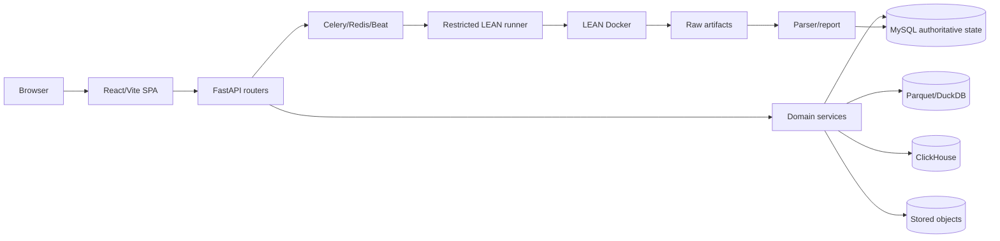
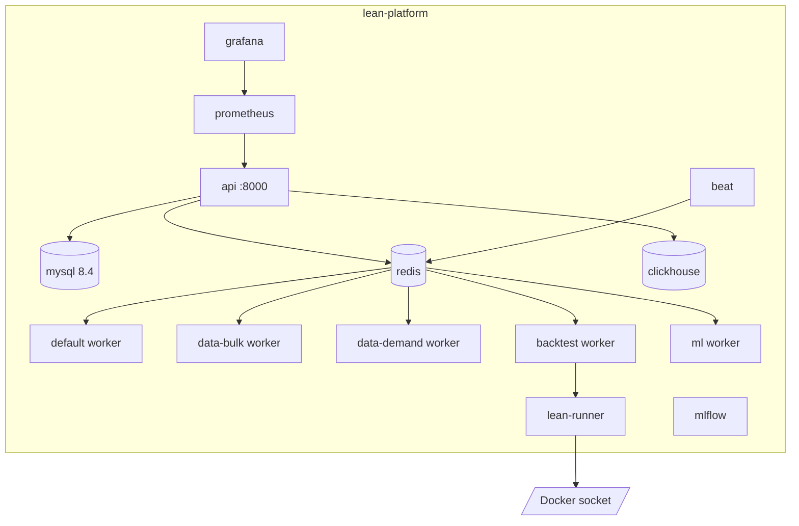
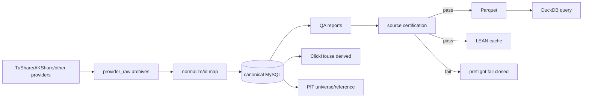
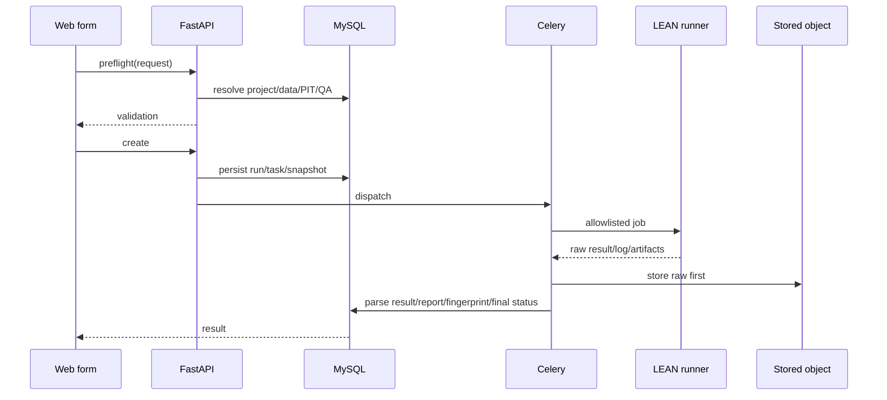
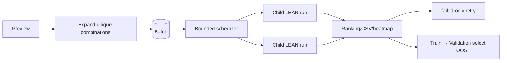
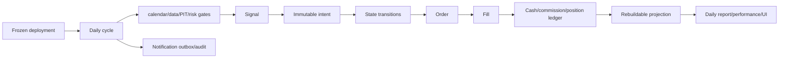
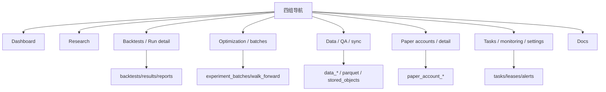
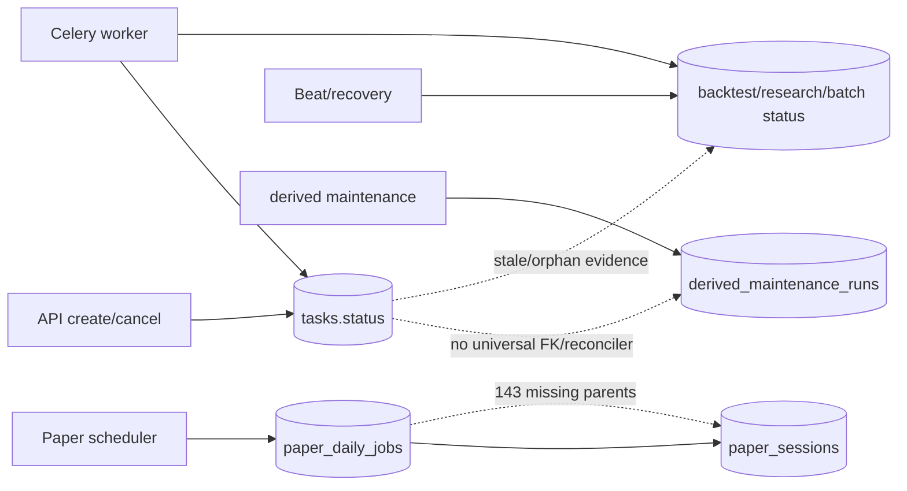
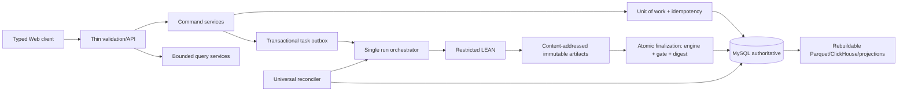

# Actual-environment system review — 2026-08-02

- 审计对象：`lean-platform`
- 审计日期：2026-08-02（Asia/Shanghai）
- 环境：当前 `lean-platform` Compose project 与 `lean_market` MySQL
- 标签：`audit-actual-env-20260802`
- 最终判定：**`LEVEL5_FAIL`**
- 分数：**48 / 100**
- 问题：1 Critical、3 P0、6 P1、4 P2、2 P3
- `NOT_VERIFIED` 检查项：27

## 1. Executive Summary

平台已经具备真实 LEAN、MySQL 权威库、Redis/Celery/Beat、受限 runner、原始结果归档、Source Gate、PIT、Parquet/ClickHouse 派生层、实验编排和 Paper v2 领域模型，属于功能面较完整的研究平台；它尚未达到 Level 5。

本轮最严重的事实是回测 `000001-20210730-20260730-20260730152334` 在数据库中为 `success`，而其最终 `validation_json` 为 `passed=false`、`severity=critical`，失败 gate 为 `production_source_certification`。提交参数声称数据版本 `tushare-a75936aa-7e7-de0df4372cfd` 已认证，最终校验却实际观察到未认证版本 `tushare-a75936aa-7e7-1913e568b965`。代码在启动前验证一次，但 LEAN 结束后先根据引擎结果决定 `success`，再刷新数据验证，形成真实 TOCTOU 缺陷。这直接阻断 Level 5。

当前数据并非永久不可用：审计期间 7 次 `source_recertification` 失败（4 次 MySQL 2013、3 次 worker restart orphan）后，运行 `5f59c8c1-3a3e-4b6d-aafd-be59b20a9ef0` 于 2026-08-02 05:28 UTC 成功；健康状态从 `degraded` 恢复为 `ok`，17,703,084 行 equity 与 44,741 行 index Parquet 均恢复 production/certified。该恢复说明 fail-closed 和恢复最终有效，也进一步证明运行所引用的数据认证可能在运行中改变，必须冻结并在最终提交时原子复核。

当前库有 4 个项目、3 个回测、2 个单子任务动态 PIT 批次、3 个 Research run，但 Paper Account、Paper Session、Paper ledger、fill、projection 全部为 0；同时遗留 143 个没有父 Session 的 daily job、139 个没有父 Session 的 reconciliation，另有 2 个无 task 的 Research run 自 7 月仍保持 `running`。Walk-Forward 有两折三段边界记录，但其 batch 和 project 都已不存在。因此，Paper 多账户、当前 Golden Run 复现、参数网格、rolling 和可导航 Walk-Forward 均不能以实际环境证据判定通过。

Web 静态构建通过；内置浏览器技能返回“无可用浏览器”，故本轮没有伪造视觉/控制台/响应式 PASS。实际 HTTP 和 API 已核对，`/api/backtests` 仅 3 条却返回 23,342,904 bytes，`/api/tasks` 9 条返回 5,197,128 bytes，属于商业级 UI 的直接性能风险。

## 2. 范围、方法与明确排除项

审计按“实际运行结果 → 数据库 → LEAN artifact/log → stored object/ledger → API → Web → 集成测试 → 代码 → 单测 → 文档”排序。先读取 README、CHANGELOG、架构/API/roadmap、Compose、示例环境、docs/history、docs/operations、前后端、scripts、38 个 migration、85 个后端测试文件、20 个 Playwright spec 和 Level 3/4/5 脚本，再检查实际环境。

以下均未执行，也不计分：数据库备份、恢复、灾难恢复、隔离数据库、隔离 Compose、新数据库、生产库克隆、全量同步、全量 Parquet 重建、全量导入、清空/重置/删除、ledger/certification 修改。未停止任何核心服务或用户任务。

测试限制：后端 pytest 的 autouse fixture 会创建临时 SQLite；现有 Playwright global setup 默认启动 `lean-e2e` MySQL/Redis/ClickHouse、写合成数据并 seed/cleanup。两者与本轮约束冲突，故只审查而不运行。审计开始前已存在的 `lean-e2e-mysql-1` 未由本轮创建且未使用。

## 3. 当前实际环境

| 项目 | 实际事实 | 状态 |
| --- | --- | --- |
| Compose project | `lean-platform` | PASS |
| API / Web | `127.0.0.1:8000`；FastAPI 同端口托管 React 静态文件 | PASS |
| OpenAPI | 3.1.0，222 paths，196,561 bytes | PASS |
| MySQL | 8.4.10，`lean_market`，145 张表，migration `0001`–`0038` 全部 applied | PASS |
| Redis | 6379，RDB 最近持久化成功，AOF 关闭 | PASS |
| Celery | default/data-bulk/data-demand/backtest/ml 共 5 个 worker pong | PASS |
| Beat | 容器在线；审计时队列均为 0 | PASS |
| LEAN | `quantconnect/lean@sha256:19e363...823`；runner healthy | PASS |
| 数据目录 | `/Users/kaermax/Data`；容器内 `/workspace/Data` | PASS |
| Parquet | `/Users/kaermax/Data/parquet` | PASS |
| Runtime | `/Users/kaermax/lean-platform/web/runtime` | PASS |
| 可选服务 | ClickHouse、Prometheus、Grafana、MLflow 在线 | PASS |
| 当前资源 | project 4；backtest 3；batch 2；research 3；Paper account/session 0 | PARTIAL |

审计没有创建任何 project、backtest、batch、Paper account 或数据库记录。唯一业务 POST 为只读 `/api/backtests/preflight`；在恢复前返回 HTTP 400 `source_not_certified:tushare:persisted_certification_incomplete`，未创建 run。

## 4. 最终成熟度与评分

| 维度 | 满分 | 得分 | 核心依据 |
| --- | ---: | ---: | --- |
| 架构 | 12 | 7 | 权威边界基本存在；状态 ownership 和超大 service 未收敛 |
| 功能完整性 | 12 | 7 | 主要入口存在；跨资产、Paper 实际资源和优化证据缺失 |
| Web 与用户流程 | 15 | 6 | build 通过、路由完整；真实浏览器和关键 journey 未验证，列表 payload 过大 |
| API | 8 | 5 | OpenAPI/错误结构/认证有效；分页、文档、类型和体积问题 |
| 数据 | 15 | 10 | 当前认证恢复、PIT/QA/archive 丰富；资产覆盖与版本权威分裂 |
| 回测 | 15 | 7 | 真实 LEAN 原始结果可对账；存在成功状态绕过最终 critical gate |
| Experiment/WF | 8 | 3 | 三段字段存在；当前血缘断裂且无 grid/rolling 当前证据 |
| Paper | 12 | 2 | 代码/历史 evidence 存在；当前无账户、无 ledger，trust 元数据陈旧 |
| 调度与稳定性 | 3 | 1 | worker/Beat 在线；实际 orphan、stale running、反复恢复失败 |
| **总计** | **100** | **48** | Critical/P0 直接触发 `LEVEL5_FAIL` |

## 5. 文档—代码—实际环境—测试证据对照

| 声明 | 文档 | 代码 | 当前实际环境 | 判定 |
| --- | --- | --- | --- | --- |
| LEAN 唯一正式回测引擎 | README/architecture | `lean_engine/` + runner | 3 个结果均有 LEAN raw artifact | PASS |
| MySQL 唯一运行事实库 | README | runtime 默认 MySQL；SQLite 仅测试开关 | `lean_market` 145 表 | PASS |
| 最新 migration 0035 | `docs/architecture.md:75` | 目录已到 0038 | 0038 applied | FAIL（文档漂移） |
| Source Gate fail-closed | roadmap/API | preflight + execution validation | 恢复前 preflight 400；恢复后 health ok | PASS（入口） |
| 最终回测仍受 gate 约束 | 隐含声明 | `worker.py:1336-1381` 顺序错误 | success run 的最终 gate critical | FAIL |
| 生产 dataset 可追踪 | docs/data | Parquet 自带 version/certification | Parquet 2 份 production；`dataset_versions` 158 份全 research/uncertified | PARTIAL |
| Walk-Forward 三段隔离 | roadmap | train/validation/OOS 字段和 leakage result | 2 folds 存在，但 batch/project 均不存在 | PARTIAL |
| Paper 多账户可用 | changelog/roadmap | v2 表/API/service 完整 | 所有 v2 事实表为 0 | CODE_ONLY |
| Paper valuation trusted | API dataTrust | `_data_trust()` 读取历史文件 | count=0 仍返回两已不存在账户 `valuationTrusted=true` | FAIL |
| 任务状态可恢复 | operations docs | recovery/lease 代码存在 | 2 stale research、143 paper job orphan | FAIL |
| 统一分页 | `docs/api.md:27` | 部分 router 支持 | 4 种 list envelope | PARTIAL |
| 真实响应式覆盖 | CHANGELOG/Playwright | 20 spec、4 目标尺寸 | 脚本会建隔离栈；浏览器技能不可用 | NOT_VERIFIED |

## 6. 架构审查

### 6.1 当前组件架构

### 6.2 当前部署与容器

### 6.3 数据同步数据流

### 6.4 回测控制流与数据流

### 6.5 Experiment Batch 流程

### 6.6 Paper 信号、订单、成交与账本

### 6.7 Web 页面与领域映射

### 6.8 当前状态 ownership

### 6.9 推荐目标架构

架构结论：LEAN 和 MySQL 权威边界成立；每个回测有独立 workspace，raw result 先归档再解析，取消主要走 service。主要缺陷是最终 gate 与状态提交非原子、任务状态分散、历史/新 Paper 记录清理不完整，以及 `data_sync.py` 4,755 行、`paper_accounts.py` 3,085 行、`api/data.py` 925 行的超大模块。

## 7. 功能完整性

完整逐项矩阵见 [actual-environment-feature-matrix-2026-08-02.md](actual-environment-feature-matrix-2026-08-02.md)。摘要：

- 项目/策略：4 个真实项目；列表、打开、文件读写、模板、克隆、删除保护、快照和运行关联均有实现。未执行写入、克隆或删除。
- 数据：provider、catalog、preview、同步、QA、PIT、Parquet、ClickHouse、raw archive、stored object 存在；canonical 资产只有 equity/index，期货/期权/可转债/分钟/tick 未落库。
- 回测：3 个真实 LEAN run，1 个有 134 orders/trades 和完整收益；日志、结果、报告、artifact、fingerprint 存在。最终 gate 竞态使可信度失败。
- Experiment：2 个 dynamic_universe 单 child batch；无当前 grid/rolling/optimization。Walk-Forward 表有两折，但父资源断裂。
- Paper：v2 API/表/service/UI/code 存在；当前所有账户事实表为 0，不能验证多账户资金/持仓/成交/账本。
- 系统：Dashboard/Tasks/Reports/Docs/Settings/health/metrics 路由存在；实际 API 可用，真实浏览器不可用。

## 8. Web 页面与用户流程

路由包含 Dashboard、Projects、Data、Research、Backtests、Run Detail、Optimization、Paper、Paper Account Detail、Insights、Reports、Tasks、Monitoring、Docs、Settings；移动端另有导航，表格普遍配置横向 scroll，CSS 含 1280/1100/991/900/768/680/640 断点。

| 检查 | 结果 | 证据 |
| --- | --- | --- |
| 前端 production build | PASS | 5,726 modules，3.12s |
| chunk | PARTIAL | ECharts charts/components 与 vendor-echarts 循环依赖警告 |
| HTTP 静态入口 | PASS | API 同端口服务 SPA |
| API 错误结构 | PASS | 400/409/404 含 error_code/category/retryable/trace_id/workflow_id |
| 1440×900 | NOT_VERIFIED | in-app Browser unavailable |
| 1280×800 | NOT_VERIFIED | 同上 |
| 768×1024 | NOT_VERIFIED | 同上 |
| 390×844 | NOT_VERIFIED | 同上 |
| 页面控制台/白屏/图表 | NOT_VERIFIED | 无浏览器证据；不得以 build 代替 |

旅程一“项目→preflight→真实回测”仅安全验证到 preflight；恢复前真实返回可理解的 source-not-certified，未创建新 run。已有 run 1 可完成 raw→DB→report 对账。旅程二历史列表由 3 条记录支持，但 23.3 MB 响应会放大加载/导航风险。旅程三只有 1×1 dynamic PIT batch，不足以验证 grid/retry/heatmap。旅程四当前无 Paper Account，无法执行。

UI 分类：IA 与四组导航代码较清晰；关键概念仍同时出现 Backtest Result/Report、Batch/Optimization、历史 Paper evidence/current account；错误结构专业；大响应、真实响应式证据缺失和空 Paper 工作台是主要 Commercial Gap。

## 9. API 与接口契约

详见 [actual-environment-api-contract-review-2026-08-02.md](actual-environment-api-contract-review-2026-08-02.md)。主要事实：

- OpenAPI 为当前事实基础：222 paths；Bearer 未授权返回 401。
- `/api/projects`、`backtests`、`tasks`、`reports`、batch/research/optimization 使用 `{items,count,limit,offset}`；sync 为 `{items,limit}`；Parquet/QA 为 `{items}`；verifications 为裸数组。
- `docs/api.md` 的 Research 路由仍写旧 `/api/research/{session_id}`，实际是 `/api/research/runs` 与 `/workspaces`。
- 文档一处宣称日志为 bounded tail，另一处又写 cursor；后端 cursor 已实现，前端类型只接 `{logs}`，无法继续翻页。
- 前端为每次 write 自动生成新的随机 `Idempotency-Key`；用户重试如果未复用原 key，就无法依靠 API replay 语义去重。
- `/result` 为 canonical，`/results` 是隐藏 308 compatibility redirect，语义可接受。

## 10. 数据资产、质量与数据流

详见 [actual-environment-data-review-2026-08-02.md](actual-environment-data-review-2026-08-02.md)。权威快照：

| 资产 | 数量/范围 | 结论 |
| --- | --- | --- |
| instruments | 8,103；8,095 equity + 8 index | canonical 无其他资产类 |
| securities | 约 5,551；ST 557；delisted 366 | 有真实生命周期数据 |
| market daily bars | 19,220,229 | 实际 API health 精确计数 |
| A-share daily bars | 19,163,456 | 实际 API health 精确计数 |
| trade status | 约 44M；存在 suspension 样本 | 多 source 行需按主键/source 理解 |
| corporate actions | 59，3 symbols，1992-03-23..2026-06-26 | 覆盖严重偏窄 |
| PIT membership | 299,610；CSI300 1,225 rows | CSI300 official coverage 2005-04-08..2026-07-26 |
| production Parquet | equity 17,703,084；index 44,741 | 审计中恢复为 certified/ok |
| stored objects | 25,011 | raw/LEAN/pipeline/universe 均有命名空间 |
| raw archives | 937 provider-raw；约 1.14 GB | daily/fut_basic/index/opt/suspend/calendar 等 |
| dataset_versions | 158，全部 research/uncertified | 与 production Parquet certification 分裂 |

抽样：600519 2026-07-30 OHLC 1323/1362/1322/1361.76、volume 7,187,261；停牌样本 002348 的 `is_tradeable=0`、buy/sell 均为 0；公司行动 000001 多个 dividend；中文名称 UTF-8 hex 正常。期货/期权 metadata raw archive 存在，但 canonical instrument/bars 为 0，不能判为支持。

数据链路可通过 source、batch、dataset id/version、QA、watermark、stored-object hash 和 run fingerprint 部分关联；生产认证目前只落在 `parquet_datasets`，没有相应 production `dataset_versions` 行，审计追踪链未完全单一。

## 11. LEAN 回测审查

回测 `000001-20260401-20260722-20260728142527` 为当前最有意义样本：项目 `a股指数技术面与基本面选股-20260727142444`，初始 300,000，结束 271,125.70，净收益 -9.625%，benchmark 6.2461%，超额 -15.8708%，drawdown 13.5%，Sharpe -2.042，Sortino -1.832，134 orders/trades，10 holdings，总费用 ¥1,038.43，turnover 4.84%。LEAN raw JSON、DB parsed result、API 与 report 的这些值一致。

raw result 文件 634,970 bytes，SHA-256 `9d06b8…`，stored object hash 匹配；summary object 310,781 bytes，SHA-256 `65a06…`。镜像字符串 digest-pinned，但 fingerprint 的独立 `docker_image_digest` 为 null；`leanZipSha256`、`factorFileSha256` 也为空，artifact manifest 只有 size/mtime，没有每文件 hash。

交易规则在最终 validation 中声明并检查：A 股 T+1、lot 100、suspension、ST buy、limit up/down、delisted、corporate action、raw adjustment、benchmark、commission/minimum/stamp/transfer fee、5 bps slippage、next-open、cash account/no short。验证说明这些 gate 被执行；本轮未创建新订单场景逐条重演，不能把声明升级为全部实际匹配 PASS。

当前数据库没有两条相同 input fingerprint 的 Golden Run。历史 audit 文件声称两条 run canonical digest 一致，但对应 run 已不在数据库；本轮不为补证据重复运行。因此当前复现性为 `NOT_VERIFIED`。

## 12. Experiment、Optimization 与 Walk-Forward

当前两个 batch 均为 `dynamic_universe`、total=1、success=1：`a20ebb77-f0b6-4c28-8a0f-e3b745af35d5` 与 `7a26b971-8811-457c-96b4-1c1a948eac86`。Optimization API count=0。

Walk-Forward run `abf80d39-abb0-569d-97bf-21b31e97503f` 有两折：

- fold 1：Train 2023、Validation 2024H1、OOS 2024H2；
- fold 2：Train 2024、Validation 2025H1、OOS 2025H2。

时间段本身独立，历史 leakage result 为 ALLOW；但 parent batch `29075e1a-...` 和 project 都已不存在，OOS 事实也不能导航到当前 backtest。当前环境无法证明 validation-only selection、OOS 不参与选参、failed-only retry 和当前 fingerprint 聚合。

## 13. Paper 多账户审查

Paper v2 表与 API 覆盖 account、generation、opening ledger、deployment、cycle、signal、intent、transition、constraint、order、fill、ledger、projection、report、outbox 和 audit。但当前：Paper accounts=0、sessions=0、execution cycles=0、fills=0、ledger=0、projections=0。没有两个账户可用于隔离、资金、持仓或账本重算。

`GET /api/paper/accounts` 实际返回 count=0，却同时返回 `valuationTrusted=true`，证据引用两条当前已不存在账户 `857c1891-...`、`136cccff-...`，且证据本身的 succeededCycles/snapshots/reports 都是 0。历史 acceptance JSON 只能记为历史证据，不能代表当前环境 PASS。

旧 Paper session 已退役，但 143 个 daily jobs 与 139 个 reconciliation 仍引用不存在的 sessions；其中还有 1 个 READY。这不直接证明当前多账户串扰，但证明清理和 FK/ownership 不完整。

## 14. 调度、异常与恢复

5 个 worker 均 pong，队列和 reserved/scheduled 均为空，Beat 与 scheduler lease 正常。反证：

- Research `fb25403d-...`、`5b98a6a0-...` 自 7 月保持 running，task_id=null、finished_at=null；
- Paper daily job：139 COMPLETED、3 FAILED、1 READY，全部 143 无父 Session；
- derived recertification 在 02:20–05:20 UTC 连续 7 次失败/孤儿后才成功；
- derived maintenance 不出现在通用 `/api/tasks`，状态 ownership 分裂。

因此“worker 在线”不能推出 domain 状态可收敛。没有做故障注入或取消活跃任务。

## 15. 商业软件对标

只比较公开外部能力，不推测内部架构。QuantConnect 官方公开完整 backtest/report/optimization、research→backtest→paper/live pipeline、paper trading 和 live reconciliation；Ricequant 公开 browser/local research、股票/指数/基金/期货/转债/期权以及因子/优化能力；JoinQuant 公开研究、回测和模拟交易；IBKR TWS 公开图表、成交、深度、期权与风险分析以及 Paper 账户；Tiger Trade 公开桌面/移动端 demo account。参考：[QuantConnect backtesting](https://www.quantconnect.com/docs/v2/cloud-platform/backtesting)、[QuantConnect research pipeline](https://www.quantconnect.com/docs/v2/cloud-platform/research-pipeline)、[QuantConnect paper trading](https://www.quantconnect.com/docs/v2/cloud-platform/live-trading/brokerages/quantconnect-paper-trading)、[QuantConnect reconciliation](https://www.quantconnect.com/docs/v2/cloud-platform/live-trading/reconciliation)、[Ricequant platform](https://www.ricequant.com/doc/quant/)、[JoinQuant](https://www.joinquant.com/about)、[IBKR TWS](https://www.interactivebrokers.com/en/trading/tws.php)、[Tiger demo account](https://www.itiger.com/sg/learn/detail/paper-trading-demo-account-guide)。

| 能力 | 商业级表现 | lean-platform 当前事实 | 差距/严重度 | 阻断 L5 |
| --- | --- | --- | --- | --- |
| 项目/编辑 | 版本、协作、IDE | 4 项目、文件编辑/模板；无当前协作证据 | P2 | 否 |
| 数据目录 | 多资产、授权、元数据 | equity/index canonical | P1 | 是（宣称全资产时） |
| 数据质量 | version/licence/coverage | Source Gate/QA/PIT 较强 | 版本权威分裂 P1 | 是 |
| 回测配置 | engine/data/rules frozen | LEAN 与规则齐，但 final gate 竞态 | Critical | 是 |
| 排队/速度 | 可视资源/配额 | 有 scheduler/worker；状态分裂 | P0 | 是 |
| 结果分析 | 报告、风险、订单、图表 | raw/DB/report 对账成立 | artifact hash 不全 P1 | 是 |
| 参数优化 | bounded search/ranking | 当前 0 optimization | P1 | 是 |
| Walk-Forward | 可导航 lineage/OOS | 两折孤儿记录 | P0 | 是 |
| 多策略实验 | 比较/矩阵/导出 | 仅 1×1 dynamic PIT | P1 | 是 |
| 多模拟账户 | 独立资金/持仓/订单 | 当前 0 账户 | P0 | 是 |
| 部署/调度 | continuous, restart, notices | 代码存在，当前无 deployment | NOT_VERIFIED | 是 |
| 风控 | broker/risk workspace | 规则代码存在，无实际账户 | NOT_VERIFIED | 是 |
| 通知/审计 | 外部送达、可追踪 | outbox/audit code；无当前账户事实 | PARTIAL | 是 |
| 移动端 | 原生/成熟响应式 | CSS/Playwright 设计存在；实际浏览器未测 | NOT_VERIFIED | 否 |
| 文档 | 与产品同步 | 33 help PASS；architecture/API 漂移 | P2/P3 | 否 |
| 异常恢复 | 状态可收敛、明确操作 | stale/orphan 实际存在 | P0 | 是 |
| 使用门槛 | 清晰 workflow | 概念多、payload 大、空 Paper | P2 | 否 |

## 16. Critical/P0 与全部问题

以下每项均是可执行问题，不使用模糊措辞。

### ACT-CRIT-001 — 最终 critical 数据门禁仍被提交为成功

- 分类/严重度/Level 5 Gate/状态：回测正确性；Critical；数据认证与结果可信度；OPEN。
- 模块/文件：`web/backend/app/tasks/worker.py:1216,1306,1336-1381`；API `/api/backtests/{id}`；表 `backtest_runs`,`backtest_results`,`dataset_versions`,`parquet_datasets`。
- 当前/预期：当前先按 `raw_success && execution_validation.passed` 定 status，再刷新包含 source certification 的 fingerprint/validation；预期最终所有 critical gates 与冻结版本在同一事务内决定 terminal status。
- 实际证据/复现：查询 run `000001-20210730-20260730-20260730152334`：status success；submitted version `...de0df...`，final gate version `...1913...`，final passed=false/severity=critical。按该 ID 查询 `validation_json.gates[production_source_certification]` 即可复现。
- 影响/根因：可把未认证、非冻结数据结果作为成功；影响数据和回测，不直接影响资金/持仓。根因是 TOCTOU 与 finalization 非原子。
- 推荐修复/涉及模块：创建 immutable execution data snapshot；LEAN 启动前锁定 version/hash；结束后在同一 Unit of Work 复核 gate、写 artifact、result、run/task；任一 critical 强制 failed/quarantined。涉及 worker、source gate、backtest service、migration。
- migration/API 兼容：增加 `execution_dataset_version/hash`、`final_gate_status`、`quarantined_at`；API additive，历史异常 success 需标 `trustStatus=invalid`。
- 测试/验收命令：并发 recertification race 集成测试；`pytest -q tests/test_backtest_worker.py -k 'certification and final'`；SQL 断言 `status='success' AND validation passed=false` 为 0。
- 完成定义/工作量/依赖：所有 terminal success 均 final gate pass 且版本等于启动快照；L（3–5 天）；依赖数据版本冻结设计。

### ACT-P0-001 — 当前环境没有任何 Paper Account，Level 5 多账户链路不可验证

- 分类/严重度/Gate/状态：Paper；P0；多账户隔离/ledger/幂等；OPEN。
- 模块/文件：`services/paper_accounts.py`、`api/paper_accounts.py`、`pages/paper-accounts.tsx`；API `/api/paper/accounts*`；全部 `paper_account_*` 表。
- 当前/预期：当前账户、cycle、fill、ledger、projection 均为 0；预期至少两个实际账户有差异资金、部署、21 个交易日、成交/无信号/等待数据与恢复证据。
- 证据/复现：SQL count；GET accounts count=0。影响资金/持仓可信度验证，但未观察到现存错误资金。
- 根因/修复：历史验收资源被清理且没有 durable certification resource；提供非删除的 acceptance cohort 与 current evidence FK，不以 JSON 文件替代事实表。
- migration/API：可能新增 `certification_cohort` 与 evidence FK；API additive。
- 测试/验收：安全窗口执行两账户差异资金 21-session acceptance、只读 ledger 重算、重复 run-now；验收无跨账户行且 digest 重放一致。
- 完成定义/工作量/依赖：当前库可导航两账户全链，证据未过期；L；依赖 ACT-P0-003 和数据认证稳定。

### ACT-P0-002 — Walk-Forward 当前血缘引用已删除 batch/project

- 分类/严重度/Gate/状态：Experiment/WF；P0；三段隔离可复现；OPEN。
- 模块/文件：experiment/walk-forward services/migration；API batch/optimization；表 `walk_forward_runs`,`walk_forward_windows`,`experiment_batches`,`projects`,`backtest_runs`。
- 当前/预期：两折时间段存在，但 parent batch/project 均 NULL；预期不可删除或通过 immutable snapshot 保留完整 lineage/OOS result。
- 证据/复现：LEFT JOIN `abf80d39-...`/2 windows 到 batch/project，结果均 NULL。影响研究选择与未来泄漏审计，不直接影响资金。
- 根因/修复：缺少 FK/删除保护或历史清理未级联到 certification；加 RESTRICT/soft archive、snapshot、OOS run FK 和 integrity reconciler。
- migration/API：加 FK 前先 quarantine orphan；API 增 `lineageStatus`。
- 测试/验收：删除保护、archive 后复现、Validation-only/OOS isolation；SQL orphan=0。
- 完成定义/工作量/依赖：每折可从 batch→selection→OOS→artifact 导航并重算；M；依赖 schema 清理。

### ACT-P0-003 — Domain 状态不能收敛，存在 stale running 与 orphan READY

- 分类/严重度/Gate/状态：调度/状态；P0；任务状态可收敛；OPEN。
- 模块/文件：research services、paper scheduler/recovery、derived maintenance、Beat；API `/api/tasks`,`/api/research/runs`; 表 `tasks`,`research_runs`,`paper_daily_jobs`,`paper_reconciliation_records`,`paper_sessions`。
- 当前/预期：2 Research running 无 task；143 Paper jobs/139 reconciliation 无 parent，含 1 READY；预期统一 reconciler 将缺 owner 的状态终结/quarantine。
- 证据/复现：本报告 §14 SQL ID/计数；影响任务事实、可能导致重复调度；当前无账户，未证实重复资金/持仓。
- 根因/修复：多个状态机各自维护且 migration/cleanup 无完整 FK；引入 run registry、owner heartbeat、terminalization policy 与不可重新派发的 orphan quarantine。
- migration/API：新增 owner/heartbeat/recovery_reason 或通用 run registry；历史孤儿只标记，不删除。
- 测试/验收：worker restart/reconciler 集成测试；SQL stale running=0、orphan READY=0；API 给出 action。
- 完成定义/工作量/依赖：所有 domain 状态可在 SLA 内收敛；L；依赖所有 scheduler owner 定义。

### ACT-P1-001 — 空账户响应仍宣称历史 Paper valuation trusted

- 分类/严重度/Gate/状态：Paper/API；P1；当前证据真实性；OPEN。
- 模块/文件：`paper_accounts.py:78-96,2361`；API `/api/paper/accounts`; 表 `paper_accounts` 与 runtime audit file。
- 当前/预期：count=0，仍返回不存在账户的 `valuationTrusted=true`；预期 trust 绑定当前 cohort/account generation 并过期。
- 证据/复现：GET accounts；两个 evidence account 在 DB 均不存在。影响 Paper 信任展示，不直接改 ledger。
- 根因/修复：全局文件级 trust metadata 无资源 FK/TTL；改为按 account/generation 计算并验证存在性。
- migration/API：可能新增 certification table；将 trust reason 扩展，向后兼容。
- 测试/验收：删除/归档账户后 trust 自动 false；count=0 不返回 trusted historical valuation。
- 完成定义/工作量/依赖：无 dangling evidence；S–M；依赖 ACT-P0-001。

### ACT-P1-002 — Source recertification 连续失败并依赖多次重启恢复

- 分类/严重度/Gate/状态：数据/SRE；P1；派生数据可重建与稳定恢复；OPEN（最终恢复）。
- 模块/文件：`services/derived_maintenance.py`,`data_sync.py`；API health/data；表 `derived_maintenance_runs`,`derived_layer_watermarks`,`parquet_datasets`。
- 当前/预期：7 次 MySQL lost/orphan 后第 8 次成功；预期 bounded query、checkpoint resume、无 worker restart orphan 链。
- 证据/复现：运行 ID 与时间线见 §1/14；期间 preflight 400，后 health ok。影响数据可用性和回测调度。
- 根因/修复：长查询连接和 worker lifecycle 不稳；分页/服务器游标、分层 checkpoint、lease heartbeat、失败退避。
- migration/API：可复用表增 attempt/checkpoint；API additive。
- 测试/验收：大数据量 maintenance 在一次 worker 生命周期内成功；强制连接断开后从 checkpoint 恢复且只一条 active。
- 完成定义/工作量/依赖：连续 7 日无 lost/orphan；M–L；依赖 DB query 优化。

### ACT-P1-003 — 列表 API 内嵌巨型运行快照，单页达 23.3 MB

- 分类/严重度/Gate/状态：API/Web 性能；P1；商业级主流程；OPEN。
- 模块/文件：backtest/task serializers、`frontend/src/api/index.ts`；API `/api/backtests`,`/api/tasks`,`/api/data/quality/reports`; 表相关运行 JSON 列。
- 当前/预期：3 backtests=23,342,904 bytes；9 tasks=5,197,128；QA=3,811,338；预期 summary DTO、字段选择和 detail endpoint。
- 证据/复现：带认证 GET 并计算 content length；影响加载、内存、移动端和 polling。
- 根因/修复：list 序列化完整 universe/fundamental schedule/validation/fingerprint；新建 summary schema，默认不返回大 JSON。
- migration/API：无 migration；API 默认响应收缩属于兼容风险，应版本化/feature flag。
- 测试/验收：3 条 list <200 KB，detail 仍完整；前端 Lighthouse/slow network。
- 完成定义/工作量/依赖：分页 list bounded；M；依赖前端 DTO 同步。

### ACT-P1-004 — Canonical 资产覆盖与页面能力声明不匹配

- 分类/严重度/Gate/状态：数据/功能；P1；完整真实数据；OPEN。
- 模块/文件：data providers/catalog/quality；API data catalog；表 `instruments`,`market_daily_bars` 等。
- 当前/预期：8,095 equity + 8 index；future/option/convertible bond/独立 ETF/minute/tick canonical=0；预期未支持能力明确 unavailable，支持能力有正式数据与 gate。
- 证据/复现：按 asset_class group；raw metadata archive 不等于可回测数据。影响数据/回测，不影响现有资金。
- 根因/修复：catalog/provider metadata 与 canonical readiness 未统一；引入 capability state `metadata_only/data_ready/executable`。
- migration/API：asset capability 表/字段；API additive。
- 测试/验收：每资产 availability 与实际 row/gate 对齐；缺数据 preflight 503/422 明确。
- 完成定义/工作量/依赖：所有 UI 入口不再把 metadata-only 当可运行；L；依赖数据许可与导入。

### ACT-P1-005 — 生产认证存在于 Parquet，但 dataset_versions 全部是 research

- 分类/严重度/Gate/状态：数据 lineage；P1；source/batch/version/QA/certification 追踪；OPEN。
- 模块/文件：derived recertification/source gate；API data；表 `parquet_datasets`,`dataset_versions`。
- 当前/预期：两份 Parquet production/certified/ok；158 条 dataset_versions 全为 research/uncertified；预期单一 immutable version record 被回测、Parquet、cache 引用。
- 证据/复现：按 environment/is_production/is_certified group；影响数据与复现。
- 根因/修复：Parquet dataset 同时承担当前认证权威，dataset_versions 多为运行 scope snapshot；拆名并建立 FK 或统一权威。
- migration/API：新 canonical dataset release 表，迁移现有 certification；API 增 releaseId。
- 测试/验收：每 production Parquet 精确一条 certified release；每 success run FK 存在。
- 完成定义/工作量/依赖：无同义 version 权威；L；依赖 ACT-CRIT-001。

### ACT-P1-006 — 当前库不能证明相同输入可复现，artifact digest 也不完整

- 分类/严重度/Gate/状态：回测/可复现；P1；Golden Run；OPEN。
- 模块/文件：fingerprint/artifact manifest/results；API run detail；表 `backtest_runs`,`stored_objects`。
- 当前/预期：无 current golden pair；image 字符串 pinned 但独立 digest、LEAN zip/factor hash 为空，manifest 无每文件 hash；预期当前 DB 有同 input pair、canonical/order/fill/equity digest。
- 证据/复现：group inputFingerprint；查询 fingerprint null 字段。影响回测可信度。
- 根因/修复：历史 evidence 生命周期与业务记录脱钩，hash 分散；创建 immutable reproducibility certificate FK。
- migration/API：certificate 表/response；additive。
- 测试/验收：最小可信窗口双跑；canonical/orders/fills/equity 全一致，raw 非确定元数据允许差异。
- 完成定义/工作量/依赖：current fetchable certificate；M；依赖 ACT-CRIT-001/005。

### ACT-P2-001 — List envelope、OpenAPI 文档和 Research 路由语义漂移

- 分类/严重度/Gate/状态：API/docs；P2；一致接口；`CODE_FIXED_REVALIDATION_REQUIRED`。
- 模块/文件：`docs/api.md:27,302-308,485-491`、routers、frontend types；多个 list API；无 migration。
- 当前/预期：四种 envelope，docs Research 路径旧；预期统一 paged schema 和生成式 reference。
- 证据/复现：GET 结构见 §9；影响客户端维护，不直接影响事实。
- 根因/修复：兼容模式与手写文档并存；OpenAPI 生成文档、deprecation window、contract tests。
- 测试/验收：schema snapshot；所有 primary list 默认同 envelope。
- 完成定义/工作量/依赖：文档/TS/OpenAPI/实际响应相同；M；依赖兼容计划。

### ACT-P2-002 — 日志 cursor 后端已实现，前端只能读取一次 bounded tail

- 分类/严重度/Gate/状态：Web/API；P2；可诊断性；`CODE_FIXED_REVALIDATION_REQUIRED`。
- 模块/文件：`services/tasks.py:86-114`,`frontend/src/api/index.ts:451`,`pages/operations.tsx:184`；logs API；tasks/backtest 表/文件。
- 当前/预期：后端返回 nextCursor/hasMore，TS 只声明 logs；预期 UI 可连续加载、保存位置和停止 polling。
- 证据/复现：代码契约对照；影响故障诊断。
- 根因/修复：前端类型未升级；实现 load older/follow 模式和 cursor tests。
- migration/API：无；前端 additive。
- 测试/验收：超过 tail 的首行可通过 cursor 到达；terminal 停 poll。
- 完成定义/工作量/依赖：完整日志可浏览；S；无。

### ACT-P2-003 — 客户端每次重试生成新 Idempotency-Key

- 分类/严重度/Gate/状态：API/幂等；P2；重复 POST/Run-now；`CODE_FIXED_REVALIDATION_REQUIRED`。
- 模块/文件：`frontend/src/api/client.ts:55-57`、middleware `app/main.py`; 所有 write API；表 `api_idempotency_keys`。
- 当前/预期：每次 request 随机新 key；预期同一用户操作重试复用稳定 key，直到 terminal response。
- 证据/复现：断网/重试代码审查；本轮未制造重复写。潜在影响任务/Paper cycle，不是已确认重复资金。
- 根因/修复：key 生命周期绑定 HTTP call 而非 UI command；调用层创建 operation ID 并持久到 retry。
- migration/API：无；兼容。
- 测试/验收：相同 UI command 两次请求同 key/同 response；不同 payload 同 key 409。
- 完成定义/工作量/依赖：所有关键写操作有稳定 operation key；S–M；无。

### ACT-P2-004 — 超大 service 与多状态写者使 ownership 难以审计

- 分类/严重度/Gate/状态：架构；P2；边界/唯一 ownership；`CODE_FIXED_REVALIDATION_REQUIRED`。
- 模块/文件：`data_sync.py` 4,755 行、`paper_accounts.py` 3,085 行、`worker.py` 1,522 行、`api/data.py` 925 行；相关 API/多表。
- 当前/预期：service 同时做 query、command、HTTP payload、scheduler、projection；预期 command/query/repository/orchestrator 分层。
- 证据/复现：LOC 与依赖审查；影响维护和状态缺陷率。
- 根因/修复：功能纵向增长未拆 bounded contexts；按 Data Release、Run Orchestration、Paper Ledger/Projection 拆模块。
- migration/API：先内部重构，无兼容变化。
- 测试/验收：route 只 validation/delegation；状态表只有声明 owner 写入；架构依赖检查。
- 完成定义/工作量/依赖：无循环私有依赖、职责可单测；XL；依赖 P0 状态模型。

### ACT-P3-001 — 架构文档仍称最新 migration 为 0035

- 分类/严重度/Gate/状态：文档；P3；文档一致性；OPEN。
- 模块/文件：`docs/architecture.md:75`；无 API/表影响。
- 当前/预期：实际 0038 applied；预期文档由 migration status 生成或不硬编码。
- 证据/复现：`scripts/db_migrate.py --status`；影响运维判断。
- 根因/修复：手工版本号；改为链接目录/生成 check。
- migration/API/测试：无；help/docs check 增 migration assertion。
- 完成定义/工作量/依赖：版本不漂移；XS；无。

### ACT-P3-002 — 前端构建存在 ECharts 循环 chunk 警告

- 分类/严重度/Gate/状态：Web build；P3；性能/一致性；OPEN。
- 模块/文件：Vite manualChunks/chart imports；无 API/表。
- 当前/预期：build 成功但 charts/components ↔ vendor-echarts circular chunks；预期稳定无循环分块。
- 证据/复现：`npm run build`；影响缓存/加载顺序风险，未复现白屏。
- 根因/修复：manual chunk 边界交叉；合并 ECharts chunk 或按官方 tree-shaking 边界拆分。
- migration/API/测试：无；build + bundle smoke。
- 完成定义/工作量/依赖：build 无该警告；XS；无。

## 17. 未验证项目

27 项包括：4 个真实 viewport；浏览器 console/network/白屏/图表；项目新建/保存/克隆/删除保护交互；新回测 queued→running 实时 UI；cancel race；当前 Golden 双跑；3×3 grid、rolling、failed-only retry、restart、CSV/heatmap；两个 Paper 账户隔离、run-now 幂等、21 日周期、ledger 重算、notification；主动 worker/Redis/MySQL 故障。原因分别为浏览器不可用、会创建隔离环境/合成数据、会产生不必要业务写入、当前没有可复用资源或禁止故障注入。

## 18. 证据索引

| 证据 | 命令/来源 | 结果 |
| --- | --- | --- |
| Compose | `docker compose ps` | 核心及观测容器在线 |
| migrations | `web/backend/.venv/bin/python scripts/db_migrate.py --status` | 0001–0038 applied |
| frontend | `cd web/frontend && npm run build` | PASS，2 类 circular warning |
| docs | `scripts/check_help_docs.py` | 33 articles PASS |
| API docs | `scripts/generate_help_api_reference.py --check` | PASS |
| hygiene | `scripts/check_repository_hygiene.py` | PASS |
| API health | `/api/health/dependencies` | degraded→ok，source certification 恢复 |
| Celery | `celery inspect ping/active/reserved/scheduled` | 5 pong，无排队 |
| DB | 只读 MySQL SQL | 本报告全部计数/ID |
| LEAN | raw result、stored object、DB/API/report | run 1 关键指标一致 |
| preflight | `/api/backtests/preflight` | 恢复前 400，无创建 |
| API size | 实际 authenticated GET | 23.3MB/5.2MB/3.8MB |
| Browser skill | in-app browser init | `No browser is available` |
| 外部对标 | 官方公开文档 | §15 链接 |

## 19. 审计限制与执行自检

- 没有创建隔离环境、新数据库或第二套平台。
- 没有执行备份、恢复、全量 reimport/rebuild/sync。
- 没有删除、清空、重置、覆盖业务数据。
- 没有修改 ledger、certification、token、密码。
- 没有停止任务或核心依赖。
- 没有创建任何新业务资源；测试 POST 只做 preflight。
- PASS 仅来自当前事实；历史 audit PASS 只记为低等级历史证据。
- Browser unavailable、pytest/Playwright 与约束冲突均明确为 NOT_VERIFIED。
- 备份/恢复完全排除，未作为分数或 Level 5 fail 单独理由。

## 20. 结论

当前平台是“真实引擎、真实数据治理、丰富领域代码”的研究级系统，但不是 Level 5。解除判定至少需要：原子化回测最终 gate 与冻结版本、清除并防止状态孤儿、建立当前可导航 Walk-Forward 证据、在实际库保留两个以上可重算 Paper 账户，以及用当前数据库中的 Golden Run 证明复现性。随后才能补做真实浏览器四视口与完整用户旅程复审。

## 21. P1 整改实现附录

本节记录审计之后完成的代码整改，不改写 §1–20 的历史实际环境事实、48 分或 `LEVEL5_FAIL` 判定。六项状态均为 `CODE_FIXED_REVALIDATION_REQUIRED`：迁移 `0040_p1_trust_and_reproducibility` 必须先在实际 MySQL 应用，随后按原验收条件采集新证据，才能关闭实际环境问题。

| Issue | 已实现控制 | 自动化验证 | 仍需实际环境验收 |
| --- | --- | --- | --- |
| ACT-P1-001 | Paper trust 改为 account + generation + active Dataset Release + TTL；校验账户、checkpoint 和 report 仍存在；空列表默认 false | 账户归档后立即失信测试 | 创建/复用正式 Paper cohort 后重算并认证 |
| ACT-P1-002 | 单 active maintenance run、attempt/heartbeat、分 scope/layer checkpoint、指数退避、原 run resume、最大尝试和外部告警 | orphan resume、唯一 active、checkpoint schema 测试 | 运行 7 日并证明无 MySQL 2013/orphan chain |
| ACT-P1-003 | backtest/task/QA 默认 list summary；详情端点保留；limit 硬上限 200；Backtest History 使用服务端分页 | 1 MB 嵌入快照下组合响应 <200 KB；前端 build | 对当前 3/9 条 authenticated GET 重新测量 |
| ACT-P1-004 | canonical capability inventory 使用 `unavailable/metadata_only/data_ready/executable`；高风险 scope preflight fail-closed | futures 0→metadata→data-ready 三态测试 | 实际 API/UI 核对 ETF/future/option/cbond/minute/tick |
| ACT-P1-005 | 新增 immutable `dataset_releases`；Parquet、run-scoped dataset version、backtest 和 Source Gate 统一引用 release ID；MySQL 无 release 时 fail-closed | release 唯一性及 Parquet authority 测试 | 应用迁移并 recertify 当前 equity/index 两个 scope |
| ACT-P1-006 | 成功的 certified-release run 生成 stored-object certificate，含 image/project/release/cache/config/orders/fills/equity/canonical/artifact digests；提供 fetch 和 golden-pair 查询 | 两个同 input/canonical output certificate 形成 golden pair | 实际运行最小双跑并下载证书 |

代码验证：后端全量 `580 passed, 2 skipped`，新增 P1 专项 `6 passed`，前端 `npm run build` PASS；ECharts circular warning 属原 ACT-P3-002，不作为本轮 P1 关闭证据。

## 22. P2 整改实现附录

本节同样只记录审计后的代码整改，不改写 §1–20 的历史实际环境判定。四项均为 `CODE_FIXED_REVALIDATION_REQUIRED`：

| Issue | 已实现控制 | 自动化验证 | 仍需实际环境验收 |
| --- | --- | --- | --- |
| ACT-P2-001 | sync runs、Parquet datasets、QA reports、workflows、verifications 统一 `{items,count,limit,offset}`，OpenAPI 显式引用 `PageEnvelope`；Research 文档改为 runs/workspaces，reference 由 OpenAPI 生成 | list contract、OpenAPI schema、generated docs check | 部署后 authenticated 响应与 TS 对账 |
| ACT-P2-002 | 通用 cursor log viewer 支持加载更早、持续跟随、手动停止；Backtest/Task 进入终态后停止轮询且不重置当前位置 | 前端 TypeScript/build；后端 cursor contract 回归 | 浏览器用超过 64 KiB 的真实日志验证首尾可达 |
| ACT-P2-003 | 每个 write command 生成一次 operation ID；网络失败自动重试时复用同一 `Idempotency-Key`，HTTP 响应不盲目重试 | 前端 TypeScript/build；既有服务端同 key/异 payload 409 测试 | 浏览器/代理注入一次 timeout 验证 replay |
| ACT-P2-004 | Data Sync command orchestrator；Paper command/query surfaces；Dataset Release、Paper ledger/projection 唯一 writer 清单；API/task entrypoint 禁止直接 SQL 改 orchestration state | architecture dependency + unique-writer tests | 部署后运行 sync/backtest/Paper characterization journey |

代码验证：P2/契约专项 `16 passed`，Data Sync/Paper/API 回归 `110 passed`，后端全量 `586 passed, 2 skipped`；前端 `npm run build`、生成式 API reference、33 篇 help 文档和 repository hygiene 均 PASS。既有 ECharts circular warning 仍归属 ACT-P3-002。
