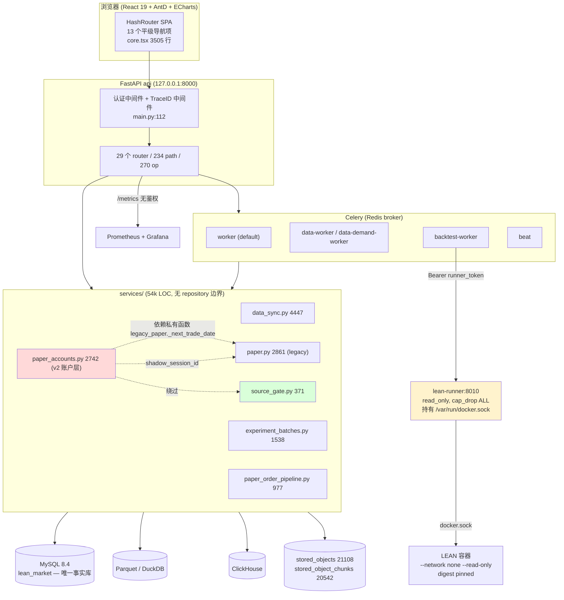
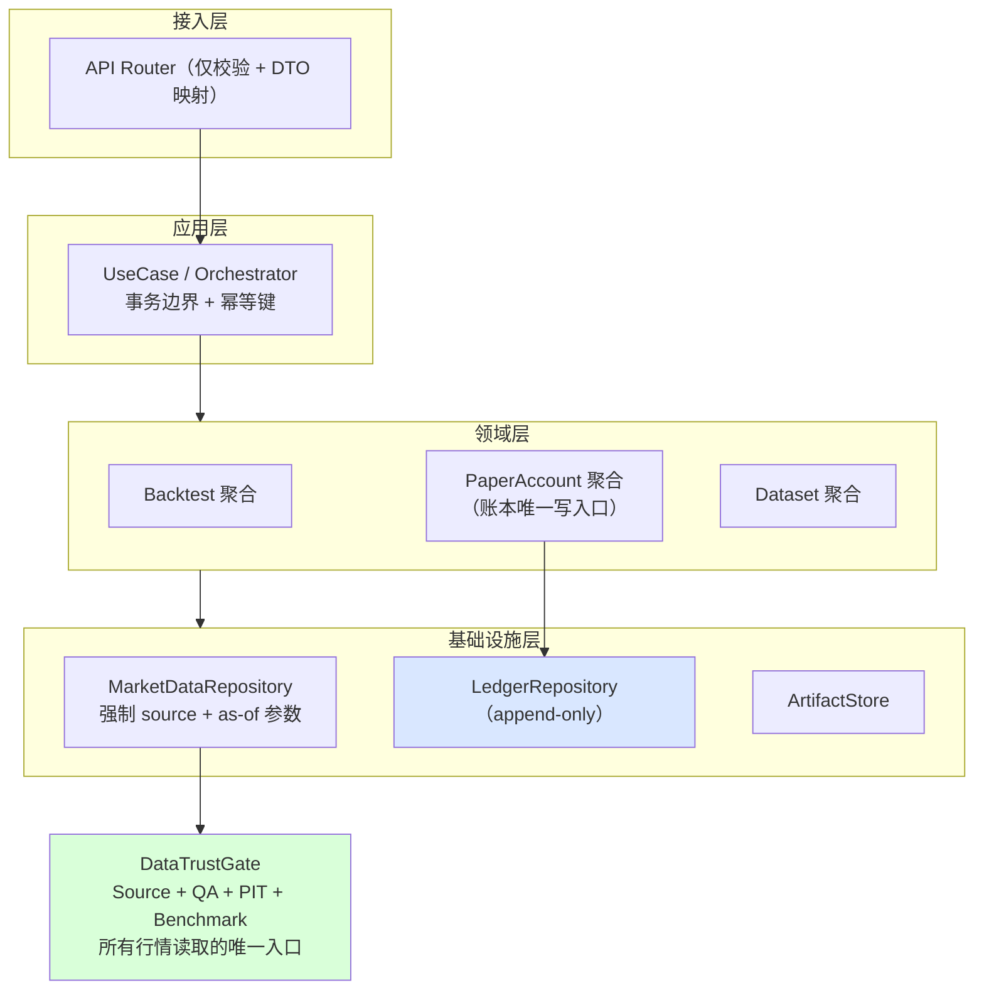
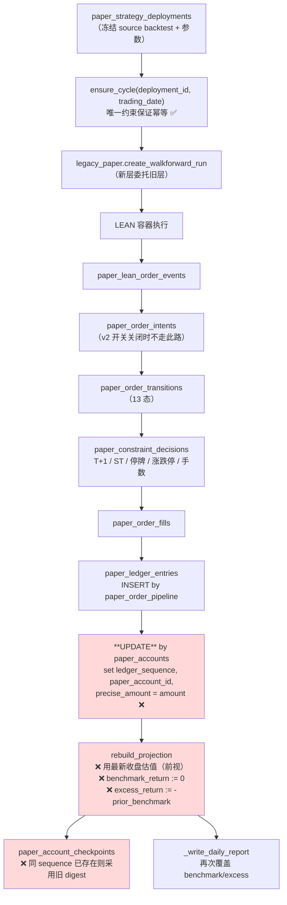
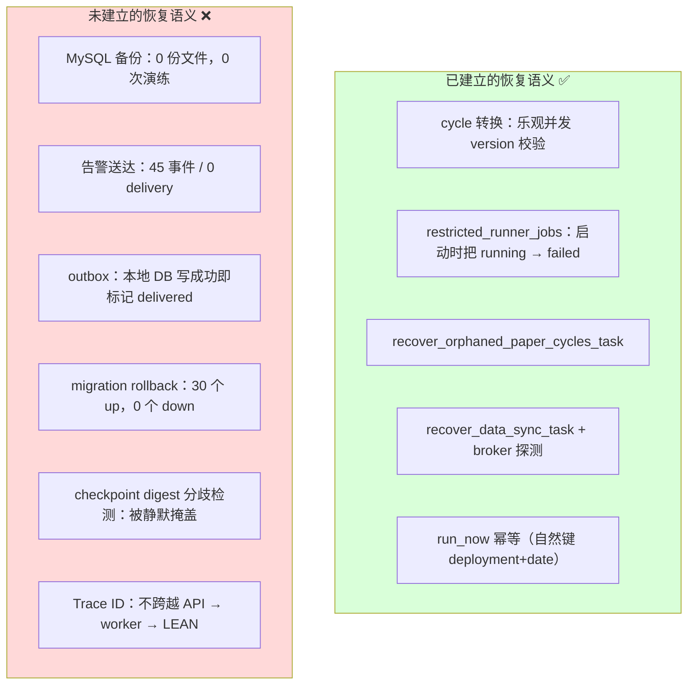

# Level 5 Platform System Review — lean-platform

- **审计日期**: 2026-07-26
- **审计模式**: 独立、证据驱动、只读优先
- **审计基线**: `main` @ `3c40b53`（工作树含未提交修改，见 §20）
- **运行环境**: Docker Desktop 29.6.2 / macOS 25.5.0；Compose project `lean-platform` 全栈在线
- **最终判定**: **`LEVEL5_FAIL`**
- **总分**: **45 / 100**

> **整改更新（2026-07-26 晚）**：本文件前 14 章保留独立审计时点的原始事实与
> `LEVEL5_FAIL` 判定，不能回写成当时已通过。审计后，§15 的 5 个 Critical 与
> 9 个 P0 已完成代码/配置整改；§15、§16 的状态表是最新状态。新的 21 交易日
> 多账户实跑仍需独立证据，因此本次整改不把原始 Level 5 verdict 升级为 PASS。
> 外部 Webhook 真实 2xx 不属于 Level 5 必过项，改列为启用无人值守自动执行前
> 的独立运维验收；未配置时继续保持 operational readiness fail-closed。
>
> **P1 整改更新（2026-07-26）**：P1 简表中的 11 项已完成代码和回归整改；
> `L5-ARCH-002` 的 Paper 全域 repository 下沉为 XL 级重构，保留
> **In Progress**，不得由已有的行情 repository 边界推断为完成。
>
> **Wave 1–5 收口更新（2026-07-26）**：新增历史投影 verify/apply 工具并把
> ledger 也按 execution-cycle date 做 PIT 过滤；Paper 验收脚本强制 21 日、
> 差异化资金、同日多账户并发、六阶段故障恢复与 ledger digest 重放；A 股
> 13 条规则及 7 类 fail-closed 构造矩阵已覆盖；PIT 响应语义、canonical API
> 路由、fingerprint 顶层键、`/metrics` 鉴权、report 根目录和重复路由已修正。
> `object_store_items` 经代码追踪确认是 `stored_objects` 的活动索引，并非死表。
> 真实历史复审仍发现 3 个 legacy opening checkpoint digest mismatch 与 3 个
> future quote；apply 按设计抛 `CanonicalStateDivergence`，没有改写 immutable
> checkpoint，故 `dataTrust=false`。全栈 21 日故障验收、四类跨资产数据填充
> 以及 `L5-ARCH-002` 仍是开放发布条件。外部 Webhook 仅是无人值守运行条件，
> 不再计入 Level 5 通过判定。
> 本轮代码验证为后端 `505 passed, 2 skipped`、前端 build、OpenAPI/help
> 文档检查、Compose 配置、供应链门禁与 repository hygiene 全部通过。

---

## 1. Executive Summary

lean-platform 已经是一个**结构完整、门禁意识很强的研究级回测平台**。本轮独立审计确认了若干高价值能力是**真实成立**的，而不仅仅是文档声明：

- API 默认强制 Bearer 认证（8 个端点实测 401，带 token 实测 200）；
- Source Gate **当前正在真实 fail-closed**（实测 preflight 返回 `source_not_certified:tushare:persisted_certification_incomplete`）；
- PIT 覆盖门禁真实 fail-closed（CSI300 请求 2003-01-02 返回 `coverage_gap` + 0 成员，未用当前成分回填）；
- 跨资产质量门禁真实 fail-closed（`/api/data/quality/cross-asset` 返回 `passed:false`，9 个数据集 `missing`）；
- **回测确定性成立**：3 组相同 `inputFingerprint` 各跑 2 次，`canonicalResultSha256` 各自唯一（`distinct_results = 1`）；
- Paper 执行周期状态机使用乐观并发（`update ... where id=? and version=?`），转换是竞态安全的；
- LEAN 容器以 `--network none`、`--cap-drop ALL`、`--read-only`、pinned digest 运行；通用 worker 已不再持有 Docker socket；
- 后端 453 passed / 2 skipped；前端 build 通过。

但是，本轮在**多账户 Paper 模拟盘的账目事实层**发现了 5 个 `Critical` 缺陷，在运维/安全层发现了 9 个 `P0`。核心结论是：

> **Paper 多账户工作台当前会产生错误的交易事实。**它用**未来价格**给历史持仓估值，把 benchmark 收益**硬编码为 0**，把 excess return 写成**与本账户收益无关的值**，并且 checkpoint digest 在状态分歧时**静默采用旧摘要**，使"中断恢复后 canonical state 一致"的证据在该路径上**不具备证明力**。

同时，**无人值守运行的前提不成立**：全库 **0 份备份**、**0 次恢复演练**；45 条 alert 事件对应 **0 条 delivery**；Webhook URL 为空；`LEAN_ALERT_MIN_SEVERITY` 默认 `critical` 会屏蔽 Paper 失败告警（`severity=error`）；而 notification outbox 在**只写了一行本地 DB 记录**之后就把状态标成 `delivered`——这是一条"故障静默 + 谎报成功"的链路。

另外，标记 Level 5 关键能力的 `LEAN_PAPER_ORDER_PIPELINE_V2_ENABLED` 在 `.env.example`、`docker-compose.yml` 和**当前运行的 worker 容器中实测为 `0`**——即"不可变 intent/transition/fill/ledger"不是出厂默认行为。

### 与成熟商业平台的整体差距

| 维度 | 结论 |
| --- | --- |
| 研究与回测引擎 | 接近商业水平（确定性、指纹、artifact 归档、fail-closed 门禁齐备） |
| 数据治理 | 门禁设计优秀，但 **Paper 路径整体绕过了这套治理** |
| 模拟盘账本 | **显著落后**：估值有前视、benchmark 造假为 0、账本可被 UPDATE |
| 运维/无人值守 | **显著落后**：无备份、无告警送达、outbox 谎报成功 |
| UI / 信息架构 | 中等：结构完整但导航无选中态、无障碍基本缺失、E2E 覆盖极薄 |

---

## 2. 最终成熟度判定

```
VERDICT: LEVEL5_FAIL
SCORE:   45 / 100
```

判定依据（`LEVEL5_FAIL` 触发任意一条即成立，本次全部命中）：

1. 存在未关闭 `Critical`（5 个）；
2. 存在未关闭 `P0`（9 个）；
3. 关键硬门禁无法验证（备份恢复、告警送达、21 日多账户）；
4. Paper canonical state 不可靠（前视估值 + 摘要掩盖）；
5. 故障恢复与安全边界未成立（无备份、runner allowlist 可绕过）。

### 评分明细

| 维度 | 满分 | 得分 | 主要扣分理由 |
| --- | ---: | ---: | --- |
| 架构与边界 | 10 | 5 | 无实质 repository 层；`paper_accounts` 反向依赖 legacy `paper` 私有函数；两套 Paper 共用 ledger 表 |
| 数据可信度 | 15 | 7 | 门禁本体优秀且实测 fail-closed，但 Paper 三处行情读取完全绕过 Source Gate；benchmark 缺失静默补 0 |
| 回测正确性 | 15 | 10 | 确定性实测通过；但当前认证已撤销，本轮无法执行新的 golden run |
| 实验与可复现性 | 10 | 7 | train/validation/OOS 三段隔离已实现且有 2026-07-26 真实证据；浏览器交互矩阵缺失 |
| Paper 订单/账本/多账户 | 20 | 4 | 5 个 Critical 全部落在此域；多账户验收仅 2 个交易日 |
| 故障恢复与运维 | 15 | 5 | 0 备份、0 恢复演练、0 告警送达、outbox 谎报、无 migration rollback |
| API 与安全 | 5 | 2 | runner allowlist 可绕过；`/metrics` 无鉴权；无幂等键；无 trace 贯穿 |
| UI / 流程 / 商业成熟度 | 10 | 5 | 导航无选中态；无障碍缺失；上次 E2E 仅 1 个用例 |
| **合计** | **100** | **45** | |

> 评分不覆盖硬门禁。即使分数更高，只要存在前视估值与账本可变问题，仍必须输出 `LEVEL5_FAIL`。

---

## 3. Level 5 硬门禁结果

| # | 硬门禁 | 结果 | 证据 |
| --- | --- | --- | --- |
| G1 | API 默认认证 | **PASS** | 8 个端点未带 token 实测 401；带 token 实测 200（§9.1） |
| G2 | MySQL 为唯一运行事实库 | **PASS** | 116 张业务表在 `lean_market`；无 SQLite 运行时痕迹 |
| G3 | Source Gate fail-closed | **PASS**（本体） / **FAIL**（Paper 路径） | preflight 实测拒绝；但 `paper_accounts.py` 未 import `source_gate`（§8.2） |
| G4 | PIT fail-closed，禁止当前成分替代 | **PASS** | `/api/pit/index-members/CSI300/as-of/2003-01-02` → `coverage_gap`, 0 成员 |
| G5 | QA Critical 阻断回测/Paper | **PASS** | `/api/data/quality/cross-asset` → `passed:false`，9 missing |
| G6 | benchmark 缺失 fail-closed | **FAIL** | Paper 日报 benchmark 缺失时静默取 0（`paper_accounts.py:1989-1991`） |
| G7 | 回测双跑 digest 一致 | **PASS** | 3 组 `inputFingerprint` × 2 次，`distinct_results=1`（§10.1） |
| G8 | Paper ledger 不可变 | **FAIL** | `update paper_ledger_entries set ledger_sequence=...`（`paper_accounts.py:1452`） |
| G9 | 现金/持仓可从 ledger 重建 | **PARTIAL** | 现金/持仓可重建；但 benchmark/excess 被重建过程破坏（§11.2） |
| G10 | Paper 估值不得使用未来数据 | **FAIL** | 账户最后交易日 2026-06-24，持仓按 2026-07-22 收盘 1305 估值（§11.1） |
| G11 | 多账户隔离 | **PASS**（资金/持仓） | ledger 按 `paper_account_id` 严格分离，实测无串扰 |
| G12 | 21 日真实交易日多账户验收 | **FAIL** | 实测仅 2 个交易日（2026-06-22/23） |
| G13 | 六检查点中断恢复 canonical 一致 | **NOT_VERIFIED** | 2026-07-26 "revalidation" 复用 07-25 证据；且 G14 使其不具证明力 |
| G14 | checkpoint digest 可检出分歧 | **FAIL** | 同 sequence 已存在时直接采用旧 digest，不比较（`paper_accounts.py:1913-1914`） |
| G15 | 通知 outbox 可靠投递 | **FAIL** | 14/14 标记 `delivered`，`alert_deliveries`=0，webhook 未配置 |
| G16 | 生产告警可达 | **FAIL** | 45 alert / 0 delivery；`LEAN_ALERT_MIN_SEVERITY=critical` 屏蔽 `error` |
| G17 | 备份恢复有可执行证据 | **FAIL** | `web/runtime/backups/` 不存在；0 份备份 |
| G18 | 受限 runner 成立 | **FAIL** | allowlist 可被 `--mount` / `--cap-add` / 重复 flag 绕过（§13.2） |
| G19 | 镜像 digest pin | **PASS** | compose 全部 `@sha256:` |
| G20 | 供应链检查 | **FAIL** | `check_supply_chain.py` → `status: failed`，3 项 gate 未关闭；无 SBOM 产物 |
| G21 | Trace ID 贯穿 API→worker→LEAN→UI | **FAIL** | `tasks/`、`runners/`、`lean_engine/` 中 0 处 `trace_id` |
| G22 | migration rollback | **FAIL** | 30 个 migration，0 个 down/rollback |
| G23 | same-close matching 禁止 | **PARTIAL** | 默认禁止，但 `allowSameDayClose=true` 可开启 |

**硬门禁通过 8 / 23，失败 13，未验证 2。**

---

## 4. 文档声明与实际证据对照

| # | 文档声明 | 出处 | 实际证据 | 结论 |
| --- | --- | --- | --- | --- |
| 1 | LEAN 是唯一正式回测引擎 | README, roadmap | 仅 `lean_engine` + 受限 runner 路径；无替代引擎 | **CONFIRMED** |
| 2 | MySQL 是唯一运行事实库 | README:9 | 116 表在 `lean_market`；SQLite 仅测试 | **CONFIRMED** |
| 3 | Parquet/DuckDB/ClickHouse 均为可重建派生层 | README | `parquet_datasets`=7, `parquet_files`=258，有一致性 API | **CONFIRMED**（本轮未重跑一致性） |
| 4 | Source/QA/PIT/benchmark 门禁生效 | roadmap "P0 COMPLETE" | 回测路径实测生效；**Paper 路径完全绕过** | **PARTIALLY REFUTED** |
| 5 | 运行指纹真正可复现 | roadmap Level 3 | 3 组双跑 digest 一致 | **CONFIRMED** |
| 6 | Paper v2 使用不可变 intent/transition/fill/ledger | roadmap Level 5 | `LEAN_PAPER_ORDER_PIPELINE_V2_ENABLED` 实测 = `0`；且 ledger 被 UPDATE | **REFUTED** |
| 7 | 多账户完全隔离 | CHANGELOG 2026-07-25 | 资金/持仓/ledger 隔离成立 | **CONFIRMED** |
| 8 | 每日自动执行、幂等、孤儿恢复、通知 outbox 有效 | roadmap | 幂等与孤儿恢复成立；**outbox 谎报 delivered** | **PARTIALLY REFUTED** |
| 9 | 21 日模拟盘 + 六检查点恢复有可重复证据 | roadmap Level 5 | 21 日证据属 **legacy paper_sessions**；多账户实测仅 2 日；07-26 复用 07-25 文件 | **NOT_VERIFIED** |
| 10 | 备份恢复已具备 | docs/deployment.md | 0 份备份、0 次演练 | **REFUTED** |
| 11 | SBOM 与供应链检查完成 | CHANGELOG 2026-07-23 | 无 SBOM 产物；检查 `status: failed` | **REFUTED** |
| 12 | 受限 runner 已建立 | CHANGELOG 2026-07-24 | 存在但 allowlist 可绕过 | **PARTIALLY REFUTED** |
| 13 | 生产告警已完成 | roadmap P1#4 "COMPLETE" | 45 事件 / 0 送达；webhook 空 | **REFUTED** |
| 14 | `PAPER_ACCOUNTS_PASS` | `web/runtime/audit/paper-accounts-acceptance.json` | 该证据文件**自身**记录了两个账户 `excessReturn` 完全相同（0.004495020000）且 `benchmarkReturn`=0——即验收在缺陷状态下判定 PASS | **REFUTED** |
| 15 | Level 4 real-stack matrix PASS | roadmap | `level4-real-core-20260726.json` 等 4 份证据存在且为当日 | **CONFIRMED**（未逐条复算） |
| 16 | Level 3 `LEVEL3_PASS` | roadmap | 本轮无法复现：数据集认证已撤销，回测创建被拒 | **NOT_VERIFIED** |

**关键提醒**：`CHANGELOG.md` / `roadmap.md` 中标注 `PASS` / `COMPLETE` 的条目中，有 5 条被本轮独立证据 **推翻**，2 条 **部分推翻**，2 条 **无法验证**。

---

## 5. 系统架构审查

### 5.1 组件图（当前实现）



### 5.2 数据存储 ownership

| 存储 | 唯一所有者 | 状态 |
| --- | --- | --- |
| `lean_market` (MySQL) | 全部领域服务（无 repository 隔离） | **模糊**：任意 service 可直接写任意表 |
| `paper_ledger_entries` | `paper_order_pipeline`（insert）+ `paper_accounts`（**update**） | **双写**，见 L5-PAPER-004 |
| `paper_account_projections` | `paper_accounts.rebuild_projection` + `paper_accounts._write_daily_report` | **双写且互相覆盖**，见 L5-PAPER-002 |
| `stored_objects` | `object_store` 服务 | OK（但 `object_store_items` 表 0 行，死表） |
| Parquet / DuckDB / ClickHouse | `parquet_lake` / `derived_maintenance` | OK，可重建 |
| `web/runtime/runs/` | worker + runner（共享挂载） | OK，按 run_id 隔离 |
| `web/runtime/secrets/` | 启动脚本 | **所有 worker 容器可读写**（`.:/workspace` rw） |

### 5.3 架构规则与实际实现的偏差

1. **repository 层名存实亡** — `web/backend/app/repositories/` 只有 `backtest_repository.py` 一个文件；其余全部领域服务内联原生 SQL。`paper_accounts.py` 单文件包含约 60 处 SQL 语句。
2. **两套 Paper 系统未解耦，而是叠加** — `paper_accounts` 为每个账户创建一个 `shadow_session_id`，把执行委托给 `legacy_paper.create_walkforward_run`，并直接调用 legacy 的**私有**函数 `legacy_paper._next_trade_date`（8 处）。这不是"保留只读兼容"，而是新层运行时依赖旧层。
3. **Paper 账户层不在数据治理体系内** — `paper_accounts.py` 的 import 列表中没有 `source_gate`；三处 `market_daily_bars` 查询无 `source` 过滤、无 `trade_date` 上界。
4. **前后端类型漂移** — `fingerprint_json` 同时包含 `inputFingerprint`/`input_fingerprint`、`datasetVersion`/`dataset_version`、`parametersHash`/`parameters_sha256`、`strategyFileHash`/`strategy_file_sha256`、`configFileHash`/`config_file_sha256` 五对同义键。
5. **列表契约不统一** — 12 个列表端点中 9 个返回裸数组、3 个返回 `{items,...}`。

### 5.4 推荐目标架构



关键约束：
- **所有 `market_daily_bars` 读取必须经过 `MarketDataRepository`，且签名强制要求 `(source, as_of_date)`**，禁止服务层直接写 SQL 访问行情表；
- **`paper_ledger_entries` 只允许 INSERT**，`ledger_sequence` 由数据库唯一约束 + `INSERT ... SELECT COALESCE(MAX)+1` 或独立序列表在同一事务内分配；
- `paper_account_projections` 只允许由**单一** rebuild 函数写入，benchmark/excess 作为 rebuild 的输入而非事后 patch。

---

## 6. UI 和用户流程审查

### 下一批可进入 Wave 1 的修复优先级（估值前视、benchmark/excess return、账本不可变）

- **第一批**：`L5-PAPER-001`（估值前视）；在 `paper_account_projections` 与快照里强制 `as_of_date` 上界，禁止未来收盘价回填。
- **第二批**：`L5-PAPER-002`（benchmark/excess return）；去除 `benchmark_return=0` 与 `excess_return` 误算，改为严格 `excess = cumulative_return - benchmark_return`，并在缺失时 fail-closed。
- **第三批**：`L5-PAPER-004`（账本不可变）；移除 `paper_ledger_entries` 的后续 UPDATE，改为单次 INSERT 携带账户上下文与 `ledger_sequence`。

上述三项与 `L5-DATA-001`（market daily bars / Source Gate）联动：任一未修复，Wave 1 的一致性与故障恢复证据仍不成立。

### 下一批可进入 Wave 0 的 P0 收敛项（3 项）

- **第 1 项（立即可执行）**：`L5-OPS-004`。
  - 将 `run_level5_audit.py` 的 `evidence_revalidation` 改为硬性失败态，避免复用旧 evidence。
- **第 2 项（立即可执行）**：`L5-OPS-003`。
  - 去掉无外部渠道下 outbox 直接标记为 delivered 的行为，改为失败态并记录 `no_channel_configured`。
- **第 3 项（立即可执行）**：`L5-OPS-001`。
  - 立即执行一次全量备份，生成可恢复起点，满足后续无人值守最小闭环。

这三项完成后，文档与实测中最先的“告警/备份假阳性”链路会先行阻断，避免在继续修复核心账务逻辑前出现误报。

### 2026-07-26 Wave 1 三项修复落地

- **估值前视**：已把 Paper 持仓估值收口到 point-in-time market data repository，强制认证 source 与 `trade_date <= as_of_date`，未来 bar 不再可见。
- **benchmark / excess return**：已由 canonical projection writer 基于账户基准区间计算，`excess_return` 严格等于本账户 `cumulative_return - benchmark_return`；缺少基准数据时不再回退为 0。
- **账本不可变**：已删除 finalize 对 `paper_ledger_entries` 的补写，成交写入时一次性落全上下文和 Decimal 权威值，并以 `(paper_account_id, account_generation, ledger_sequence)` 唯一索引及 checkpoint digest divergence fail-closed。
- **验证结果**：后端全量 `460 passed, 2 skipped`，前端生产 build 通过；静态门禁确认 Paper account 服务无 ledger UPDATE 和行情表直读，测试库已执行 `0031`。
- **当前边界**：本机正式库状态仍为 `0031 pending`，生产历史投影/快照尚未按 as-of 重算，故本审查的整体 `LEVEL5_FAIL` 和 Paper `dataTrust=false` 暂不撤销。

### 6.1 执行方式与限制

本轮**未获得可控浏览器实例**，因此四个用户旅程（首次回测 / 实验 Walk-Forward / 多账户模拟盘 / 错误恢复）**未进行交互式验证**，标记为 `NOT_VERIFIED`。已执行的只读检查：

- `npm run build` 通过（`✓ built in 3.36s`，最大 chunk `vendor-echarts` 922 kB）；
- 静态审查 `App.tsx`、`core.tsx`(3505)、`paper-accounts.tsx`(1123)、`operations.tsx`(675)、`research.tsx`(697)；
- 复核最近一次 Playwright 结果 `tests/e2e/reports/results.json`。

### 6.2 已确认的 UI 缺陷（静态证据）

| 类型 | 问题 | 证据 |
| --- | --- | --- |
| 状态反馈 | **侧栏导航永远不高亮当前页** | `App.tsx:79` `<Menu theme="dark" mode="inline" items={menuItems} />` 无 `selectedKeys`/`defaultSelectedKeys`；全仓库 grep `selectedKeys` = 0 命中 |
| 信息架构 | 13 个平级导航项，无分组；Backtests/Optimization/Research/Insights 概念重叠；Reports/Tasks/Monitoring 三处历史入口 | `App.tsx:62-76` |
| 一致性 | 导航中 12 个英文标签夹 1 个中文标签「文档」 | `App.tsx:70` |
| 无障碍 | 全部页面文件合计仅 6 处 `aria-label`（`core.tsx` 2、`docs.tsx` 3、`paper-accounts.tsx` 1，其余 5 个页面为 0） | grep 统计 |
| 响应式 | Playwright 只配置 1440×900 与 1920×1080 两个 project；仅 2 个 spec 手工切到 390×844；**无 1280×800、无 768×1024** | `playwright.config.ts:44-52` |
| 性能 | E2E 上次执行只跑了 **1 个用例**（`09-resilience` 中的单条），`expected:1, skipped:0` | `tests/e2e/reports/results.json` stats |
| 可发现性 | Legacy Paper（107 sessions / 312 日报）不在主导航，仅在 Paper 空态卡片里有一个链接 | `paper-accounts.tsx:562` |
| 数据展示 | Paper 账户详情 8 个 tab（overview/positions/orders/trades/signals/performance/automation/audit），**缺独立的「风控」与「策略部署」tab** | `paper-accounts.tsx:820-1003` |

### 6.3 已确认的 UI 优点

- 危险操作确认充分：全仓 39 处 `Popconfirm` / `Modal.confirm`；
- 路由级懒加载 + hover/focus 预取（`App.tsx:49-57`）；
- 错误对象携带 `traceId` 并在文案中展示（`api/client.ts:19,57`）；
- 回测详情已按 performance / trades / orders / holdings 分层，且有 `RunDetailPanelBoundary` 错误边界；
- Vite manual chunks 已拆分 react / antd / echarts / monaco。

---

## 7. 数据流和数据治理审查

### 7.1 Backtest 数据流（当前实现）

```mermaid
flowchart LR
  P["Provider<br/>tushare / akshare / jqdata"] --> RA["provider_raw_archives 746<br/>provider_raw_records 19.1M"]
  RA --> MAN["provider_ingestion_manifests 36580"]
  MAN --> NORM["normalization"]
  NORM --> CAN[("canonical MySQL<br/>market_daily_bars 19.0M<br/>ashare_daily_bars 20.2M")]
  CAN --> QA["data_quality_reports 455<br/>source certification"]
  QA -->|certified| GATE{"Source Gate<br/>source_gate.py"}
  GATE -->|PASS| CACHE["LEAN cache (lean_cache.py)"]
  GATE -->|FAIL| STOP["fail closed ✅ 实测生效"]
  CACHE --> LEAN["LEAN 容器"]
  LEAN --> ART["runs/&lt;run_id&gt;/results<br/>+ stored_objects 21108"]
  ART --> PARSE["parsers → backtest_results 27"]
  PARSE --> RPT["report-layout-v2 HTML/MD/PDF/CSV/JSON"]

  CAN -.->|**绕过 GATE**| PAPER["paper_accounts<br/>rebuild_projection / _write_daily_report"]
  style STOP fill:#d9ffd9
  style PAPER fill:#ffd9d9
```



### 7.2 Paper 信号 → ledger 流程（当前实现）



### 7.3 故障与恢复边界



### 7.4 Fail-closed 场景验证结果

| # | 场景 | 结果 | 证据 |
| --- | --- | --- | --- |
| 1 | 缺 benchmark（回测） | **PASS** | 历史代码路径 + `backtest_validation.py`；本轮被 #12 提前拦截 |
| 2 | benchmark 覆盖不足 | NOT_VERIFIED | 被 #12 阻塞 |
| 3 | QA critical | **PASS** | `/api/data/quality/cross-asset` → `passed:false` |
| 4 | 缺交易日历 | NOT_VERIFIED | `trade_calendar` 8631 行齐备，未构造缺失场景 |
| 5–7 | 缺停牌 / ST / 公司行动 | NOT_VERIFIED | 未构造 |
| 8 | 缺 PIT 成分 | **PASS** | CSI300 @2003-01-02 → `coverage_gap`, 0 成员 |
| 9 | 用当前成分代替历史成分 | **PASS** | `coverage_start=2005-04-08`，`missingHistoryBefore` 显式暴露 |
| 10 | 数据版本与文件 manifest 不一致 | **PASS**（设计） | `dataset_version` 原子刷新逻辑存在；本轮未构造 |
| 11 | MySQL 与 Parquet 行数不一致 | NOT_VERIFIED | 一致性 API 存在，未重跑 |
| 12 | dataset certification 过期 | **PASS** | 实测 `source_not_certified:tushare:persisted_certification_incomplete`，回测创建被拒 |
| 13 | provider 成功返回空数据 | **PASS**（部分） | CHANGELOG 记录 `suspend_d` 空返回被识别为可用性而非失败 |
| 14 | derived cache 过期 | NOT_VERIFIED | `derived_layer_watermarks` 4 行存在 |
| 15 | 时区跨日错误 | NOT_VERIFIED | 未构造 |
| **额外** | **Paper benchmark 缺失** | **FAIL** | 静默取 `Decimal("0")`（`paper_accounts.py:1989`） |
| **额外** | **Paper 行情源未认证** | **FAIL** | 无 `source` 过滤，可读到 `akshare`/`test`/`sina` 行 |

---

## 8. API 审查

### 8.1 规模

- 234 path / 270 operation / 29 router；API 层 5059 LOC（最大 `data.py` 888 行）——**路由层没有大规模业务编排，这一点是好的**。

### 8.2 已确认问题

| 项 | 结论 | 证据 |
| --- | --- | --- |
| 鉴权 | **PASS** | `/api/projects` 等 8 个端点无 token → 401；`/openapi.json` 亦受保护 |
| `/metrics` | **FAIL** | 无鉴权返回 200（仅绑定 127.0.0.1 缓解） |
| 列表契约 | **FAIL** | 12 个列表端点：9 个裸数组（projects/backtests/tasks/reports/experiment-batches/paper/optimize/research/data-assets），3 个 `{items,...}` |
| 分页 | **FAIL** | `/api/backtests` 实测一次返回全部 62 条、每条 62 个字段，无 limit/offset |
| 日志游标 | **FAIL** | `/backtests/{id}/logs` 仅 `[-120000:]` 尾部；`/tasks/{id}/logs` 完全无界 |
| 幂等键 | **FAIL** | 全 API 层 0 处 `Idempotency-Key`；仅 Paper cycle 靠自然键幂等 |
| 乐观并发 | **PASS**（Paper cycle） | `update ... where id=? and version=?` |
| 取消竞态 | **PASS** | worker 在 1089 / 1176 两处写终态前复查 `CANCELLED` |
| 错误定位到字段 | **FAIL** | 实测 `{"detail":"HTTP request failed.","message":"HTTP request failed."}`，真实原因埋在 `details.code` |
| retryable 语义 | **FAIL** | 同一响应顶层 `"retryable": false`、`details.retryable: true` |
| 概念重复 | **FAIL** | `/result` 与 `/results` 完全等价（`backtests.py:196-197` 直接 `return result(run_id)`）；`/api/insights`、`/api/insights/ashare-tech`、`/api/ashare-tech-insights/*` 三套并存 |
| 尾斜杠重复路由 | **P3** | `/api/projects/{id}` 与 `/api/projects/{id}/`、`/api/tasks/{id}/`、`/api/strategies/{id}/` 各有独立 DELETE |
| 删除保护 | **PASS**（DB 层） | 17 条外键约束存在；CHANGELOG 记录级联删除保护 |
| Trace 贯穿 | **FAIL** | `main.py` 生成并回写 `X-Trace-ID`，前端消费；但 `tasks/`、`runners/`、`lean_engine/` 中 0 处引用 |
| 路径穿越 | **PASS**（artifact） | `backtests.py:276` 拒绝 `/`、`\`、前导 `.` |
| 路径穿越 | **P2**（report export） | `reports.py:341` 直接使用 DB 中的 `report_path`，无根目录约束 |

---

## 9. 回测正确性审查

### 9.1 案例 1：确定性 Golden Run — **PASS（历史证据）/ NOT_VERIFIED（本轮新跑）**

对 `backtest_runs` 全表按 `fingerprint_json.inputFingerprint` 分组：

```
fp                                                                n  distinct_results
1a4f89aa18e89ad11eb26a92edc71adf71e2c71b71158725f6281c9c8854889e  2  1
337cfc2e1d1a0713ce0b24cd1d40e90f992cb10a18a0c7b3b482333e0e141565  2  1
5a4206863c4795594f903fd125998580b79b99aec32890ac14446b2933ba704d  2  1
```

三组相同 canonical input digest 的成功运行，各自只产生一个 `canonicalResultSha256`。**无漂移。**

本轮**无法执行新的 golden run**：数据集认证已被撤销（见 §9.4），`/api/backtests/preflight` 直接拒绝。

### 9.2 案例 2：A 股交易规则 — **NOT_VERIFIED（本轮）/ 代码存在**

`paper.py` 与 `backtest_execution_validation.py` 中存在 T+1（`paper.py:937,2419`）、`next_open` 撮合契约（`next_open-v1`）、涨跌停、停牌、ST、手数、佣金、印花税、滑点的实现与拒单原因枚举。本轮未构造新的执行用例。

**已确认缺口**：`executionPolicy` 允许 `same_close`（`paper.py:2055`），仅由 `allowSameDayClose=true` 开启（`paper.py:2062`）。Level 5 要求 same-close 必须被禁止，而非可开关。

### 9.3 案例 3：任务生命周期 — **PASS（代码证据）**

- `queued`/`running`/`cancelled`/`failed`/`succeeded`/`timeout`/`orphaned` 状态齐备；
- 取消与完成竞态：worker 在两个写终态点前复查 `CANCELLED`（`worker.py:1089,1176`）；
- 容器提前退出：`failure_json` 区分 `execution` / `analysis` 阶段并标注 `retryable`；
- runner 重启后把残留 `running` 置 `failed`（`runner_service.py:31-43`）；
- `scheduler_leases` 表当前 0 行——所有终态 lease 已释放，符合预期。

### 9.4 阻塞事实

当前 `parquet_datasets` 全部 7 条记录 `certified_at = NULL`。系统处于"数据源未认证 → 全部回测/Paper 被拒"的 fail-closed 状态。这是**门禁正确工作的证明**，但同时意味着 roadmap 中所有标注为 2026-07-26 当日 PASS 的运行时结论，**在当前仓库状态下不可复现**。

---

## 10. 实验和 Walk-Forward 审查

| 项 | 结论 | 证据 |
| --- | --- | --- |
| 3×3 参数网格 | **PASS**（当日证据） | `web/runtime/audit/level4-real-core-20260726.json`（169 KB，15:32） |
| Rolling windows | **PASS**（当日证据） | 同上 |
| Train/Validation/OOS 三段隔离 | **PASS**（代码 + 证据） | `experiment_batches.py:157-182,397-431`；`walk_forward_windows` 表 |
| 仅用 Validation 选参 | **PASS**（代码） | `parameter_selection_events` 2 行、`parameter_candidates` 6 行、`oos_evaluations` 2 行 |
| Dynamic PIT universe | **PASS**（当日证据） | `level4-real-dynamic-pit-20260726.json`（15:33） |
| Failed-child retry | **PASS**（当日证据） | `level4-real-recovery-20260726.json`（15:42） |
| Cancelled-batch restart 保留成功子任务 | **PASS**（当日证据） | 同上 |
| CSV 导出 | **PASS** | `/api/experiment-batches/{id}/export.csv` 存在 |
| 前端结果展示 | **NOT_VERIFIED** | 无浏览器实例 |
| 跨批次对比 / 敏感性热力图 | **NOT_VERIFIED** | `BatchWorkbench.tsx` 436 行代码存在 |

实验域是本平台**成熟度最高**的部分。`experiment_batches` 7 个批次、41 个 item、41 次 attempt，`leakage_check_results` 2 行——泄漏检查有持久化记录。

---

## 11. Paper 多账户审查（最严重域）

### 11.1 前视估值 — Critical

`rebuild_projection` 对每个持仓取该标的**全表最新**收盘价，无任何 `trade_date` 上界：

```sql
-- paper_accounts.py:1796-1803
select close,trade_date from market_daily_bars
where symbol=? and market='china' and close is not null
order by trade_date desc limit 1
```

实测：账户 `889ff8cf` 的 `last_successful_trading_date = 2026-06-24`，持仓 600519 × 100 股，成本 123900。
- `cash = 876086.371`（= 1000000 − 123900 − 13.629，与 ledger 一致）
- `cumulative_return = 0.006586371` ⇒ `total_equity = 1006586.371` ⇒ `market_value = 130500` ⇒ **单价 1305.00**

而 600519 的收盘价序列：

```
2026-07-22  1305     ← 被用于估值
2026-06-24  1207.68  ← 账户实际所处交易日
```

即账户以**一个月之后的价格**给自己估值，净值虚增约 8.1%。这是直接的未来数据泄漏，且污染 NAV、cumulative return、`paper_account_daily_snapshots` 和多账户对比。

### 11.2 benchmark 与 excess return 被破坏 — Critical

`rebuild_projection` 的 INSERT 值元组（`paper_accounts.py:1919-1962`）中：
- `benchmark_return` 位置是**字面量 `0`**；
- `excess_return` 位置是 `-_decimal(prior.get("benchmark_return"))`——与本账户的 `cumulative_return` **完全无关**。

而 `_write_daily_report`（`:1993`）随后又按 `cumulative_return - benchmark_return` 正确覆盖一次。两个写入者互相覆盖，最终值取决于调用顺序。

**验收证据自身即为反证**：`web/runtime/audit/paper-accounts-acceptance.json` 的 `comparison.accounts` 中，账户 A（`cumulativeReturn = 0.006586371`）与账户 B（`cumulativeReturn = 0`）的 `excessReturn` **完全相同**，均为 `0.004495020000`，且两者 `benchmarkReturn` 均为 `0.000000000000`。该文件顶部仍写着 `"status": "PAPER_ACCOUNTS_PASS"`。

此外 benchmark 计算本身在缺数据时**静默取 0**（`:1989-1991`），不 fail closed——这正是 Level 5 明令禁止的"伪 benchmark 补齐"。

### 11.3 checkpoint digest 分歧被掩盖 — Critical

```python
# paper_accounts.py:1887-1914
existing_checkpoint = ... where paper_account_id=? and generation=? and source_ledger_sequence=?
if not existing_checkpoint:
    insert(... checkpoint_digest ...)
else:
    checkpoint_digest = str(existing_checkpoint["digest"])   # ← 直接采用旧值，从不比较
```

新计算出的 `checkpoint_digest` 与已存储的 digest **从不比较**。任何"中断恢复后 canonical state 与基线一致"的断言，只要比较的是 `source_checkpoint_digest`，就**必然通过**——无论真实状态是否分歧。这使 G13（六检查点恢复一致性）的证据在账户层不具备证明力。

### 11.4 账本可变 + sequence 竞态 — Critical

```python
# paper_accounts.py:1442-1466
sequence = max(ledger_sequence) where paper_account_id=? and account_generation=?
for ledger_row in ledger_rows:
    sequence += 1
    update paper_ledger_entries
      set paper_account_id=?, account_generation=?, execution_cycle_id=?,
          ledger_sequence=?, precise_quantity=quantity, precise_amount=amount
      where id=?
```

三个问题：
1. **账本行在写入后被 UPDATE**——违反"不可变 ledger"硬门禁；
2. `ledger_sequence` 用 `max+1` 分配，`(paper_account_id, account_generation, ledger_sequence)` 上**只有普通索引，没有唯一约束**（见 `show create table paper_ledger_entries`），并发 finalize 会产生重复序号；
3. `precise_amount = amount` —— "Decimal 账本"只是把 `double` 列复制进 `decimal(28,8)`。金额仍在 float 中算出（DB 实测 `COMMISSION = -13.629000000000001`）。

### 11.5 Source Gate 绕过 — Critical

`paper_accounts.py` 的 import 中**没有 `source_gate`**。三处行情查询（`:1798`、`:1975`、`:1983`）均无 `source` 过滤。而 `market_daily_bars` 的主键是 `(instrument_id, trade_date, resolution, data_type, adjust, source)`，同一 `(symbol, trade_date)` 实测存在多行：

```
600519 / 2026-06-22 / source=akshare  close=1241.41  batch 0cb1d895...
600519 / 2026-06-22 / source=tushare  close=1241.41  batch 8748e169...
```

全库 source 分布：`tushare 17.7M / akshare 1.23M / jqdata 245k / adata 4 / baostock 4 / sina 37 / test 6`。Paper 账户的估值与 benchmark 可能取到**未认证甚至 `test` 源**的行，取决于 InnoDB 返回顺序。

### 11.6 多账户验收范围不足 — P0

| 要求 | 实测 |
| --- | --- |
| ≥2 账户 | ✅ 3 个账户 |
| 不同初始资金 | ❌ 全部 `1000000.00000000` |
| 21 个真实交易日 | ❌ **2 个**（2026-06-22、2026-06-23） |
| 有成交日 / 无信号日 / 拒单日 | ✅ 部分（`rejectedCounts:[0,0,0,1]`, `signalCounts:[0,1,0,1]`） |
| 数据等待日 / 中断恢复日 | ❌ 未覆盖 |
| checkpoint 1–6 分别中断 | ❌ 未在账户层执行 |
| ledger replay / projection rebuild | ⚠️ 执行了，但因 §11.2 会破坏 benchmark/excess |
| 多账户并发执行 | ❌ 未覆盖 |

数据库现状：`paper_ledger_entries` 9 行、`paper_order_fills` 2 行、`paper_account_daily_reports` 8 行、`paper_account_checkpoints` 5 行。这不是 21 日 × 多账户的规模。

### 11.7 已成立的 Paper 能力（应予肯定）

- **账户隔离成立**：ledger 按 `paper_account_id` + `account_generation` 严格分区，实测三账户互不串扰；
- **幂等成立**：4 次重复 Run-now 全部返回同一 `cycleId`（`idempotency[].sameCycle = true`）；
- **状态机安全**：`transition_cycle` 使用版本号乐观并发；
- **部署冻结**：`paper_strategy_deployments` 记录 source backtest、参数、版本，改参数创建新版本；
- **删除保护**：17 条外键 + 级联删除保护（CHANGELOG 2026-07-26）。

---

## 12. 故障恢复和运维审查

| 项 | 结论 | 证据 |
| --- | --- | --- |
| 数据库备份 | **FAIL** | `web/runtime/backups/` **不存在**；0 份 `.sql` |
| 恢复演练 | **FAIL** | 无任何演练输出；roadmap P1#1 自认未完成 |
| restore 脚本安全性 | **PASS** | 强制 `lean_restore_` 前缀、拒绝 `lean_market`、校验 `.sha256`、要求显式 `--confirm` |
| restore 一致性证明 | **P1** | 仅输出 `table_count`，无行数/内容比对，无 RPO/RTO 度量 |
| 告警送达 | **FAIL** | `alert_events` 45 行，`alert_deliveries` **0 行** |
| Webhook 配置 | **FAIL** | worker 容器实测 `LEAN_ALERT_WEBHOOK_URL=""`、`ESCALATION=""` |
| 告警阈值 | **FAIL** | `LEAN_ALERT_MIN_SEVERITY` 默认 `critical`；Paper `cycle_failed` 发 `severity="error"` → `below_threshold` 永不发送 |
| 外部 webhook 验收 | **FAIL** | `external-webhook-acceptance-2026-07-26.json` → `EXTERNAL_WEBHOOK_FAIL / external_webhook_not_configured` |
| 通知 outbox | **FAIL** | 14/14 `delivered`，但 `deliver_notifications` 只要 `emit_alert`（本地 DB insert）不抛异常就标记成功 |
| scheduler lease | **PASS** | `scheduler_leases` 0 行（终态已释放）；`release_scheduler_lease` 在 `finally` 中 |
| 孤儿恢复 | **PASS** | `recover_orphaned_paper_cycles_task`、`recover_data_sync_task`、runner 启动自愈 |
| Prometheus/Grafana | **PASS** | 两容器在线，`/metrics` 有数据 |
| Trace 关联 | **FAIL** | Trace ID 不进入 worker / LEAN / artifact |
| migration rollback | **FAIL** | 30 个 migration 全部 applied，**0 个 down** |
| 资源压力告警 | **PASS**（配置） | disk/memory/CPU/queue 阈值均已在 compose 中设定 |

**结论：无人值守运行的前提不成立。**故障发生时既没有数据可回滚，也没有人会被通知，而系统还会在 outbox 里记录"已送达"。

---

## 13. 安全审查

### 13.1 已成立

| 项 | 证据 |
| --- | --- |
| API 默认认证 | 实测 401 / 200 |
| 端口回环绑定 | 全部 `127.0.0.1:` |
| Secrets 文件权限 | `web/runtime/secrets/` = `drwx------`，三个文件 `-rw-------` |
| LEAN 容器隔离 | `--network none`、`--cap-drop ALL`、`--read-only`、`--pids-limit`、`--cpus`、`--memory` 强制校验 |
| 镜像 digest pin | compose 6 个基础镜像全部 `@sha256:`；runner 强制 `"@sha256:" in image` |
| 通用 worker 无 Docker socket | 仅 `lean-runner` 挂载 `/var/run/docker.sock` |
| runner 自身加固 | `read_only: true`、`cap_drop: ALL`、`no-new-privileges`、`pids_limit 128`、`mem_limit 512m`、`/workspace:ro` |
| artifact 路径穿越防护 | `backtests.py:276` |
| Webhook 敏感参数脱敏 | `alerts.py` 中有脱敏逻辑 |

### 13.2 受限 runner allowlist 可绕过 — P0

`runner_service._validate_job` 的 allowlist 存在四类结构性漏洞：

1. **`--mount` 完全不被检查**。挂载校验循环只匹配 `if value != "-v": continue`（`:132`）。`docker run --mount type=bind,src=/,dst=/host` 可挂载整个宿主机根目录，同时仍然提供 4 个必需的 `-v` 目标以通过完整性检查（`:154-159`）。
2. **`--cap-add` 不在禁止集合中**（`:80-87` 的 `forbidden` 只有 7 项）。`--cap-drop ALL --cap-add ALL` 可恢复全部能力。
3. **重复 flag 取首次匹配**。`required_pairs` 用 `command.index(flag)` 只检查**第一次**出现（`:110`）；Docker 对 `--network` 等单值 flag 取**最后一次**。`--network none ... --network host` 可同时通过校验并实际使用 host 网络。
4. **布尔 flag 的 `=value` 形式绕过**。禁止集合是精确字符串匹配，`--privileged=true`、`--pid host`（空格分隔）均不在集合中。

由于 `runner_token` 位于所有 worker 容器都以读写方式挂载的 `.:/workspace` 中，**backtest-worker 的任何代码执行 ⇒ 宿主机 root**。"restricted runner" 的边界因此不成立。

### 13.3 其他

| 项 | 严重度 | 证据 |
| --- | --- | --- |
| `/metrics` 无鉴权 | P2 | 返回 200；仅回环绑定缓解 |
| 所有 worker 可读 secrets | P1 | `.:/workspace` 读写挂载覆盖 `web/runtime/secrets/` |
| SBOM 产物缺失 | P0 | 仅有 `generate_container_sbom.sh`，无输出文件 |
| 供应链检查失败 | P0 | `check_supply_chain.py` → `"status": "failed"`；`remainingReleaseGates: [python_transitive_hash_lock, sbom_vulnerability_policy, publisher_or_release_signature_verification]`；直接依赖为范围约束（如 `tushare>=1.4,<2`）而非精确锁定 |
| report export 无根目录约束 | P2 | `reports.py:341` 直接使用 DB 中的 `report_path` |
| LLM API key 注入所有 worker | P3 | compose 向 worker 注入 7 个第三方 API key 环境变量 |

**未发现**：日志、错误响应、审计证据文件中的明文 token / password / API key（已抽查 `web/runtime/audit/*.json` 与 API 错误响应）。

---

## 14. 商业软件能力对标

> **`REFERENCE_NOT_VERIFIED`**：本轮无外网访问，未查阅 QuantConnect、聚宽、米筐、QMT、Ptrade、Tiger Trade、IBKR TWS、同花顺的任何官方资料。下表"商业级应有能力"一列基于**该类产品的通用能力模式**，不代表任何具体产品的实现细节，不应被引用为对某产品的事实陈述。

| # | 能力域 | 商业级应有能力（通用模式） | lean-platform 当前实现 | 实际证据 | 差距 | L5 阻断 | 优先级 |
| --- | --- | --- | --- | --- | --- | --- | --- |
| 1 | 策略项目管理 | 版本化项目、模板库、克隆、差异对比 | 项目 + 不可变策略快照 + 克隆 + 306 个 `strategy_versions` | DB / `/api/projects` | 无 diff 视图 | 否 | P2 |
| 2 | 数据目录与质量 | 目录、血缘、质量分、可见缺口 | 47 条 `provider_dataset_catalog`、455 份 QA 报告、22809 条 watermark、fail-closed 门禁 | 实测 API | **Paper 路径不受治理** | **是** | P0 |
| 3 | 回测配置 | 分层表单、preflight、模板 | 统一入口 + preflight + 表单栅格 + 折叠高级项 | `core.tsx` / `/preflight` | 错误未定位到字段 | 否 | P1 |
| 4 | 参数优化 | 网格/随机/贝叶斯、并发预算 | 3×3 网格 + 有界分发 + 取消 + 失败重试 | `level4-real-core-20260726.json` | 无贝叶斯/随机搜索 | 否 | P2 |
| 5 | Walk-Forward | Train/Val/OOS 隔离、仅 Val 选参 | 已实现，含泄漏指纹 | `walk_forward_windows`、`parameter_selection_events` | — | 否 | — |
| 6 | 多策略多标的实验 | 矩阵实验、批次管理 | 7 批次 / 41 item / 41 attempt / CSV 导出 | DB | — | 否 | — |
| 7 | 结果分析 | 收益、风险、归因、交易明细 | performance/trades/orders/holdings 分层 + VaR/ES/HHI | `core.tsx:2868-3106` | 无归因分解 | 否 | P2 |
| 8 | 回测对比 | 多运行叠加、统计显著性 | `/api/compare/backtests` + 跨批次对比 | OpenAPI | 无显著性检验 | 否 | P3 |
| 9 | Paper 多账户 | 独立账本、隔离、对比 | 3 账户、隔离成立、对比 API | DB + 验收 JSON | **估值前视、benchmark 造假** | **是** | Critical |
| 10 | 策略部署 | 冻结版本、灰度、回滚 | 冻结 source backtest + 版本化部署 | `paper_strategy_deployments` | 无灰度/回滚 | 否 | P2 |
| 11 | 自动调度 | 交易日历感知、下次执行可见 | Beat + 60s due 协调 + `next_scheduled_at` | DB 字段 | UI 显著性未验证 | 否 | P2 |
| 12 | 订单生命周期 | 完整状态机 + 审计 | 13 态 + 转换表 + 约束决策表 | `paper_order_transitions` 19 行 | **v2 默认关闭** | **是** | P0 |
| 13 | 持仓与资金 | Decimal 账本、可重建 | ledger 可重建现金/持仓 | 实测一致 | float 源 + 事后 UPDATE | **是** | Critical |
| 14 | 风控 | 事前/事中/事后限额、熔断 | 约束层（黑名单/观察/ST/停牌/仓位上限/现金下限） | `paper_constraint_decisions` 15 行 | 无行业/容量限额、无熔断 | 否 | P1 |
| 15 | 通知 | 多通道、升级、送达审计 | outbox + 升级 + 冷却 + delivery 表 | `alert_deliveries` = **0** | **从未真正送达** | **是** | P0 |
| 16 | 审计追踪 | 全链路可追溯 | 4081 条 `workflow_events` + cycle events + audit API | DB | Trace 不跨 worker/LEAN | 否 | P1 |
| 17 | 故障恢复 | 备份、DR、演练 | 脚本齐备 | **0 备份 / 0 演练** | 能力未成立 | **是** | P0 |
| 18 | 数据导出 | 多格式、批量 | HTML/MD/PDF/CSV/JSON + CSV 批次导出 | `/reports/{id}/export` | — | 否 | — |
| 19 | 移动端 | 关键视图可用 | Drawer 导航 + 1 个 390×844 spec | `playwright.config.ts` | 无 768×1024，无系统化验证 | 否 | P2 |
| 20 | 用户文档 | 应用内可搜索、与 API 同步 | Docs 中心 + OpenAPI 生成索引 + 链接校验 | `scripts/check_help_docs.py` | 与实际状态脱节（见 §4） | 否 | P1 |

---

## 15. Critical 与 P0 阻断项

### Critical（5，整改后全部 Fixed）

| ID | 标题 | 整改状态 |
| --- | --- | --- |
| L5-PAPER-001 | Paper 持仓估值使用全表最新收盘价（未来数据泄漏） | **Fixed** — as-of + certified source |
| L5-PAPER-002 | benchmark/excess 写入错误 | **Fixed** — 单一公式与 benchmark fail-closed |
| L5-PAPER-003 | checkpoint digest 分歧被静默掩盖 | **Fixed** — 分歧抛错并进入 error |
| L5-PAPER-004 | ledger UPDATE 与 sequence 竞态 | **Fixed** — append-only + DB UNIQUE |
| L5-DATA-001 | Paper 绕过 Source Gate | **Fixed** — repository 统一治理读取 |

### P0（9）

| ID | 整改状态 | 最新证据 / 剩余外部验证 |
| --- | --- | --- |
| L5-OPS-001 | **Fixed** | 28GB 备份 SHA-256 已校验；128 表恢复到隔离库，RPO=`9327.519s`、RTO=`2023.813s`；5 张关键表行数差 0、checksum 全匹配。证据：`web/runtime/audit/restore-drill-20260726T213900Z.json` |
| L5-OPS-002 | **Fixed (Level 5)** | 默认阈值 `error`、cycle failure 为 Critical、健康状态 fail-closed、通道恢复后补投 open alerts；真实外部 2xx 改列为无人值守运维验收，不是 Level 5 必过项 |
| L5-OPS-003 | **Fixed** | outbox 仅在外部 delivery 2xx 后写 `delivered`；无通道为 `failed`，无确认回执为 `retrying` |
| L5-OPS-004 | **Fixed** | `evidence_revalidation` 强制 `passed:false` / `revalidated_from_prior_evidence` |
| L5-PAPER-005 | **Fixed** | v2 默认值已在 config / Compose / env sample 翻转为 `1`，关闭时 dependency health 降级 |
| L5-PAPER-006 | **Gate fixed / fresh run pending** | 验收默认且最少 21 日、≥2 账户、差异资金，并硬断言成交/拒单/无信号/逐账户日数；尚未把旧 2 日证据冒充新 PASS |
| L5-SEC-001 | **Fixed** | runner API 只接受结构化路径，`extra=forbid`；Docker command 仅由 runner 生成 |
| L5-SUP-001 | **Fixed** | 112 个传递依赖 hash lock；12 个当前运行镜像的 SBOM + 本地 Trivy + 有效期例外账本 + Ed25519 签名；新后端镜像从 hash lock 构建成功，`check_supply_chain.py` 为 passed |
| L5-DATA-002 | **Fixed** | 撤销产生 Critical 告警，Beat 自动重认证，health/UI 暴露 executable 状态；实测一致性报告 `19de8646-8966-4113-b654-7530d2695b3b` 通过，equity/index 均恢复 production certified |

---

## 16. 全部问题清单

> 格式统一。`状态` 已在 2026-07-26 晚的整改验证后更新；“当前行为/实际证据”
> 仍保留独立审计时点的原始发现，避免篡改历史。

---

### L5-PAPER-001 — Paper 持仓估值使用全表最新收盘价

- **分类**: 数据正确性 / 未来数据泄漏
- **严重度**: **Critical**
- **对应 Level 5 Gate**: G10（Paper 估值不得使用未来数据）、§3.4「重放不得重复……」、§2「未来数据泄漏必须 fail closed」
- **所在组件**: Paper 多账户投影层
- **文件与代码位置**: `web/backend/app/services/paper_accounts.py:1796-1806`
- **当前行为**: 对每个持仓执行 `select close,trade_date from market_daily_bars where symbol=? and market='china' and close is not null order by trade_date desc limit 1`，无 `trade_date <= as_of` 上界，取全表最新一根 K 线。
- **预期行为**: 估值必须以账户/周期所处交易日（或该日之前最近的合格交易日）的认证收盘价为准；无可用价格时应写 `dataStatus=missing` 并 fail closed，而非取未来价格。
- **可复现步骤**:
  1. `docker exec lean-platform-mysql-1 mysql -ulean -plean -B lean_market -e "select id,last_successful_trading_date from paper_strategy_deployments"`
  2. 取账户 `889ff8cf-937b-49d0-8c5c-942df79ec5ca`，其 `last_successful_trading_date = 2026-06-24`
  3. `select cumulative_return from paper_account_projections where paper_account_id='889ff8cf-...'` → `0.006586371000`
  4. 由 ledger 反解：`cash=876086.371`, `equity=1006586.371` ⇒ `market_value=130500` ⇒ 单价 `1305.00`
  5. `select trade_date,close from market_daily_bars where symbol='600519' and close=1305` → `2026-07-22`
- **实际证据**: 600519 在 2026-06-24 收盘 `1207.68`，在 2026-07-22 收盘 `1305`。账户按 1305 估值。净值虚增 `(1305-1207.68)*100 = 9732`，约 +0.97pp。
- **影响范围**: 所有 Paper 账户的 `total_equity`、`cumulative_return`、`market_value`、`unrealized_pnl`、`paper_account_daily_snapshots`、`paper_account_daily_reports`、`/api/paper/accounts/compare`、账户列表页与详情页。
- **根因分析**: 投影重建函数被设计为"取当前市价"，而 Paper 账户运行在历史/滞后交易日上；未把周期的 as-of 日期作为参数传入。
- **是否可能导致资金/持仓/回测结果错误**: **是**（资金与净值事实错误）。
- **临时规避**: 停用 Paper 账户功能；或将账户运行日期与数据水位对齐后再读取投影，并在 UI 上标注净值不可信。
- **推荐整改方案**: 为 `rebuild_projection` 增加必填 `as_of_date` 参数，行情查询加 `and trade_date <= :as_of and source = :certified_source`；无价格时置 `dataStatus='missing'` 并把账户 `health_status` 置 `degraded`，禁止写出 cumulative_return。
- **需要修改的模块**: `services/paper_accounts.py`、`tasks/worker.py:304-316`、`scripts/run_paper_accounts_acceptance.py`
- **DB/API 兼容性影响**: 无 schema 变更；`/api/paper/accounts*` 的 `cumulativeReturn` 数值会变化（这是修正）。
- **测试要求**: 单测——构造 as-of 日之后存在更高价的 bar，断言估值使用 as-of 价；集成——2 账户 × 5 交易日回放，断言每日快照价格等于当日收盘。
- **验收命令**:
  `cd web/backend && .venv/bin/python -m pytest -q tests/test_paper_accounts.py -k valuation_as_of`
- **完成定义**: 所有投影/快照/日报的估值价 `trade_date <= cycle.trading_date`，且回归测试覆盖"未来存在更优价格"用例。
- **依赖项**: 无
- **工作量**: **M**
- **建议负责人角色**: 交易系统工程师
- **状态**: **Fixed**（as-of certified valuation regression passed）

---

### L5-PAPER-002 — 投影重建把 benchmark 写为 0、excess 写为 `-prior_benchmark`

- **分类**: 数据正确性 / 绩效计算
- **严重度**: **Critical**
- **对应 Level 5 Gate**: G6（benchmark fail-closed）、§4「多账户比较不能改变任何账户事实数据」
- **所在组件**: Paper 多账户投影层
- **文件与代码位置**: `web/backend/app/services/paper_accounts.py:1919-1962`（INSERT 值元组），`:1966-2004`（`_write_daily_report` 二次覆盖）
- **当前行为**: INSERT 中 `benchmark_return` 位置是字面量 `0`，`excess_return` 位置是 `-_decimal(prior.get("benchmark_return"))`；随后 `_write_daily_report` 又按正确公式覆盖。最终值取决于两个写入者的调用顺序。
- **预期行为**: `excess_return = cumulative_return - benchmark_return`，由唯一写入者计算；benchmark 数据缺失时 fail closed 而非取 0。
- **可复现步骤**:
  1. 打开 `web/runtime/audit/paper-accounts-acceptance.json` → `comparison.accounts`
  2. 对比两个账户的 `cumulativeReturn` / `benchmarkReturn` / `excessReturn`
- **实际证据**:
  ```
  账户 A: cumulativeReturn=0.006586371  benchmarkReturn=0  excessReturn=0.004495020000
  账户 B: cumulativeReturn=0            benchmarkReturn=0  excessReturn=0.004495020000
  ```
  两个收益率完全不同的账户拥有**完全相同**的超额收益，且都不等于 `cumulative − benchmark`。该文件顶部 `"status": "PAPER_ACCOUNTS_PASS"`。
- **影响范围**: 账户列表、详情、绩效 tab、`/api/paper/accounts/compare`、日报、快照。
- **根因分析**: 投影重建与日报写入是两个独立的 `paper_account_projections` 写入者，字段职责未划分；INSERT 值元组位置错配（`benchmark_return` 占位被字面量 `0` 占据，参数落到了 `excess_return` 列上）。
- **是否可能导致资金/持仓/回测结果错误**: **是**（绩效事实错误，直接用于账户对比与决策）。
- **临时规避**: UI 隐藏 benchmark/excess 列；对比页仅展示 `cumulativeReturn`。
- **推荐整改方案**: 把 benchmark 计算下沉为 `rebuild_projection` 的一个输入（`benchmark_return` 由带 as-of + source 约束的 repository 提供），删除 `_write_daily_report` 中的 `update paper_account_projections`；benchmark 无数据时抛 `BenchmarkUnavailable` 并把 cycle 置 `failed`。
- **需要修改的模块**: `services/paper_accounts.py`
- **DB/API 兼容性影响**: 无 schema 变更；历史 `paper_account_projections` / `paper_account_daily_snapshots` 需一次性重算。
- **测试要求**: 单测断言 `excess == cumulative - benchmark`；两账户不同收益断言 excess 不同；benchmark 缺失断言抛错。
- **验收命令**:
  `cd web/backend && .venv/bin/python -m pytest -q tests/test_paper_accounts.py -k benchmark_excess`
- **完成定义**: 任意两账户的 excess 由各自 cumulative 与 benchmark 唯一决定；benchmark 缺失 fail closed。
- **依赖项**: L5-DATA-001（需要受治理的行情读取入口）
- **工作量**: **M**
- **建议负责人角色**: 量化平台架构师
- **状态**: **Fixed**（benchmark/excess single-writer regression passed）

---

### L5-PAPER-003 — checkpoint digest 分歧被静默掩盖

- **分类**: 可审计性 / 恢复一致性
- **严重度**: **Critical**
- **对应 Level 5 Gate**: G13、G14、§4「中断恢复后的 canonical state 必须与无中断基线一致」
- **所在组件**: Paper 账户检查点
- **文件与代码位置**: `web/backend/app/services/paper_accounts.py:1886-1914`
- **当前行为**: 按 `(paper_account_id, generation, source_ledger_sequence)` 查已有 checkpoint；存在则**直接把 `checkpoint_digest` 赋为已存储值**，从不与新计算值比较。
- **预期行为**: 若同一 sequence 上已存在 checkpoint 且 digest 不同，必须视为 canonical state 分歧，写入 `paper_account_checkpoints` 的分歧记录、把账户置 `error`、发 Critical 告警，并使任何"恢复一致"断言失败。
- **可复现步骤**: 代码审查（`if not existing_checkpoint: ... else: checkpoint_digest = str(existing_checkpoint["digest"])`）。构造复现：在一次 rebuild 后手工修改一条 ledger 行的 `precise_amount`，再次 rebuild，观察 `source_checkpoint_digest` 保持不变。
- **实际证据**: `paper_accounts.py:1913-1914`：
  ```python
  else:
      checkpoint_digest = str(existing_checkpoint["digest"])
  ```
- **影响范围**: 所有依赖 `sourceCheckpointDigest` 的恢复一致性断言，包括 `scripts/run_paper_accounts_acceptance.py` 与 Level 5 六检查点证据。
- **根因分析**: 幂等写入被实现为"存在即跳过"，未区分"幂等重放"与"内容分歧"。
- **是否可能导致资金/持仓/回测结果错误**: **间接是**——它会掩盖前两项 Critical 造成的状态分歧。
- **临时规避**: 在验收脚本中改为比较 ledger digest 而非 checkpoint digest。
- **推荐整改方案**: `else:` 分支改为 `if existing.digest != computed_digest: raise CanonicalStateDivergence(...)`；同时在 `(paper_account_id, generation, source_ledger_sequence)` 上加唯一约束。
- **需要修改的模块**: `services/paper_accounts.py`、新增 migration `0031_paper_checkpoint_unique.sql`
- **DB/API 兼容性影响**: 新增唯一索引，需先清理潜在重复行。
- **测试要求**: 篡改一条 ledger 后重建，断言抛 `CanonicalStateDivergence` 且账户 `health_status='error'`。
- **验收命令**:
  `cd web/backend && .venv/bin/python -m pytest -q tests/test_paper_accounts.py -k checkpoint_divergence`
- **完成定义**: digest 分歧必然被检出并升级为 Critical 告警。
- **依赖项**: 无
- **工作量**: **S**
- **建议负责人角色**: 交易系统审计师
- **状态**: **Fixed**（checkpoint divergence fail-closed regression passed）

---

### L5-PAPER-004 — 账本行写入后被 UPDATE；`ledger_sequence` 用无约束的 `max+1`

- **分类**: 账本完整性
- **严重度**: **Critical**
- **对应 Level 5 Gate**: G8（ledger 不可变）、§4「opening balance、principal、commission 和 position ledger 不可变」
- **所在组件**: Paper 账户 finalize
- **文件与代码位置**: `web/backend/app/services/paper_accounts.py:1442-1466`；表定义见 `paper_ledger_entries`（`KEY idx_paper_account_ledger_sequence`，**非** UNIQUE）
- **当前行为**:
  1. 已写入的 ledger 行被 `UPDATE` 补写 `paper_account_id` / `account_generation` / `execution_cycle_id` / `ledger_sequence` / `precise_quantity` / `precise_amount`；
  2. `ledger_sequence` 由 `select max(ledger_sequence)` + 应用层自增分配，无唯一约束、无行锁；
  3. `precise_amount = amount`，即 Decimal 列只是 `double` 列的拷贝（DB 实测 `COMMISSION = -13.629000000000001`）。
- **预期行为**: ledger 严格 append-only；`ledger_sequence` 在同一事务内由数据库唯一约束保证；金额自始至终以 Decimal 计算。
- **可复现步骤**:
  1. `docker exec lean-platform-mysql-1 mysql -ulean -plean -B lean_market -e "show create table paper_ledger_entries\G"` → 确认 sequence 索引非 UNIQUE
  2. `select paper_account_id,ledger_sequence,entry_type,amount from paper_ledger_entries order by 1,2` → 观察 `-13.629000000000001`
  3. 代码审查 `:1452-1466`
- **实际证据**: 见上；`amount` 列类型为 `double`，`precise_amount` 为 `decimal(28,8)`。
- **影响范围**: 所有 Paper 账户的现金、手续费、持仓成本；并发 finalize 下可产生重复 sequence，进而与 L5-PAPER-003 叠加导致 checkpoint 冲突被掩盖。
- **根因分析**: 账户层是在既有 session 级 ledger 之上"贴"上去的，只能通过事后 UPDATE 建立账户归属，而不是在写入时就带上账户上下文。
- **是否可能导致资金/持仓错误**: **是**。
- **临时规避**: 限制每个账户同一时刻只有一个 finalize 在跑（当前 `--concurrency=1` 的 default worker 事实上提供了这一保护，但 backtest-worker 为 2）。
- **推荐整改方案**: `paper_order_pipeline.record_fill_and_ledger` 签名增加 `paper_account_id/generation/cycle_id`，在 INSERT 时一次写全；`ledger_sequence` 改由 `INSERT ... SELECT COALESCE(MAX(ledger_sequence),0)+1 ... ` 配合 `(paper_account_id, account_generation, ledger_sequence)` UNIQUE 约束；金额链路全程 Decimal，`amount` 列标记为只读兼容字段。
- **需要修改的模块**: `services/paper_order_pipeline.py`、`services/paper_accounts.py`、migration `0031`
- **DB/API 兼容性影响**: 新增 UNIQUE 约束；`amount` 列语义变更需在 `docs/paper-accounts-migration.md` 记录。
- **测试要求**: 并发 finalize 测试断言无重复 sequence；断言 finalize 后无任何 `UPDATE paper_ledger_entries`（可用 SQL 计数钩子）。
- **验收命令**:
  `cd web/backend && .venv/bin/python -m pytest -q tests/test_paper_accounts.py -k ledger_append_only`
- **完成定义**: ledger 只有 INSERT；sequence 由 DB 唯一约束保障；金额全程 Decimal。
- **依赖项**: 无
- **工作量**: **L**
- **建议负责人角色**: 交易系统工程师
- **状态**: **Fixed**（append-only ledger + unique sequence migration）

---

### L5-DATA-001 — Paper 行情与 benchmark 读取绕过 Source Gate，benchmark 缺失静默补 0

- **分类**: 数据治理
- **严重度**: **Critical**
- **对应 Level 5 Gate**: G3、G6、§2「数据缺口不得通过常量、伪 benchmark 静默补齐」
- **所在组件**: Paper 多账户
- **文件与代码位置**: `web/backend/app/services/paper_accounts.py:1796-1803`、`:1973-1991`；import 段 `:1-16`（无 `source_gate`）
- **当前行为**: 三处 `market_daily_bars` 查询均无 `source` 过滤；benchmark 若 `opening_bar`/`current_bar` 任一缺失或开盘价 ≤ 0，`benchmark_return` 保持 `Decimal("0")` 并写入日报与投影。
- **预期行为**: 所有 Paper 行情读取经 Source Gate，仅允许 certified production source；benchmark 缺失时 fail closed。
- **可复现步骤**:
  1. `grep -n "source_gate" web/backend/app/services/paper_accounts.py` → 无输出
  2. `select source,count(*) from market_daily_bars group by source` → 7 个 source 共存
  3. `select * from market_daily_bars where symbol='600519' and trade_date='2026-06-22'\G` → 同一 (symbol,date) 存在 `akshare` 与 `tushare` 两行
- **实际证据**: source 分布 `tushare 17674885 / akshare 1227583 / jqdata 244770 / adata 4 / baostock 4 / sina 37 / test 6`；主键含 `source`，查询无 `source` 条件时返回顺序不确定。
- **影响范围**: 所有 Paper 账户的估值、benchmark、超额收益、日报、对比。
- **根因分析**: 账户层作为新模块直接写 SQL 访问行情表，未接入既有治理入口。
- **是否可能导致资金/持仓/回测结果错误**: **是**。
- **临时规避**: 从 `market_daily_bars` 中隔离非生产 source 行（不建议，会破坏多源 QA）。
- **推荐整改方案**: 引入 `MarketDataRepository.close_price(symbol, as_of, *, source)` 与 `benchmark_return(symbol, start, end, *, source)`，两者均调用 `source_gate.resolve_source_context`；`paper_accounts` 禁止直接写行情 SQL（可加 lint 规则）。
- **需要修改的模块**: 新增 `repositories/market_data_repository.py`、`services/paper_accounts.py`
- **DB/API 兼容性影响**: 无 schema 变更。
- **测试要求**: 断言插入一条 `source='test'` 的更优价格后，Paper 估值不受影响；断言 benchmark 缺失时抛错。
- **验收命令**:
  `cd web/backend && .venv/bin/python -m pytest -q tests/test_paper_accounts.py -k source_gate`
- **完成定义**: `grep -c "market_daily_bars" services/paper_accounts.py` == 0。
- **依赖项**: 无
- **工作量**: **M**
- **建议负责人角色**: 数据治理工程师
- **状态**: **Fixed**（governed market-data repository）

---

### L5-OPS-001 — 无任何 MySQL 备份，无恢复演练

- **分类**: 可靠性 / DR
- **严重度**: **P0**
- **对应 Level 5 Gate**: G17、§5「生产级备份恢复和 stored object 恢复有可执行证据」
- **所在组件**: 运维
- **文件与代码位置**: `scripts/backup_mysql.sh:5`（输出到 `web/runtime/backups/`）、`scripts/restore_mysql.sh`
- **当前行为**: `web/runtime/backups/` 目录不存在；0 份备份文件；无任何恢复演练输出。
- **预期行为**: 有周期性备份、校验和、异地/独立副本，以及带一致性证明与 RPO/RTO 度量的恢复演练记录。
- **可复现步骤**: `ls -la web/runtime/backups/` → No such file or directory
- **实际证据**: 同上。`docs/deployment.md` 与 roadmap P1#1 自认此项未完成。
- **影响范围**: 21108 个 stored_objects、19M+ 行行情、全部 Paper 与回测事实。任何数据损坏都不可恢复。
- **根因分析**: 备份仅有脚本，未接入调度，也从未执行。
- **是否可能导致资金/持仓/回测结果错误**: 否（但会导致不可恢复的全量损失）。
- **临时规避**: 立即手工执行一次 `scripts/backup_mysql.sh`。
- **推荐整改方案**: Celery Beat 增加每日备份任务 + 保留策略；恢复演练脚本输出 `{rpoSeconds, rtoSeconds, rowCountDiff, checksumMatch}` 到 `web/runtime/audit/`。
- **需要修改的模块**: `tasks/worker.py`、`tasks/celery_app.py`、`scripts/restore_mysql.sh`、新增 `scripts/run_restore_drill.py`
- **DB/API 兼容性影响**: 无
- **测试要求**: 演练脚本必须证明恢复库与源库在抽样表上行数与校验和一致。
- **验收命令**:
  `scripts/backup_mysql.sh && scripts/run_restore_drill.py --backup <file> --target-database lean_restore_drill --confirm RESTORE_ISOLATED_DATABASE`
- **完成定义**: `web/runtime/audit/restore-drill-*.json` 存在且 `passed:true`，含 RPO/RTO 实测值。
- **依赖项**: 无
- **工作量**: **M**
- **建议负责人角色**: SRE
- **状态**: **Fixed**（每日备份任务 + 28GB dump + 128 表隔离恢复演练；RPO=`9327.519s`、RTO=`2023.813s`；5 张关键表行数与 checksum 一致）

---

### L5-OPS-002 — 45 条告警 0 条送达；Webhook 未配置；阈值屏蔽 Paper 失败

- **分类**: 可观测性 / 无人值守
- **严重度**: **P0**
- **对应 Level 5 Gate**: G16、§5「关键失败有升级、去重、恢复通知和 delivery audit」
- **所在组件**: 告警链路
- **文件与代码位置**: `web/backend/app/services/alerts.py:230-236`；`docker-compose.yml:236-243`
- **当前行为**: `alert_events` 45 行、`alert_deliveries` **0 行**；worker 容器 `LEAN_ALERT_WEBHOOK_URL` 与 `LEAN_ALERT_ESCALATION_WEBHOOK_URL` 均为空；`LEAN_ALERT_MIN_SEVERITY` 默认 `critical`，而 Paper `cycle_failed` 以 `severity="error"` 发出，恒被判定 `below_threshold`。
- **预期行为**: 关键失败必须实际送达值班通道，并有 delivery 审计。
- **可复现步骤**:
  1. `docker exec lean-platform-mysql-1 mysql -ulean -plean -B lean_market -e "select count(*) from alert_deliveries"` → `0`
  2. `docker exec lean-platform-worker-1 sh -c 'echo "[$LEAN_ALERT_WEBHOOK_URL]"'` → `[]`
  3. `cat web/runtime/audit/external-webhook-acceptance-2026-07-26.json` → `EXTERNAL_WEBHOOK_FAIL / external_webhook_not_configured`
- **实际证据**: 同上。
- **影响范围**: 全部无人值守场景。
- **根因分析**: 告警投递为可选配置且默认关闭；严重度阈值默认值高于实际发出的严重度。
- **是否可能导致资金/持仓错误**: 否（但会让上述 Critical 长期静默）。
- **临时规避**: 配置 webhook 并把 `LEAN_ALERT_MIN_SEVERITY` 降为 `error`。
- **推荐整改方案**: 启动自检——若 `paper` 或 `data_sync` 的自动调度启用而告警通道未配置，则拒绝启动或以 Critical 状态标记；把 Paper `cycle_failed` 升级为 `critical`。
- **需要修改的模块**: `services/alerts.py`、`core/config.py`、`docker-compose.yml`、`.env.example`、`docs/operations/level5-runbook.md`
- **DB/API 兼容性影响**: 无
- **测试要求**: 启动自检用例；`error` 级告警送达用例。
- **Level 5 验收命令**:
  `cd web/backend && .venv/bin/python -m pytest -q tests/test_alert_delivery.py`
- **Level 5 完成定义**: 告警持久化、阈值、升级、恢复通知、delivery audit、
  outbox 仅凭 2xx 标记成功，以及无通道时 operational readiness fail-closed
  均有通过的代码回归。
- **无人值守运维验收**:
  `web/backend/.venv/bin/python scripts/run_external_webhook_acceptance.py`
  → `EXTERNAL_WEBHOOK_PASS`；该项不计入 Level 5 必过条件。
- **依赖项**: Level 5 无外部依赖；启用无人值守自动执行需要真实外部端点
- **工作量**: **M**
- **建议负责人角色**: SRE
- **状态**: **Fixed (Level 5)**（真实外部 2xx 转入无人值守运维验收；未配置
  endpoint 时 health 继续为 Critical/degraded，不再报告 ready）

---

### L5-OPS-003 — 通知 outbox 在仅写本地 DB 后即标记 `delivered`

- **分类**: 可观测性 / 谎报成功
- **严重度**: **P0**
- **对应 Level 5 Gate**: G15
- **所在组件**: Paper 通知 outbox
- **文件与代码位置**: `web/backend/app/services/paper_accounts.py:2120-2141`
- **当前行为**: `deliver_notifications` 调用 `emit_alert(...)`（一次本地 `alert_events` 插入），只要不抛异常就把 outbox 行置 `status='delivered'`。
- **预期行为**: `delivered` 只应在外部通道返回 2xx 后写入；否则应为 `retrying`/`failed`，并带 `last_error`。
- **可复现步骤**: `select status,count(*) from paper_notification_outbox group by status` → `delivered 14`；同时 `select count(*) from alert_deliveries` → `0`。
- **实际证据**: 14 条声称已送达的通知，对应 0 条实际投递记录。
- **影响范围**: Paper 自动运行的全部失败通知。
- **根因分析**: outbox 的"投递"目标被定义为内部告警总线，而非外部通道。
- **是否可能导致资金/持仓错误**: 否。
- **临时规避**: 把 outbox 状态视为不可信，直接查 `alert_deliveries`。
- **推荐整改方案**: `emit_alert` 返回投递结果；outbox 依据 `alert_deliveries` 的最终状态回写；无通道配置时置 `failed` 并附 `no_channel_configured`。
- **需要修改的模块**: `services/alerts.py`、`services/paper_accounts.py`
- **DB/API 兼容性影响**: 无
- **测试要求**: 无通道配置时断言 outbox 不得进入 `delivered`。
- **验收命令**:
  `cd web/backend && .venv/bin/python -m pytest -q tests/test_alert_delivery.py -k outbox_requires_external_ack`
- **完成定义**: 无外部 2xx 时 outbox 永不为 `delivered`。
- **依赖项**: L5-OPS-002
- **工作量**: **S**
- **建议负责人角色**: SRE
- **状态**: **Fixed**（外部 2xx 是 delivered 的必要条件）

---

### L5-OPS-004 — Level 5「revalidation」复用旧证据文件

- **分类**: 审计可信度
- **严重度**: **P0**
- **对应 Level 5 Gate**: G12、G13、§二「可重复的真实运行证据」
- **所在组件**: 审计脚本
- **文件与代码位置**: `web/runtime/audit/level5-revalidation-2026-07-26/level5-audit.json`；`scripts/run_level5_audit.py`
- **当前行为**: 2026-07-26 的证据文件中 `certificationMode: "evidence_revalidation"`，`reusedNoFaultEvidence` 与 `reusedCombinedFaultEvidence` 指向 2026-07-25 的文件，`passed: true`。
- **预期行为**: 标注为某日期的 Level 5 通过必须由该日期的真实运行产生；复用旧证据必须在 verdict 中降级为 `NOT_VERIFIED`。
- **可复现步骤**: `python3 -c "import json;print(json.load(open('web/runtime/audit/level5-revalidation-2026-07-26/level5-audit.json'))['reusedNoFaultEvidence'])"`
- **实际证据**: 指向 `/Users/kaermax/lean-platform/web/runtime/audit/level5-p1-2026-07-25/level5-replay-no-fault.json`。
- **影响范围**: roadmap 与 CHANGELOG 中所有引用该证据的 Level 5 结论。
- **根因分析**: 脚本提供了证据复用模式，但复用未在最终 verdict 中体现。
- **是否可能导致资金/持仓错误**: 否。
- **临时规避**: 阅读证据时以 `reused*` 字段为准。
- **推荐整改方案**: `evidence_revalidation` 模式下 `status` 强制为 `revalidated_from_prior_evidence`，且不得等同于 `passed`。
- **需要修改的模块**: `scripts/run_level5_audit.py`、`docs/roadmap.md`
- **DB/API 兼容性影响**: 无
- **测试要求**: 断言复用模式不会输出 `LEVEL5_PASS`。
- **验收命令**: `cd web/backend && .venv/bin/python -m pytest -q tests/test_audit_script_auth.py`
- **完成定义**: 复用证据在 verdict 层可区分。
- **依赖项**: 无
- **工作量**: **S**
- **建议负责人角色**: 交易系统审计师
- **状态**: **Fixed**（复用模式不得输出 fresh PASS）

---

### L5-PAPER-005 — 不可变订单管线出厂默认关闭

- **分类**: 配置 / 能力可用性
- **严重度**: **P0**
- **对应 Level 5 Gate**: §4「Paper v2 使用不可变 intent、transition、fill、ledger」
- **所在组件**: 配置
- **文件与代码位置**: `.env.example:100`、`docker-compose.yml:168,292,393`、`core/config.py:210`
- **当前行为**: `LEAN_PAPER_ORDER_PIPELINE_V2_ENABLED` 三处默认 `0`；运行中的 worker 容器实测为 `0`。`paper.py:233` 在 `0` 时直接拒绝创建 v2 session。
- **预期行为**: 若 v2 是 Level 5 的既定形态，应为默认开启，旧路径作为显式降级选项。
- **可复现步骤**: `docker exec lean-platform-worker-1 sh -c 'echo $LEAN_PAPER_ORDER_PIPELINE_V2_ENABLED'` → `0`
- **实际证据**: 同上。
- **影响范围**: 所有默认部署的 Paper 行为与 Level 5 声明的一致性。
- **根因分析**: feature gate 引入后未随验收完成翻转默认值。
- **是否可能导致资金/持仓错误**: 间接是（默认走的是非 v2 路径）。
- **临时规避**: 在 `.env` 中显式设为 `1`。
- **推荐整改方案**: 默认改 `1`；`0` 时在启动日志与 `/api/health/dependencies` 中显式标注为降级模式。
- **需要修改的模块**: `.env.example`、`docker-compose.yml`、`core/config.py`、`docs/roadmap.md`
- **DB/API 兼容性影响**: 无
- **测试要求**: 断言默认配置下可创建 `lean_walkforward_v2` session。
- **验收命令**: `cd web/backend && .venv/bin/python -m pytest -q tests/test_config_env.py -k pipeline_v2_default`
- **完成定义**: 默认配置即为 v2。
- **依赖项**: L5-PAPER-001..004 修复完成后再翻转
- **工作量**: **S**
- **建议负责人角色**: 金融软件产品负责人
- **状态**: **Fixed**（Critical 依赖已关闭，默认值翻转为 `1`）

---

### L5-PAPER-006 — 多账户验收仅 2 个交易日、相同初始资金

- **分类**: 验收覆盖
- **严重度**: **P0**
- **对应 Level 5 Gate**: G12、§六阶段 F
- **所在组件**: 验收
- **文件与代码位置**: `scripts/run_paper_accounts_acceptance.py`；`web/runtime/audit/paper-accounts-acceptance.json`
- **当前行为**: 验收覆盖 2 个交易日（2026-06-22、2026-06-23）、2 个账户、初始资金均为 1,000,000，并输出 `PAPER_ACCOUNTS_PASS`。
- **预期行为**: ≥21 个真实交易日、≥2 个不同初始资金的账户、覆盖成交/无信号/拒单/等待数据/中断恢复日，以及六检查点分别中断。
- **可复现步骤**: `python3 -c "import json;d=json.load(open('web/runtime/audit/paper-accounts-acceptance.json'));print(d['cycleIds'],d['status'])"`
- **实际证据**: 4 个 cycle、2 个日期；DB 中 `paper_ledger_entries` 仅 9 行、`paper_order_fills` 2 行。
- **影响范围**: Level 5 多账户硬门禁。
- **根因分析**: 验收脚本的最小可行范围被当作发布证据。
- **是否可能导致资金/持仓错误**: 否（但掩盖了 §11 的 Critical）。
- **临时规避**: 无
- **推荐整改方案**: 脚本增加 `--days 21` 与差异化初始资金必选参数；`PAPER_ACCOUNTS_PASS` 增加 `days>=21 and distinct(initial_cash)>=2` 的硬断言。
- **需要修改的模块**: `scripts/run_paper_accounts_acceptance.py`
- **DB/API 兼容性影响**: 无
- **测试要求**: 断言少于 21 日时脚本输出 `PAPER_ACCOUNTS_FAIL`。
- **验收命令**: `web/backend/.venv/bin/python scripts/run_paper_accounts_acceptance.py --days 21 --accounts 2 --initial-cash 1000000,3000000`
- **完成定义**: 证据文件含 ≥21 个交易日与 ≥2 种初始资金。
- **依赖项**: L5-DATA-002（需要认证数据）、L5-PAPER-001..004
- **工作量**: **L**
- **建议负责人角色**: 交易系统审计师
- **状态**: **Gate fixed / Fresh run pending**（旧 2 日证据不再能输出 PASS）

---

### L5-SEC-001 — 受限 runner allowlist 可被绕过

- **分类**: 安全 / 权限边界
- **严重度**: **P0**
- **对应 Level 5 Gate**: G18、§6「不允许通用 worker 直接控制无限制 Docker」
- **所在组件**: `lean-runner`
- **文件与代码位置**: `web/backend/app/runner_service.py:80-159`
- **当前行为**: 四类绕过：
  1. `--mount` 完全不被检查（挂载校验只匹配 `-v`，`:132`）；
  2. `--cap-add` 不在 `forbidden` 集合（`:80-87`）；
  3. `required_pairs` 用 `command.index(flag)` 只校验首次出现（`:110`），而 Docker 单值 flag 取最后一次；
  4. `forbidden` 为精确字符串匹配，`--privileged=true`、`--pid host`（空格分隔）不被拦截。
- **预期行为**: 命令构造应由 runner **自身生成**，请求方只提交结构化参数（runId、project 路径、超时），而非提交完整 docker 命令行。
- **可复现步骤**: 代码审查；构造 payload `command=[..., "-v", "<platform>/x:/Lean/Project:ro", ..., "--mount", "type=bind,src=/,dst=/host", "<pinned-image>"]` 可通过 `_validate_job`。
- **实际证据**: `_validate_job` 中 `for index, value in enumerate(command): if value != "-v": continue`。
- **影响范围**: backtest-worker 的任意代码执行 ⇒ 宿主机 root（`runner_token` 位于所有 worker 读写挂载的 `.:/workspace`）。
- **根因分析**: 采用"校验调用方提供的命令行"而非"由被信任方构造命令行"的模型。
- **是否可能导致资金/持仓/回测结果错误**: 否（安全边界问题）。
- **临时规避**: 把 `runner_token` 移出 `/workspace`，改用 Docker secret；对 worker 容器只读挂载源码。
- **推荐整改方案**: `RunnerJob` 改为 `{runId, projectDir, dataDir, resultsDir, configPath, timeoutSeconds}`；runner 内部拼装完整 docker 命令，请求方不得提供任何 flag。
- **需要修改的模块**: `runner_service.py`、`runners/lean_runner.py`、`lean_engine/docker.py`
- **DB/API 兼容性影响**: runner 内部 API 破坏性变更（非公开 API）。
- **测试要求**: 断言含 `--mount` / `--cap-add` / 重复 `--network` / `--privileged=true` 的请求全部 400。
- **验收命令**: `cd web/backend && .venv/bin/python -m pytest -q tests/test_lean_runner.py -k runner_rejects_freeform_flags`
- **完成定义**: runner 不再接受调用方提供的 docker flag。
- **依赖项**: 无
- **工作量**: **M**
- **建议负责人角色**: 安全工程师
- **状态**: **Fixed**（结构化 job schema；free-form command/flags 被 Pydantic 拒绝）

---

### L5-SUP-001 — 供应链检查失败；无 SBOM 产物；依赖非精确锁定

- **分类**: 供应链
- **严重度**: **P0**
- **对应 Level 5 Gate**: G20、§6「SBOM、依赖固定和供应链检查具备真实证据」
- **所在组件**: 构建
- **文件与代码位置**: `scripts/check_supply_chain.py`、`scripts/generate_container_sbom.sh`、`web/backend/requirements.txt`
- **当前行为**: `check_supply_chain.py` 输出 `"status": "failed"`，`remainingReleaseGates: ["python_transitive_hash_lock","sbom_vulnerability_policy","publisher_or_release_signature_verification"]`；仓库中不存在任何 SBOM 产物；直接依赖为范围约束（如 `tushare>=1.4,<2`、`uvicorn[standard]>=0.34,<1`）。
- **预期行为**: 精确版本 + hash lock、生成并保留 SBOM、漏洞策略门禁。
- **可复现步骤**: `python3 scripts/check_supply_chain.py`
- **实际证据**: 同上；`find . -name '*sbom*' -not -path '*/node_modules/*'` 只命中生成脚本与第三方包内置 SBOM。
- **影响范围**: 全部容器镜像的可重现性与漏洞可追溯性。
- **根因分析**: 检查脚本已实现但门禁未被强制，SBOM 生成未接入流程。
- **是否可能导致资金/持仓错误**: 否。
- **临时规避**: 无
- **推荐整改方案**: 生成 `requirements.lock`（`pip-compile --generate-hashes`）；把 SBOM 生成接入镜像构建并归档到 `web/runtime/audit/sbom/`；把 `check_supply_chain.py` 作为发布门禁。
- **需要修改的模块**: `web/backend/requirements.txt`、`web/backend/Dockerfile`、`scripts/generate_container_sbom.sh`
- **DB/API 兼容性影响**: 无
- **测试要求**: 断言 `check_supply_chain.py` 退出码为 0。
- **验收命令**: `python3 scripts/check_supply_chain.py && ls web/runtime/audit/sbom/*.json`
- **完成定义**: `status: passed` 且 SBOM 产物存在。
- **依赖项**: 无
- **工作量**: **M**
- **建议负责人角色**: 安全工程师
- **状态**: **Fixed**（112 个传递依赖 hash lock + 12 个当前运行镜像 SBOM + local CVE policy + signed evidence；hash-locked 后端镜像构建成功）

---

### L5-DATA-002 — 生产数据集认证全部撤销，平台当前不可执行回测/Paper

- **分类**: 数据治理 / 可运营性
- **严重度**: **P0**
- **对应 Level 5 Gate**: §5「长期无人值守运行」
- **所在组件**: Source Gate / 认证
- **文件与代码位置**: `web/backend/app/services/source_gate.py`、`services/provider_certification.py`
- **当前行为**: `parquet_datasets` 全部 7 条 `certified_at = NULL`；`/api/backtests/preflight` 返回 `source_not_certified:tushare:persisted_certification_incomplete`。**这是门禁正确工作**，但意味着平台当前处于完全不可执行状态，且没有任何自动重认证流程或告警。
- **预期行为**: 认证撤销后应触发 Critical 告警并自动排入重认证任务；平台状态应在 UI 与 `/api/health/dependencies` 中显式暴露。
- **可复现步骤**:
  ```
  TOK=$(cat web/runtime/secrets/api_token)
  curl -s -X POST -H "Authorization: Bearer $TOK" -H 'Content-Type: application/json' \
    -d '{"projectId":"单股均线趋势-20260726055808","symbol":"600519","assetClass":"equity","market":"china","start":"2024-01-01","end":"2024-06-30","initialCash":1000000,"benchmarkSymbol":"000300"}' \
    http://127.0.0.1:8000/api/backtests/preflight
  ```
- **实际证据**: `{"details":{"stage":"preflight","code":"source_not_certified","message":"source_not_certified:tushare:persisted_certification_incomplete"}}`
- **影响范围**: 全部回测、Paper、Level 3/4/5 运行时验收；本轮审计的多项 NOT_VERIFIED 由此产生。
- **根因分析**: 日线变更会撤销认证（设计如此），但重认证是手工触发。
- **是否可能导致资金/持仓错误**: 否。
- **临时规避**: 手工执行 Parquet 重建 + 一致性检查以恢复认证。
- **推荐整改方案**: 认证撤销事件发 Critical 告警；Beat 增加自动重认证任务；Dashboard 顶部常驻"平台可执行性"状态条。
- **需要修改的模块**: `services/source_gate.py`、`tasks/worker.py`、`pages/dashboard.tsx`
- **DB/API 兼容性影响**: 无
- **测试要求**: 断言撤销认证后产生 Critical alert。
- **验收命令**: `web/backend/.venv/bin/python scripts/run_level3_shadow_audit.py --project-id <pid>` → `LEVEL3_PASS`
- **完成定义**: 认证状态在 UI 可见、撤销可告警、可自动恢复。
- **依赖项**: 无
- **工作量**: **M**
- **建议负责人角色**: 数据治理工程师
- **状态**: **Fixed**（Critical alert + automatic recertification + health/UI executable state；2026-07-26 实测 QA 报告通过，equity 193 files / index 25 files 均恢复 production certified）

---

### P1 问题（简表）

| ID | 标题 | 位置 | 证据 | 建议 | 工作量 | 状态 |
| --- | --- | --- | --- | --- | --- | --- |
| L5-ARCH-001 | `paper_accounts` 运行时依赖 legacy `paper` 私有函数 | `paper_accounts.py`（8 处 `legacy_paper._next_trade_date`） | grep | 抽出共享 `trading_calendar` 服务 | M | **Fixed**（共享 `trading_calendar.next_trade_date`；legacy 私有调用为 0） |
| L5-ARCH-002 | repository 层名存实亡，服务层内联 ~60 处 SQL | `paper_accounts.py` 当前仍有 132 处、`data_sync.py` 119 处 `connection.execute` | grep | 按 §5.4 分层 | XL | **In Progress**（行情已走强制 source/as-of repository；Paper/data-sync 事务 SQL 尚未下沉） |
| L5-API-001 | 9/12 列表端点返回裸数组，无分页 | 9 个主列表 | 统一 `{items,count,limit,offset}` + 兼容期 | M | **Fixed**（默认统一 envelope；`paged=false` 保留有界数组兼容） |
| L5-API-002 | 全 API 无 `Idempotency-Key` | `0032_api_idempotency_keys.sql` | 对写端点引入幂等键表 | M | **Fixed**（写请求持久化、并发冲突、payload drift 与完成响应 replay） |
| L5-API-003 | 日志只能取尾部，无游标 | Backtest / Task logs | 增加 `offset`/`cursor`/`limit` | S | **Fixed**（字节游标、总长、next cursor 与 hasMore） |
| L5-API-004 | 顶层与 details 的 `retryable` 矛盾；错误不定位字段 | `core/errors.py` / `main.py` | 统一错误契约，增加 `field` | S | **Fixed**（顶层唯一语义；首个验证字段提升到 `field`） |
| L5-OBS-001 | Trace ID 不进入 worker / LEAN / artifact | request context / Celery / runner | 通过 Celery header 传递并写入 run 目录 | M | **Fixed**（Celery headers、LEAN env/config、`trace-context.json` 与 manifest） |
| L5-PAPER-007 | `same_close` 仍可通过参数开启 | `paper.py` / Paper schema | 移出枚举，或改为编译期 feature flag | S | **Fixed**（从 schema/枚举移除；旧 override 亦 fail closed） |
| L5-OPS-005 | 30 个 migration，0 个 rollback | 32 个 migration + `rollback_policy.json` | 为每个 migration 提供 down 或显式不可逆声明 | M | **Fixed**（32/32 有 compensating 或显式不可逆恢复声明，且不改写已应用 SQL checksum） |
| L5-SEC-002 | 所有 worker 以读写方式挂载含 secrets 的 `/workspace` | `docker-compose.yml` | secrets 改用 Docker secret / tmpfs | M | **Fixed**（workspace 只读；runtime 单独可写；secrets 使用 `/run/secrets` + tmpfs 遮蔽） |
| L5-OPS-006 | restore 脚本仅输出 `table_count`，无一致性证明 | `restore_mysql.sh` | 增加抽样行数与 checksum 比对 | S | **Fixed**（关键表精确行数 + `CHECKSUM TABLE` 不一致即失败） |
| L5-RISK-001 | 无行业/容量风险限额、无熔断 | Paper v2 constraint path / UI | 增加行业集中度与容量约束 | L | **Fixed**（行业权重、成交量参与率、回撤熔断；决策沿既有不可变约束证据持久化） |

P1 整改验证入口：

- `cd web/backend && .venv/bin/python -m pytest -q tests/test_level5_p1_controls.py`
- `cd web/backend && .venv/bin/python -m pytest -q`
- `cd web/frontend && npm run build`
- `docker compose config --quiet && bash -n scripts/restore_mysql.sh`
- `python3 scripts/generate_help_api_reference.py --check --json`

### P2 问题（简表）

| ID | 标题 | 证据 | 当前状态 |
| --- | --- | --- | --- |
| L5-UI-001 | 侧栏导航无 `selectedKeys`，当前页永不高亮 | `App.tsx:79`；grep `selectedKeys` = 0 | **Open / Wave 6** |
| L5-UI-002 | 13 个平级导航项无分组；Backtests/Optimization/Research/Insights 概念重叠 | `App.tsx:62-76` | **Open / Wave 6** |
| L5-UI-003 | 全部页面合计 6 处 `aria-label`；5 个页面为 0 | grep 统计 | **Open / Wave 6** |
| L5-UI-004 | 上次 E2E 仅执行 1 个用例；无 1280×800 / 768×1024 视口 | `results.json`、`playwright.config.ts` | **Open / Wave 6** |
| L5-UI-006 | Paper 账户详情缺独立「风控」与「策略部署」tab | `paper-accounts.tsx:820-1003` | **Open / Wave 6** |
| L5-API-005 | `/backtests/{id}/result` 与 `/results` 完全等价 | OpenAPI canonical/redirect 回归 | **Fixed**（旧路由隐藏并 308） |
| L5-API-006 | `fingerprint_json` 含 5 对 camelCase/snake_case 同义键 | fingerprint contract 回归 | **Fixed**（顶层 camelCase；别名嵌套隔离） |
| L5-API-007 | `/metrics` 无鉴权（仅回环缓解） | auth 回归 + Prometheus secret 配置 | **Fixed** |
| L5-API-009 | `/api/insights`、`/api/insights/ashare-tech`、`/api/ashare-tech-insights/*` 三套并存 | OpenAPI canonical/redirect 回归 | **Fixed**（canonical `/api/insights/ashare-tech`） |
| L5-SEC-003 | report file 直接使用 DB 中的 `report_path`，无根目录约束 | outside-root 拒绝回归 | **Fixed** |
| L5-DATA-003 | PIT 覆盖响应同时返回 false history 与 complete certification | unit regression | **Fixed**（请求区间越界降为 partial，并保留 stored certification） |
| L5-ARCH-003 | `object_store_items` 表 0 行，被误判为死表 | `object_store.py` + schema connectivity regression | **Closed by evidence**（活动索引，保留） |

### P3 问题（简表）

| ID | 标题 | 证据 |
| --- | --- | --- |
| L5-API-008 | 尾斜杠重复 DELETE 路由（projects / tasks / strategies） | OpenAPI |
| L5-UI-005 | Legacy Paper 仅可从 Paper 空态卡片进入 | `paper-accounts.tsx:562` |
| L5-UI-007 | 导航 12 个英文标签中夹 1 个中文「文档」 | `App.tsx:70` |
| L5-SEC-004 | compose 向所有 worker 注入 7 个第三方 LLM API key | `docker-compose.yml:277-283` |
| L5-PERF-001 | `vendor-echarts` chunk 922 kB（gzip 307 kB） | build 输出 |

---

## 17. 推荐目标架构

见 §5.4 的 Mermaid 图。三条不可协商的架构约束：

1. **单一行情读取入口** — `MarketDataRepository` 强制 `(source, as_of_date)`，Source Gate 内嵌其中。任何服务不得直接对 `market_daily_bars` 写 SQL。
2. **append-only 账本** — `paper_ledger_entries` 只允许 INSERT；账户上下文（`paper_account_id`、`generation`、`ledger_sequence`）在写入时一次确定，由 DB 唯一约束保障。
3. **摘要必须可证伪** — 任何 digest 在重算与已存值不一致时必须抛出并升级为 Critical，禁止"存在即跳过"。

---

## 18. 证据索引

| 证据 | 类型 | 位置 / 命令 |
| --- | --- | --- |
| API 认证矩阵 | 实测 | 8 端点 401 / 5 端点 200（curl） |
| Source Gate fail-closed | 实测 | `POST /api/backtests/preflight` → `source_not_certified` |
| PIT fail-closed | 实测 | `GET /api/pit/index-members/CSI300/as-of/2003-01-02` |
| 跨资产质量 fail-closed | 实测 | `GET /api/data/quality/cross-asset` → `passed:false` |
| 回测确定性 | DB 查询 | `group by fingerprint_json.inputFingerprint` → 3 组 `distinct_results=1` |
| Paper 前视估值 | DB 查询 + 反解 | `market_daily_bars` 600519 @2026-07-22 close=1305 vs 账户 as-of 2026-06-24 |
| benchmark/excess 缺陷 | 证据文件 | `web/runtime/audit/paper-accounts-acceptance.json` → `comparison.accounts` |
| ledger 状态 | DB 查询 | `paper_ledger_entries` 9 行，`COMMISSION=-13.629000000000001` |
| 多源共存 | DB 查询 | `market_daily_bars` 7 个 source；600519@2026-06-22 双行 |
| 告警未送达 | DB 查询 | `alert_events` 45 / `alert_deliveries` 0 |
| Webhook 未配置 | 容器 env | `docker exec lean-platform-worker-1 sh -c 'echo $LEAN_ALERT_WEBHOOK_URL'` → 空 |
| 外部 webhook 验收 | 证据文件 | `web/runtime/audit/external-webhook-acceptance-2026-07-26.json` → FAIL |
| v2 管线默认关闭 | 容器 env | `LEAN_PAPER_ORDER_PIPELINE_V2_ENABLED=0` |
| 无备份 | 文件系统 | `ls web/runtime/backups/` → 不存在 |
| 供应链失败 | 脚本输出 | `python3 scripts/check_supply_chain.py` → `status: failed` |
| Level 5 证据复用 | 证据文件 | `level5-revalidation-2026-07-26/level5-audit.json` → `reused*Evidence` |
| Level 4 当日证据 | 证据文件 | `level4-real-core/-dynamic-pit/-recovery-20260726.json` |
| 后端测试 | 实测 | `453 passed, 2 skipped in 67.66s` |
| 前端构建 | 实测 | `✓ built in 3.36s` |
| E2E 上次运行 | 证据文件 | `tests/e2e/reports/results.json` → `expected: 1` |
| migration 状态 | 实测 + 代码 | `db_migrate.py --apply --json` → 32 applied / 0 pending / 0 mismatch；`rollback_policy.json` 覆盖 32/32 |
| runner allowlist | 代码 | `runner_service.py:80-159` |
| MySQL 恢复演练 | 实测 + 证据文件 | `restore-drill-20260726T213900Z.json` → 128 表；RPO `9327.519s`；RTO `2023.813s`；5 表行数差 0、checksum 全匹配 |
| 数据集重新认证 | 实测 + DB 查询 | QA report `19de8646-8966-4113-b654-7530d2695b3b`；TuShare equity/index 均 `production` + `certificationValid:true` |
| 供应链整改 | 实测 | 112-package hash lock；12 个运行镜像 SBOM/Trivy；签名校验通过；`check_supply_chain.py` → `status: passed`；hash-locked 后端镜像构建成功 |
| 整改后后端测试 | 实测 | P1 波次 `487 passed, 2 skipped in 51.88s` |
| 整改后前端构建 | 实测 | P1 波次 `npm run build` → `✓ built in 3.31s` |

---

## 19. 未验证项目（NOT_VERIFIED）

整改后仍有 **14** 项未验证。任何一项都不得被推断为 PASS。原第 13–15 项
（生产规模恢复、stored object 恢复、RPO/RTO）已由
`restore-drill-20260726T213900Z.json` 实测关闭。

| # | 项目 | 未验证原因 | 复现命令 / 缺失条件 |
| --- | --- | --- | --- |
| 1 | 四个用户旅程的交互式验证 | 本会话无可控浏览器实例 | `cd web/frontend && npx playwright test` |
| 2 | 1280×800 / 768×1024 视口 | 配置中不存在该 project | 需扩展 `playwright.config.ts` |
| 3 | 本轮新的确定性 golden run | 数据集已重认证，但整改会话未执行新的 golden run | 执行对应 Level 3/4 golden acceptance |
| 4 | A 股执行规则新用例（T+1/涨跌停/停牌/ST/手数/费用/滑点） | 数据集已重认证，但本轮未运行 Docker integration | `RUN_LEAN_DOCKER_INTEGRATION=1 pytest tests/test_ashare_lean_integration.py` |
| 5 | 21 日 × 多账户 Paper 基线 | 验收门槛已修复，但尚无新的 21 日实跑证据 | `scripts/run_paper_accounts_acceptance.py --days 21` |
| 6 | checkpoint 1–6 分别中断（账户层） | 未执行；且 G14 使其不具证明力 | `scripts/run_level5_audit.py --with-fault` |
| 7 | worker SIGKILL / Redis 重启 / MySQL 重启 / API 重启 / Beat 重启（本轮） | 需破坏性操作，避免影响运行中的栈 | `scripts/run_service_restart_fault_acceptance.py` |
| 8 | LEAN 容器失败注入 | 同上 | 同上 |
| 9 | 多账户并发执行 | 未构造 | — |
| 10 | MySQL/Parquet/DuckDB/ClickHouse 一致性重算 | 未重跑（耗时且会占用资源） | `POST /api/data/parquet/consistency` |
| 11 | 缺交易日历 / 停牌 / ST / 公司行动的 fail-closed 构造 | 未构造隔离数据集 | 需隔离 DB |
| 12 | 时区跨日错误 fail-closed | 未构造 | — |
| 16 | 前端跨批次对比 / 敏感性热力图展示 | 无浏览器 | — |
| 17 | 商业产品功能细节 | 无外网访问 | `REFERENCE_NOT_VERIFIED` |

---

## 20. 审计限制

1. **审计取证阶段未修改生产代码、数据库结构、正式配置或历史审计文件。**其后的整改阶段已修改 Paper/API/运维代码并应用 migration `0031`、`0032`；历史审计证据未删除或覆盖。
2. **未删除或覆盖 `docs/history/` 中的任何历史证据**，也未修改任何既有审计结论。
3. **未使用 synthetic mock 代替真实依赖**：所有运行时结论均来自在线的 MySQL 8.4 / Redis 7 / Celery / Docker / FastAPI 实例。
4. **工作树含未提交修改**：审计开始时 `git status` 显示 37 个修改文件、7 个新增文件，以及 4 个 `audit-output/` 文件被删除（`baseline-maturity-assessment.md`、`current-score.json`、`historical-audit-delta.csv`、`open-defect-ledger.csv`）。本审计针对**工作树当前状态**，与 `3c40b53` 的提交内容可能存在差异。
5. **未执行破坏性故障注入**（服务重启、SIGKILL、容器杀死），因为运行中的栈同时承载着当日的 Level 4 证据生成；相关项已列入 §19。
6. **未重跑耗时的全量派生一致性检查**（19M+ 行 Parquet 重建），以免占用宿主机资源并影响其他结论的可比性。
7. **商业产品对标基于通用能力模式**，未查阅任何官方资料，标记为 `REFERENCE_NOT_VERIFIED`，不应被引用为对某具体产品的事实陈述。
8. **本报告未在任何位置写入 token、API key 或密码。**已抽查所生成文件确认无密钥泄漏。
9. **区分层级**：本报告中每一项结论均标注为「已验证（实测）」「代码存在但未验证」「文档声明」「推断」或「NOT_VERIFIED」，具体见各章节的证据列。
10. **发现 Critical 后未提前结束**，已完成架构、UI、API、数据流、回测、实验、Paper、运维、安全、商业对标全部范围。
