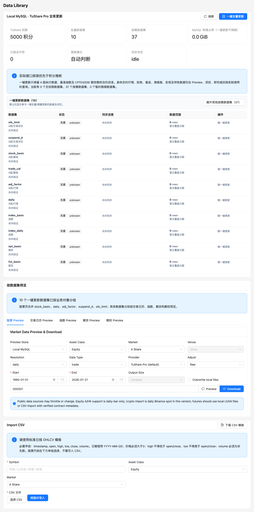

# 数据、增量更新与 PIT

MySQL 是行情、参考数据、同步状态和质量记录的事实来源。LEAN 缓存、Parquet/DuckDB 和 ClickHouse 是可重建或可选派生层。



## 数据集类型

### 一键更新的 10 个数据集

| Dataset | 内容 | 常用消费者 |
| --- | --- | --- |
| `stock_basic` | A 股证券主数据和上市状态 | 搜索、公司资料、交易规则 |
| `trade_cal` | 交易日历 | preflight、回测日期和增量窗口 |
| `daily` | A 股日线 OHLCV | 回测、Preview、研究 |
| `adj_factor` | 复权因子 | LEAN factor 文件和复权研究 |
| `suspend_d` | 停牌历史 | 可交易状态和执行门禁 |
| `stk_limit` | 每日涨跌停价 | A 股成交约束 |
| `index_basic` | 指数资料 | 基准和股票池元数据 |
| `index_daily` | 指数日线 | 真实基准和指数 Preview |
| `fut_basic` | 期货合约资料 | 合约搜索和研究 |
| `opt_basic` | 期权合约资料 | 合约搜索和研究 |

`daily_basic` 等其他 catalog 数据集默认是 `on_demand`，不会参与一键更新。

### 全量与增量

- 没有成功完整建库标记时，页面显示“一键全量更新”。
- 10 个数据集完整成功后保存建库状态、水位和 checkpoint，按钮变为“一键增量更新”。
- 重启 API、worker 或电脑不会重置全量完成状态。
- 增量同步按数据集水位决定范围；`daily`、`stk_limit` 等日常数据优先按缺失交易日更新。
- 同步幂等：重复处理不等于重复插入，因此 `processed` 可以大于 `inserted`。

## 进度字段

| 字段 | 含义 |
| --- | --- |
| API 真实调用 | Provider 实际请求次数，不是股票计数 |
| 下载 | Provider 返回并进入处理链路的行数 |
| 入库 | 成功写入或幂等更新 canonical 表的行数 |
| 校验 | 通过字段和业务质量检查的行数 |
| 隔离 | 未通过校验、不能进入 canonical 表的行数 |
| 空结果 | 合法请求但没有返回数据的工作单元 |
| 工作单元/s | 股票、交易日或批次的完成速度 |
| Checkpoint | 可恢复的小批次边界 |

某些股票没有停牌或涨跌停记录，`suspend_d`/`stk_limit` 空结果是正常现象。大量空结果仍会计入覆盖分析。

## 正确性和审计链

每个 Provider 批次依次执行：

1. 检查接口权限、请求范围和响应结构。
2. 标准化股票代码、日期、数值和 null。
3. 验证必填字段、主键、日期范围、OHLC 关系和业务约束。
4. 响应内去重，并按 canonical 主键幂等 upsert。
5. 在内存或整批范围内处理来源优先级。
6. 将无效行连同原因、来源和批次信息写入隔离区。
7. 保存 manifest、请求/载荷哈希、计数、质量报告和水位。
8. 需要时比较 MySQL、Parquet 或另一来源的行数与日期范围。

规范化表已经无损保存的数据不会再次逐行序列化完整 JSON。`provider_raw_records` 只保留键、日期和哈希索引；不能无损规范化的响应按批 gzip 压缩并内容寻址归档。

## 按需下载

展开其他数据集后点击单独下载：

1. 选择 catalog 中标记为 `on_demand` 的数据集。
2. 从后台批准的宿主机目标中选择实际存储地址。
3. 选择 Parquet 或 JSON Lines 等支持格式。
4. 查看任务状态和最终 artifact 路径。

系统不会无提示地固定写到电脑默认硬盘。`LEAN_MYSQL_ON_DEMAND_MAX_DATABASE_GB` 默认 50 GB，只限制按需 MySQL 缓存，不限制一键建库。

## 数据集 Preview

- 股票 Preview：行情、公司资料、复权、停牌、涨跌停、覆盖、标识符和股票池。
- 交易日历 Preview：按市场、来源和日期查看交易状态。
- 指数 Preview：指数资料和指数日线。
- 期货/期权 Preview：合约代码、品种、上市到期日、交易所和标的。

Preview 只读取本地数据库，不会因为打开预览而自动调用 Provider。未知字段必须安全格式化，单个预览错误不能导致整个 Web 白屏。

## CSV 导入

导入前先下载匹配模板：

```text
GET  /api/data/import-csv/template
POST /api/data/import-csv
```

模板随 Asset Class、Market、Resolution 和 Data Type 变化。后端会先检查必填列、日期和数值类型；格式错误应整体拒绝并返回字段信息，不能静默部分入库。

## PIT 股票池

独立批量回测默认解析回测开始日的历史有效成分，并把股票代码固化到批次配置。动态组合在每个调仓日根据 `announce_date`、`effective_date`、`start_date` 和 `end_date` 解析成分。

缺少历史覆盖时必须阻止运行，不能用当前成分回填历史。CSI300 官方缓存目前从 2017-12-08 开始，更早区间仍是已知缺口。

## 容量和磁盘安全

- 一键同步没有数据库大小上限。
- 更新后必须保留 `max(500 GiB, 总磁盘 50%)` 的空间。
- 页面显示 MySQL 物理分配空间，不等于单表逻辑行内容。
- 删除行或清空旧 JSON 后，InnoDB 通常不会立即把物理空间返还给宿主机。
- bulk loader 可关闭可重建 Provider 数据的 binlog；业务元数据仍保持正常持久性。

## 常用接口

| 方法 | 路径 | 说明 |
| --- | --- | --- |
| `GET` | `/api/data/catalog` | 数据集、权限、策略和同步状态 |
| `POST` | `/api/data/sync-runs` | 创建一键或指定数据集同步 |
| `GET` | `/api/data/sync-runs/{id}` | 查询实时进度 |
| `GET` | `/api/data/sync-runs/{id}/validation` | 质量和隔离结果 |
| `POST` | `/api/data/sync-runs/{id}/cancel` | 干净取消 |
| `POST` | `/api/data/sync-runs/{id}/resume` | 从 checkpoint 恢复 |
| `GET` | `/api/data/dataset-preview/{dataset}` | 数据集感知 Preview |
| `POST` | `/api/data/on-demand/downloads` | 创建按需下载 |

更完整的数据模型、归档和派生层说明见 [数据管线](../data_pipeline.md)。
