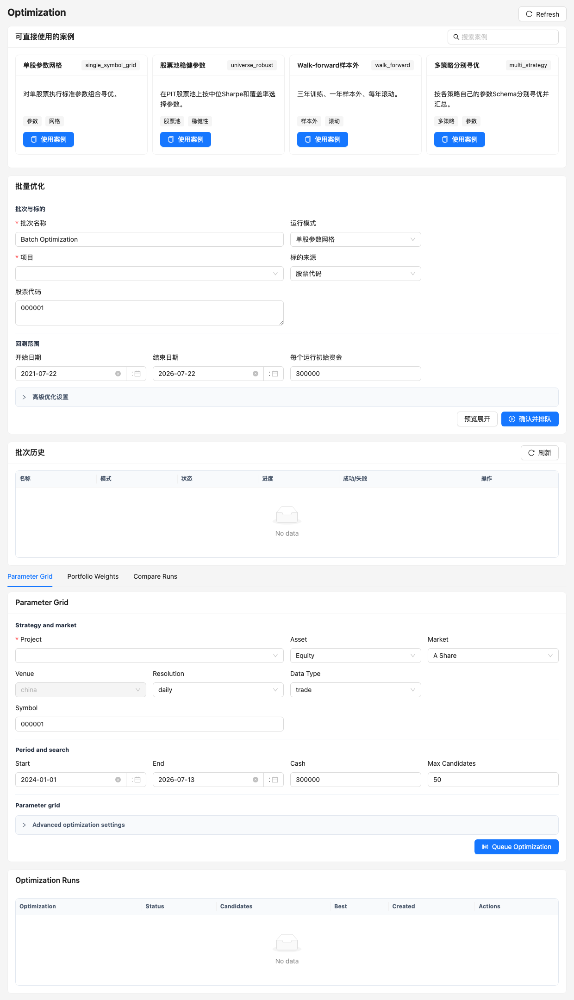

# Optimization

Optimization 将参数候选展开成标准 LEAN 子回测，因此共享单次回测的数据 preflight、并发限制、取消、结果解析和验证链路。



## 开始前

- 项目必须存在并且当前只支持 Python Optimization。
- 模板参数 Schema 应定义稳定键和合法范围。
- 先在少量数据和少量候选上验证策略能正常运行。
- 样本外窗口、目标指标和失败处理规则应在运行前确定。

## 单次参数网格

`POST /api/optimize` 接受一个项目、一个标的和参数网格：

页面中的 Project、市场、标的、周期和候选上限直接显示；由策略模板定义的动态参数网格也始终可见。Docker Image、Custom Parameter Grid JSON 和 Fixed Parameters JSON 位于 Advanced optimization settings，JSON 输入始终占整行。

```json
{
  "projectId": "ema-project",
  "symbol": "000001",
  "assetClass": "equity",
  "market": "china",
  "venue": "china",
  "resolution": "daily",
  "dataType": "trade",
  "start": "2020-01-01",
  "end": "2024-12-31",
  "cash": 300000,
  "parameters": {"benchmarkSymbol": "000300"},
  "parameterGrid": {"fast": [5, 10, 20], "slow": [30, 60, 120]},
  "maxCandidates": 50
}
```

候选数是各参数值数量的笛卡尔积，并受 `maxCandidates`（1–200）约束。不要用扩大上限代替合理缩小参数空间。

## 批量优化模式

| 模式 | 说明 |
| --- | --- |
| `single_symbol_grid` | 在单股票上比较标准参数组合 |
| `universe_robust` | 在 PIT 股票池上比较每组参数的分布和覆盖率 |
| `walk_forward` | 在滚动训练窗口选参，只在随后样本外窗口评价 |
| `multi_strategy` | 每个策略使用自己的参数 Schema 分别寻优，再比较最优结果 |

股票池稳健参数默认关注中位 Sharpe；有效覆盖低于 80% 的候选不进入最优选择。动态组合参数每个候选运行一次多资产组合，而不是拆成独立股票。

## Walk-forward

默认案例使用三年训练、一年样本外、每年滚动。每个窗口必须遵守：

1. 只在训练数据上选择参数。
2. 将选出的参数冻结到随后测试窗口。
3. 汇总所有样本外窗口，不用训练结果替代样本外结果。
4. 保留每个窗口的候选、失败和最终选择证据。

训练或测试窗口数据不足时应明确失败或跳过，不能悄悄改变日期。

## 如何评价候选

不要只选择最高收益。至少观察：

- 样本外 Sharpe、回撤、Calmar 和交易数；
- 股票池或窗口的有效覆盖率与失败率；
- 参数邻域是否平滑，而不是只有单个尖峰；
- 费用、滑点和成交限制下结果是否稳定；
- 结果是否过度依赖少量股票或少数交易。

## 常用接口

| 方法 | 路径 | 说明 |
| --- | --- | --- |
| `GET` | `/api/optimize` | 单次优化运行列表 |
| `POST` | `/api/optimize` | 创建参数网格优化 |
| `GET` | `/api/optimize/{id}` | 查询状态与结果 |
| `POST` | `/api/experiment-batches/preview` | 预览批量优化展开 |
| `POST` | `/api/experiment-batches` | 创建批量优化 |
| `POST` | `/api/experiment-batches/compare` | 跨 2–10 个批次按 Sharpe、收益、回撤或交易数排名并返回并排指标 |

批次历史支持勾选多个已完成批次。比较结果使用每批成功运行的指标中位数排序，同时展示最佳运行、参数二维敏感性热图，以及按 fold 对齐的 Train / Validation / OOS Sharpe。热图单元格聚合同一参数组合跨标的、窗口或 fold 的均值与中位数，并保留样本数，避免把单次最优误当成稳健区域。

Optimization 的输出是研究证据，不会自动创建 Paper 会话或覆盖项目参数。
