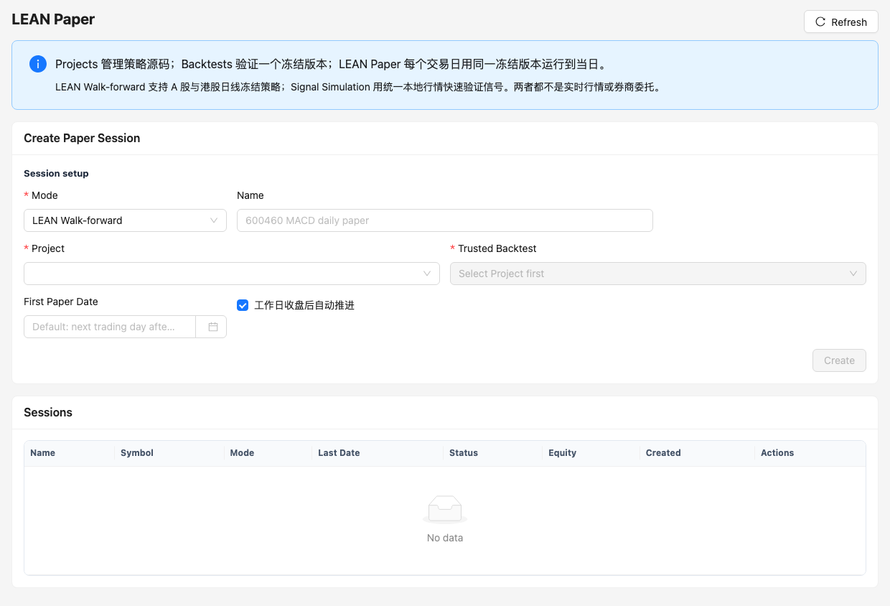

# Paper 模拟交易

Paper 页面提供 `lean_walkforward` 和 `signal_simulation` 两种稳定模式，并提供受功能开关保护的 `lean_walkforward_v2` 整改模式。它们都只在本地模拟，不连接真实券商，也不会自动发出实盘订单。



## 模式区别

| 模式 | 输入 | 行为 |
| --- | --- | --- |
| `lean_walkforward` | Project + 可信 Backtest | 每个交易日运行隔离 LEAN 窗口并保存每日证据 |
| `lean_walkforward_v2` | Project + 可信 Backtest | 将 LEAN 输出作为 intent，经统一约束、撮合、fill 和 ledger 管线处理 |
| `signal_simulation` | 手工或 Insights 信号 | 按执行规则模拟目标仓位、订单和持仓 |

LEAN Paper 必须同时提供 `projectId` 和 `sourceBacktestId`。候选接口只返回满足项目关联和可信度要求的历史运行。

`lean_walkforward_v2` 默认关闭。仅在隔离整改环境设置
`LEAN_PAPER_ORDER_PIPELINE_V2_ENABLED=1` 后才能创建新 v2 session。旧 session 不会
自动迁移或改写；完成新的 21 日真实 LEAN、故障恢复和对账验收前，v2 也不代表
Level 5 已获生产认证。

## 创建 LEAN Paper

1. 在 Projects 确认策略代码和参数。
2. 完成可信历史回测并检查 admission、基准和数据证据。
3. 在 Paper 选择 Project 和 Trusted Backtest。
4. 配置市场、资金、基准、持仓上限、现金下限和黑白名单。
5. 创建后按交易日顺序运行。

Create Paper Session 只展示当前模式需要的字段：LEAN Walk-forward 显示 Project 与 Trusted Backtest，Signal Simulation 显示 Market、Symbol 与 Initial Cash；切换模式不会产生另一模式的隐藏必填校验。

```json
{
  "name": "EMA walk-forward",
  "mode": "lean_walkforward",
  "projectId": "ema-project",
  "sourceBacktestId": "trusted-run-id",
  "symbol": "000001",
  "market": "china",
  "venue": "china",
  "cash": 300000,
  "benchmarkSymbol": "000300",
  "maxPositionWeight": 0.2,
  "minCash": 20000
}
```

## 逐日运行

`POST /api/paper/{session_id}/run-day` 对 LEAN Paper 创建一个新的 walk-forward 子运行；信号模拟模式则进行当日撮合。

```json
{"tradeDate":"2026-07-21","autoSignal":true}
```

LEAN Paper 必须按交易日顺序推进。`replay` 对该模式只允许开始日等于结束日，不能一次跨越多个日期并跳过每日状态。

v2 将每条 LEAN 订单输出先持久化为不可变 intent，再按合法状态图追加 transition。
约束通过后才允许写 fill 和 ledger；约束失败会在同一来源链上形成带原因的 rejected
order。开仓现金与持仓、成交本金、手续费均写入 append-only ledger；会话现金和
持仓只是从该账本重建的读模型，重试同一 intent 不会再次成交或扣费。`intent_capture`、`constraint_validation`、`matching`、`ledger`、
`snapshot_report` 和 `reconciliation` 六个 checkpoint 都带稳定 digest，重复完成
同一阶段时若 payload 漂移会直接失败。

## 信号模拟

手工信号接口接收交易日、方向、标的、目标仓位、强度、原因和来源。服务端执行规则拥有最终决定权；无效方向、不可交易标的、风险上限或缺失行情会产生拒绝原因。

Insights 产生的候选信号不会自动进入 Paper。用户必须显式调用 handoff，且当前只支持 equity 和现货 crypto 会话。

## 每日检查

每个交易日应检查：

- Daily Runs 是否成功以及关联回测；
- Signals 的来源、理由和目标仓位；
- Orders 的状态、价格、数量、费用和拒绝原因；
- Positions、现金和 NAV；
- Daily Report 的基准、质量门禁、警告和 fingerprint。

## 常用接口

| 方法 | 路径 | 说明 |
| --- | --- | --- |
| `GET/POST` | `/api/paper` | 会话列表和创建 |
| `GET` | `/api/paper/candidates?projectId=...` | 可信历史候选 |
| `GET` | `/api/paper/{id}` | 会话、信号、订单、持仓和运行 |
| `GET` | `/api/paper/{id}/intents` | v2 不可变订单意图 |
| `GET` | `/api/paper/{id}/intents/{intent_id}/transitions` | v2 订单状态迁移证据 |
| `POST` | `/api/paper/{id}/run-day` | 推进一个交易日 |
| `POST` | `/api/paper/{id}/replay` | 信号模拟回放或单日 LEAN 运行 |
| `GET` | `/api/paper/{id}/reports` | 每日报告列表 |

Paper 仍是研究和运维验证工具，不等同于实盘交易系统。
