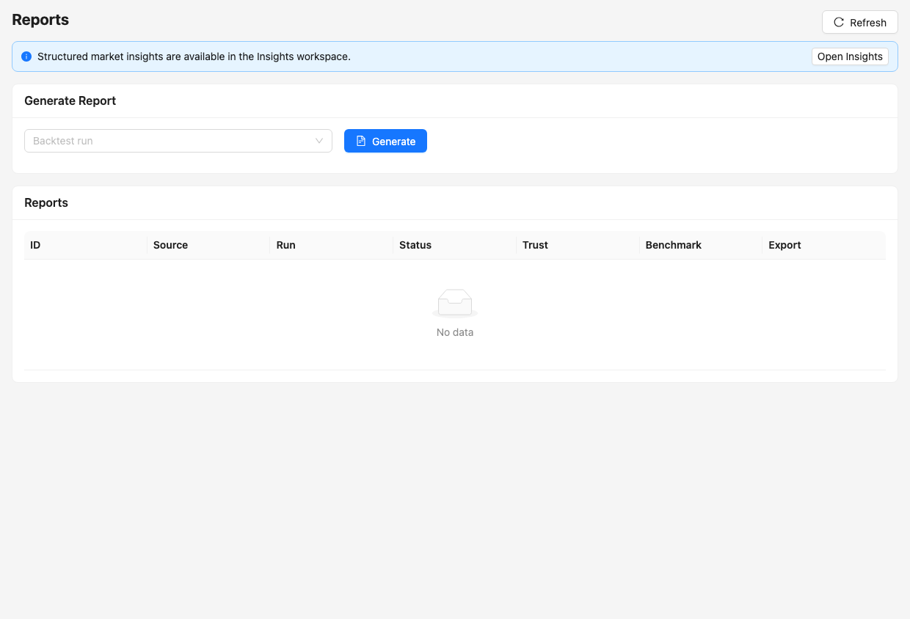

# 回测结果、比较与报告

Run Detail 用于检查单次运行的结构化结果；Compare 横向比较多个运行；Reports 生成统一、可分享的 HTML/Markdown/PDF/CSV/JSON 研究报告。



## Run Detail

成功回测通常包括：

- 运行元数据、状态、项目和参数；
- Statistics、equity、benchmark、drawdown 和价格曲线；
- Orders、Trades、Holdings；
- Validation、A-share Rules、Data Gates、Data Evidence；
- Experiment Fingerprint、策略版本和数据集版本；
- LEAN 原始 JSON、日志、summary 和归档对象。

缺少某项数据时页面应显示明确空态，不能用估算值伪装成真实 LEAN 输出。

## Compare Runs

Optimization 页面中的 Compare Runs 可选择多个成功运行，比较：

- 指标表；
- Equity 和 Drawdown 曲线；
- 按不同目标生成的排名。

比较前确认运行使用相同或可解释的日期、资金、市场、基准和数据版本。不同口径的结果不能仅按收益排序。

## 统一报告

Reports 页面从 backtest run、parsed result 和 stored objects 生成 `report-layout-v2` 报告。报告头部统一显示：

- 策略/项目、标的和日期；
- 运行与生成时间；
- 数据与策略版本、fingerprint；
- Validation 状态；
- 可用图表和原始对象摘要。

报告正文包含绩效、风险、成交、持仓、数据证据和图表，不再把 JSON 文件路径和 Charts available 等元数据堆成无说明的纯文本。

使用 `ashare_index_screening` 模板时，LEAN 日志中的结构化最终快照还会生成
`screening-report.json`。同目录的 `report.html` 会增加逐股筛选章节，列出走势、
技术分、基本面分、综合分、是否合格、Top-N 精选状态、公司名称、通过依据和风险/缺失。
筛选报告不显示收益、持仓或订单区块；该结论是研究规则输出，不构成投资建议。

`ashare_trend_pullback_portfolio` 还会生成 `trend-pullback-decisions.json`，按调仓日保存入选
股票、行业、模型版本、评分、目标权重、ATR、回撤、相对强弱、成交额和质量风险，并汇总各
硬过滤阶段的排除数量。原始不可变输入快照可在同一运行的 artifact 清单中核对哈希。

## 生成与导出

```text
GET  /api/reports
POST /api/reports
GET  /api/reports/{report_id}
GET  /api/reports/{report_id}/file
GET  /api/reports/{report_id}/export?format=html|markdown|pdf|csv|json
```

HTML 和 Markdown 适合阅读与分享；PDF 使用 Unicode 字体生成固定版式，CSV
输出摘要、指标、门禁和 artifact 台账，JSON 输出带 schema/layout 版本的完整
规范 payload。所有格式均使用 `Cache-Control: no-store`。

## 为什么仍看到旧报告

报告 HTML 是已生成的静态产物。更新 renderer 不会自动重写历史文件：

1. 确认打开的是新生成报告，不是旧 browser tab。
2. 报告响应使用 `Cache-Control: no-store`，仍异常时检查实际报告 ID。
3. 对历史报告运行重建脚本的 dry-run，再显式执行需要重建的范围。

```bash
web/backend/.venv/bin/python scripts/regenerate_backtest_reports.py --dry-run
```

## 对象归档

报告和运行对象可以从 MySQL `stored_objects` 恢复。`web/runtime/runs` 是执行和调试缓存，不是唯一事实来源。清理运行目录前必须验证关键对象已归档。

完整字段约定见 [Backtest Result Format](../backtest_result_format.md)。
