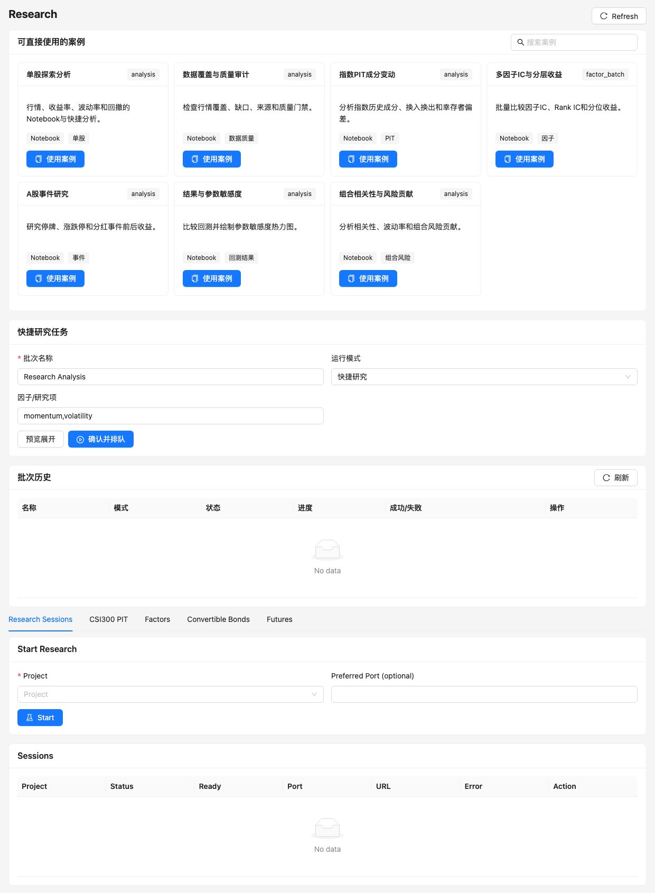

# Research 与 Notebook

Research 提供两种入口：网页快捷研究适合标准化、可重复任务；Jupyter Research 适合交互探索、绘图和自定义分析。



## 案例和快捷研究

当前案例目录覆盖：

- 单股行情、收益率、波动率和回撤 EDA；
- 数据覆盖、缺口、来源和质量审计；
- PIT 指数成分、换入换出和幸存者偏差；
- 多因子 IC、Rank IC 和分层收益；
- 停牌、涨跌停和分红等 A 股事件研究；
- 回测参数敏感度与组合风险贡献。

“使用案例”会创建项目副本，并在项目的 `notebooks/` 生成可编辑 Notebook。系统案例本身保持只读。

## Jupyter 会话

1. 在 Research 选择 Project。
2. 可指定端口，也可以让系统选择可用端口。
3. 创建后等待 `readiness_status=ready`。
4. 打开 Jupyter，在项目工作区保存 Notebook 和输出。
5. 完成后停止或删除会话，避免长期占用 Docker 内存和端口。

```json
POST /api/research
{
  "projectId": "research-project",
  "port": 18888
}
```

端口范围为 1024–65535；端口已占用时服务会返回明确错误或选择其他可用端口。

## 文件和挂载边界

| 路径 | 权限 | 内容 |
| --- | --- | --- |
| Research workspace | 可写 | 项目副本、Notebook、研究输出 |
| `/Lean/Data` | 只读 | LEAN 可执行行情缓存 |
| `/Lean/Parquet` | 只读 | Parquet 分析数据 |

不要在 `/Lean/Data` 或 `/Lean/Parquet` 内保存 Notebook。事实数据更新应通过 Data 页面或 API 完成。

## 会话检查

`POST /api/research/{session_id}/checks` 可以验证：

- 工作区和策略入口存在；
- Python 策略语法；
- 指定股票和日期的数据覆盖；
- 最近项目回测与研究范围的关联。

```json
{
  "symbols": ["000001", "600519"],
  "startDate": "2022-01-01",
  "endDate": "2024-12-31"
}
```

## 批量研究

Batch Workbench 支持：

- `analysis`：标准快捷研究；
- `factor_batch`：股票池和多个因子的批量评价。

提交前同样需要 preview 展开数量，并受 `maxBatchRuns` 和全局任务并发限制。结果持久化到实验批次，可查询、重试失败项和导出。

## 生命周期和接口

| 方法 | 路径 | 说明 |
| --- | --- | --- |
| `GET/POST` | `/api/research` | 列表或启动会话 |
| `GET` | `/api/research/{id}` | 状态、端口和容器信息 |
| `GET` | `/api/research/{id}/logs` | worker 与 Docker 日志 |
| `POST` | `/api/research/{id}/checks` | 工作区和数据检查 |
| `POST` | `/api/research/{id}/stop` | 停止容器，保留工作区 |
| `POST` | `/api/research/{id}/restart` | 使用保留工作区重启 |
| `DELETE` | `/api/research/{id}` | 删除会话及受控资源 |

Research 输出不会自动进入 Paper，也不构成投资建议。需要 Paper 时必须从可信历史运行显式创建。
