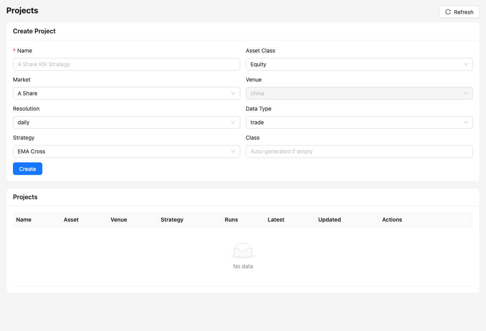

# 项目、策略与案例模板

Project 是可编辑、可版本化的策略工作区；Strategy Template 定义代码骨架和参数 Schema；Example 在模板之上增加市场、股票池、日期、批量模式和研究说明。



## 三者的区别

| 类型 | 是否可编辑 | 用途 |
| --- | --- | --- |
| 策略模板 | 系统源只读 | 创建项目代码和参数默认值 |
| 案例 | 系统目录只读 | 提供可直接使用的完整工作流配置 |
| 项目 | 可编辑 | 回测、Optimization、Research 和 Paper 的正式输入 |

点击“使用案例”会创建独立项目，并在 `project.json` 记录 `exampleKey`、`exampleKind`、`exampleVersion` 和默认配置。修改副本不会改变系统模板或其他项目。

## 当前策略模板

实际清单以 `GET /api/strategies/templates` 为准。当前覆盖：

- Blank Custom、Buy & Hold；
- SMA/EMA Cross、MACD Trend、Donchian Breakout；
- RSI/Bollinger Mean Reversion；
- ETF Momentum Rotation、Risk Parity、Turning Point Selection；
- Crypto Momentum、Futures Trend；
- PIT Dynamic Universe Portfolio。

每个模板位于 `strategies/templates/<key>/`，至少包含 `manifest.json` 和策略主体。文件格式与扩展规则见 [策略模板参考](../strategy_template.md)。

## 创建和编辑项目

1. 在 Projects 选择 Asset、Market、Venue、Resolution、Data Type 和 Strategy。
2. 创建后选择 Current Project，并检查项目配置。
3. 在 Strategy Source 中编辑主文件；Python 项目会做基础语法检查。
4. 保存配置与代码后再进入 Backtests。
5. 需要比较不同策略版本时克隆项目，不要反复覆盖同一个生产候选项目。

相关接口：

| 方法 | 路径 | 说明 |
| --- | --- | --- |
| `GET` | `/api/projects` | 项目列表 |
| `POST` | `/api/projects` | 从模板创建项目 |
| `POST` | `/api/projects/{id}/clone` | 克隆独立副本 |
| `GET` | `/api/projects/{id}/files` | 文件目录 |
| `GET/PUT` | `/api/projects/{id}/file` | 读取或保存文件 |
| `GET` | `/api/examples` | 按 kind 查询案例 |
| `POST` | `/api/examples/{kind}/{key}/instantiate` | 实例化案例 |

## 参数 Schema

参数键必须稳定。数值参数应提供默认值、下限、上限和步长；Optimization 使用模板自己的 Schema 验证网格。不要让不同策略共享同名但含义不同的参数。

```json
{
  "key": "fast",
  "label": "Fast EMA",
  "type": "number",
  "default": 10,
  "min": 1,
  "max": 100,
  "step": 1
}
```

项目默认参数、回测表单参数和批量/优化参数的优先级是：运行请求覆盖项目配置，项目配置覆盖模板默认值。已提交运行保存最终参数和项目快照。

## A 股策略要求

- 使用 `AShareExecutionHelper` 处理 T+1、整手、费用、停牌和涨跌停。
- 使用真实指数或 ETF 基准；正式运行不能使用常数收益替代。
- 股票池和财务数据必须按当时已公布且已生效的 PIT 记录解析。
- 禁止未来函数；研究日期、信号日期和成交日期必须可解释。
- 回测成功后仍需检查结果完整性、执行审计、数据证据和 admission gate。

## 案例选择

Backtest 案例包括单股基准、趋势、均值回归、突破、单策略 × 股票池、单股票 × 多策略、多策略矩阵、滚动稳定性和沪深 300 动态组合。

Optimization 案例包括单股网格、股票池稳健参数、Walk-forward 和多策略分别寻优。Research 案例包括单股 EDA、数据质量、PIT 换手、多因子 IC、事件研究、参数敏感度和组合风险。

案例只提供可复现起点，不代表策略适合实盘，也不构成投资建议。

## 版本和可复现性

任务创建时会保存不可变策略快照、策略版本、数据集版本、实验配置和运行指纹。历史运行即使原项目随后被修改或删除，仍应能读取结果和归档对象。

新回测必须显式传入 `projectId`。正式 runner 不再回退到根目录 demo 算法。
