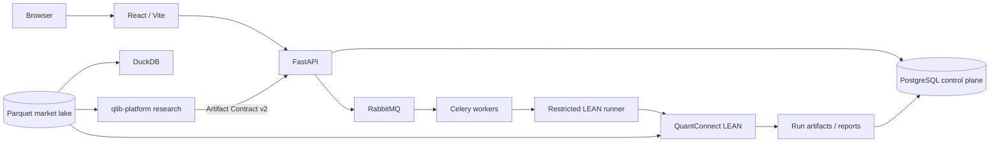

# LEAN Local Web Platform

The `web/` workspace is the browser-facing control plane for LEAN Local Platform. It combines a React/Vite frontend with a FastAPI API, Celery workers, governed data workflows, restricted LEAN execution, experiment orchestration, Paper workflows, reports, monitoring, and in-app documentation.

The current architecture does **not** use MySQL or Redis. For the canonical platform-wide architecture and support boundary, see [`../docs/current-state.md`](../docs/current-state.md) and [`../docs/architecture.md`](../docs/architecture.md).

## Current Architecture



| Concern | Current authority / component |
| --- | --- |
| Browser UI | React, Vite, TypeScript, Ant Design, ECharts, Monaco Editor |
| HTTP/API control plane | FastAPI |
| Control-plane facts | PostgreSQL 17, database `lean_platform` |
| Background task transport | RabbitMQ 4.3.5, vhost `lean` |
| Background execution | Celery workers and Celery Beat |
| Celery result metadata | PostgreSQL `lean_celery`; disposable and non-authoritative |
| MLflow metadata | PostgreSQL `lean_mlflow` |
| Market time-series facts | Parquet under `$LEAN_DATA_DIR` |
| Parquet query engine | DuckDB |
| Backtest / execution validation | Restricted runner + QuantConnect LEAN |
| Optional analytical mirror | ClickHouse; never authoritative |
| Runtime cache | `web/runtime/` |

PostgreSQL stores control-plane state such as tasks, registries, accounts, PIT/control metadata, run metadata, reports, audit facts, and object metadata. **Market quote time series remain in Parquet and are queried through DuckDB; they must not be moved into PostgreSQL.** RabbitMQ is transport only, not a source of business truth.

SQLite is restricted to isolated tests. Legacy `LEAN_MYSQL_*` and `REDIS_URL` runtime variables are rejected by strict runtime v2 rather than translated silently.

## Recommended Local Start

Run the supported platform launcher from the repository root instead of starting individual infrastructure services by hand.

```bash
cp .env.example .env
```

Set unique values for at least:

```text
LEAN_POSTGRES_ADMIN_PASSWORD
LEAN_POSTGRES_APP_PASSWORD
LEAN_POSTGRES_CELERY_PASSWORD
LEAN_POSTGRES_MLFLOW_PASSWORD
LEAN_RABBITMQ_PASSWORD
```

Then validate and start the full Docker profile:

```bash
python scripts/platformctl.py --mode docker --profile full doctor
python scripts/platformctl.py --mode docker --profile full start
python scripts/platformctl.py --mode docker --profile full status
```

The Docker dependency chain is:

```text
PostgreSQL healthy -> postgres-init -> migration -> API / workers / beat / runner
RabbitMQ healthy ---------------------------------> API / workers / beat
MLflow DB upgrade --------------------------------> MLflow
```

See [`../docs/deployment.md`](../docs/deployment.md) for secrets, backup/restore, native deployment, health checks, and production-like requirements.

## Web Development

### 1. Start PostgreSQL and RabbitMQ

From the repository root, with `.env` configured:

```bash
docker compose --profile app up -d postgres rabbitmq postgres-init migration
```

The root `.env` is loaded by the backend. Current native connection variables are:

```text
LEAN_DATABASE_URL=postgresql+psycopg://lean_app:<password>@127.0.0.1:5432/lean_platform
CELERY_BROKER_URL=amqp://lean_worker:<password>@127.0.0.1:5672/lean
CELERY_RESULT_BACKEND=db+postgresql+psycopg://lean_celery:<password>@127.0.0.1:5432/lean_celery
LEAN_MLFLOW_DATABASE_URL=postgresql+psycopg://lean_mlflow:<password>@127.0.0.1:5432/lean_mlflow
```

Use `.env.example` as the template instead of copying the placeholder passwords above.

### 2. Start the backend API

```bash
cd web/backend
python3 -m venv .venv
source .venv/bin/activate
pip install -r requirements.txt
uvicorn app.main:app --reload --host 127.0.0.1 --port 8000
```

On PowerShell, activate the virtual environment with the platform-appropriate command before starting Uvicorn.

### 3. Start a Celery worker when testing queued workflows

```bash
cd web/backend
source .venv/bin/activate
celery -A app.tasks.celery_app worker --loglevel=info --pool=solo
```

The full Compose application profile splits work across dedicated `default`, `data-bulk`, `data-lineage`, `data-demand`, `backtest`, and `ml` workers. Use the full platform launcher when validating production-like routing rather than a single development worker.

### 4. Start the frontend

```bash
cd web/frontend
npm ci
npm run dev
```

Open `http://127.0.0.1:5173`. Vite binds this port strictly and proxies `/api`, `/docs`, and `/openapi.json` to `http://127.0.0.1:8000`.

## Production-Style Frontend Build

```bash
cd web/frontend
npm ci
npm run build
```

When `web/frontend/dist` exists, FastAPI can serve the built frontend at `/`; API routes remain under `/api`.

## Database and Migration Model

Fresh PostgreSQL deployments use the PostgreSQL baseline and ordered migrations under:

```text
web/backend/app/migrations/postgres/
```

Only the migration service applies production migrations. API and worker processes verify migration state read-only at startup. The legacy migration lineage under `web/backend/app/migrations/versions/` is retained for auditability and is not replayed into a fresh PostgreSQL database.

For native deployment management use:

```bash
python scripts/platformctl.py --mode native db init
python scripts/platformctl.py --mode native db migrate
```

## Web Features

- Project workspace and Monaco-based strategy editing.
- Governed A-share data workflows, dataset previews, on-demand downloads, and Parquet consistency checks.
- LEAN backtests with persisted logs, raw artifacts, charts, structured reports, and exports.
- Experiment batches, optimization, rolling windows, PIT-universe workflows, retry, cancellation, and CSV export.
- Research Artifact Contract v2 import from the external `qlib-platform` research plane.
- Paper Account lifecycle, immutable execution evidence, checkpoints, and audit surfaces.
- Local object-store workflows and runtime artifact inspection.
- Celery task queues, scheduling, worker health, and operational logs.
- Dependency health at `/api/health` and Prometheus metrics at `/metrics`.
- Optional Prometheus/Grafana observability and ClickHouse analytical mirror.
- Searchable in-app documentation backed by `docs/help/`.

## Data Ownership

The web UI and backend can ingest, validate, and materialize market data, but the storage contract is explicit:

1. Provider data is normalized and certified into the Parquet market lake.
2. DuckDB queries Parquet directly for analytical/read paths.
3. LEAN-readable caches are derived from the authoritative Parquet data.
4. PostgreSQL receives lineage, manifests, checkpoints, control metadata, and other operational facts — not quote time series.
5. ClickHouse may mirror analytical data when enabled, but it never becomes the source of truth.

For the complete data contract, see [`../docs/data_pipeline.md`](../docs/data_pipeline.md), [`../docs/data_sources.md`](../docs/data_sources.md), and [`../docs/data-operations.md`](../docs/data-operations.md).

## More Documentation

- [`backend/README.md`](backend/README.md) — backend development and runtime dependencies.
- [`frontend/README.md`](frontend/README.md) — frontend development workflow.
- [`../docs/current-state.md`](../docs/current-state.md) — canonical current architecture and support matrix.
- [`../docs/architecture.md`](../docs/architecture.md) — component boundaries and execution chains.
- [`../docs/deployment.md`](../docs/deployment.md) — Docker/native deployment, migration, backup, restore, and operations.
- [`../docs/testing.md`](../docs/testing.md) — validation matrix.
